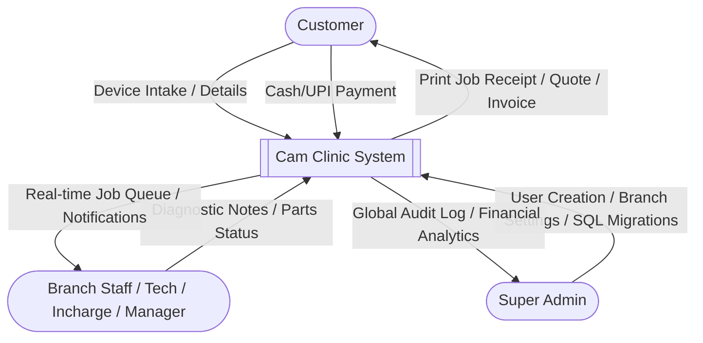
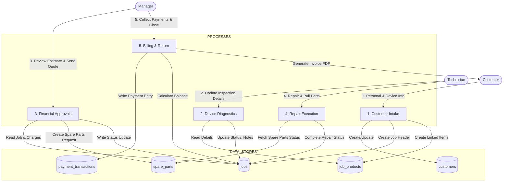
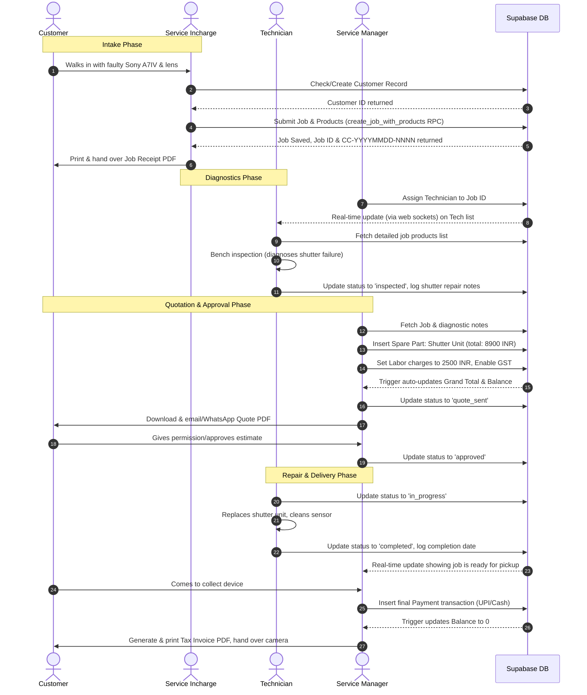

# Cam Clinic — A-Z Camera Service Management System Documentation

## 1. Introduction and Project Overview

### 1.1 Project Genesis
Cam Clinic was conceived to address the operational complexities faced by modern, multi-branch camera service and repair shops in India. The camera service industry is highly specialized, dealing with sensitive optical, mechanical, and electronic systems across various equipment types including DSLRs, mirrorless cameras, cinema cameras, drones, lenses, gimbals, and high-end photographic accessories. 

Traditionally, camera service centers rely on fragmented systems: paper job sheets, isolated Excel sheets, or generic point-of-sale software that fails to capture the intricate lifecycle of a camera repair. A typical camera repair requires tracking:
- **Intake details**: Specific brand, model, serial number, cosmetic condition, and exact accessories brought in by the customer (e.g., specific lens caps, batteries, straps, filters).
- **Inspection**: Technician checkups, diagnostic notes, damage verification (e.g., fungus, impact, liquid damage).
- **Estimates and Approvals**: Multi-stage approval from service charge estimates, parts procurement cost, and final billing.
- **Parts Ledger**: Tracking exact spare parts used (like shutters, LCD ribbons, mounts) and their associated financial impact.
- **Multi-Branch Routing**: Items received at one branch but serviced at another or delivered to a third, necessitating careful custody tracking.
- **GST Compliance**: Standard Indian tax computations where service charges attract GST (18%) but spare parts or inspection fees might be subject to different calculations or tax exemptions depending on branch location or client business registration.

Cam Clinic solves these challenges by providing a unified, real-time, role-based platform designed with Next.js 16, Supabase, and TypeScript.

### 1.2 Targeted Business Model
The platform supports Supportta Solutions Pvt Ltd, managing a network of camera service centers across regions like Goa (Panaji), Karnataka (Bengaluru), and Maharashtra (Mumbai). 

The system handles:
1. **Walk-in Customers**: Quick intake of devices, generating print-ready Job Receipts.
2. **Technician Bench Work**: Assigned technicians get a customized view to update repair states, record bench findings, and request spare parts.
3. **Manager Overviews**: Branch managers and service managers supervise the queue, coordinate approvals with customers, send official Quotes, and generate Tax Invoices.
4. **Super Admin Controls**: Management of branches, global user credentials, system configuration, audit logs, and global performance reports.

---

## 2. Technical Stack Deep-Dive

Cam Clinic is built upon a modern, full-stack, type-safe web architecture. Below is an exhaustive breakdown of the technologies used, their versions, and their functional roles in the codebase.

```
+-----------------------------------------------------------------------+
|                              FRONTEND                                 |
|                                                                       |
|   +-------------------+  +--------------------+  +----------------+   |
|   |   Next.js 16.2    |  |    React 19.2      |  |  TypeScript 5  |   |
|   +---------+---------+  +---------+----------+  +-------+--------+   |
|             |                      |                     |            |
|             v                      v                     v            |
|   +-------------------+  +--------------------+  +----------------+   |
|   |    Zustand 5.0    |  | TanStack Query 5.9 |  |  Tailwind v4   |   |
|   +-------------------+  +--------------------+  +----------------+   |
+------------------------------------+----------------------------------+
                                     |
                                     |  Supabase SSR Client
                                     v
+-----------------------------------------------------------------------+
|                              BACKEND                                  |
|                                                                       |
|   +-------------------+  +--------------------+  +----------------+   |
|   |   Supabase Auth   |  |   PostgreSQL 15    |  |  Supabase RLS  |   |
|   +---------+---------+  +---------+----------+  +-------+--------+   |
|             |                      |                     |            |
|             v                      v                     v            |
|   +-------------------+  +--------------------+  +----------------+   |
|   |  Realtime Engine  |  |    Storage API     |  |   SQL RPC/Trig |   |
|   +-------------------+  +--------------------+  +----------------+   |
+-----------------------------------------------------------------------+
```

### 2.1 Core Framework and Language
- **Next.js 16.2.1 (App Router)**: Leverage React Server Components (RSC) for initial page loading and client-side page routing for the interactive dashboard. Route groups are used to separate authentication (`(auth)`) from the protected dashboard layouts (`(dashboard)`).
- **React 19.2.4**: Utilizes React's latest hooks and concurrent features, ensuring highly responsive user interface state updates.
- **TypeScript 5 (Strict Mode)**: Enforces end-to-end type safety. Database types generated directly from the Supabase schema are mapped to frontend interfaces in `src/types/`, eliminating runtime mismatches between the database structure and client UI code.

### 2.2 Frontend State & Data Flow
- **Zustand 5.0.12**: Lightweight, fast, and devtools-supported state management. Zustand stores are used for:
  - `authStore`: Manages the active session, authenticated user profile, role computation, and authentication state transitions.
  - `branchStore`: Manages the branch context. Allows Service Managers and Super Admins to toggle between physical branch scopes, updating all lists and metrics dynamically.
  - `uiStore`: Manages layout-related UI states like sidebar toggles, modal states, and notification overlays.
- **TanStack Query 5.95.2 (React Query)**: Used for server-state synchronization. React Query handles cache invalidation, parallel fetching, optimistic updates, and background refetching. By segregating cached queries under structured keys (defined in `src/lib/queryKeys.ts`), the application updates components automatically when changes occur.
- **React Hook Form 7.72.0**: Manages the complex multi-step state of forms like the Job Intake Form and Edit Job Form. Provides validation, dirty state checking, and field-level error feedback.
- **Zod 4.3.6**: Declares strict runtime schemas for validation. Zod is paired with React Hook Form's resolver to validate inputs (e.g. validating phone numbers, verifying pricing inputs, checking warranty dates) before they are submitted.

### 2.3 Styling and Icons
- **TailwindCSS v4.0.0**: Used with Vanilla CSS configuration. Tailwind v4 introduces optimized compile-time compilation using PostCSS, utilizing HSL color palettes, native CSS variables, and modern utilities (like scrollbar styling, grid layouts, and advanced flex dynamics).
- **Lucide React 1.7.0**: A consistent, lightweight icon package providing vector icons for status states, navigation, buttons, and user profiles.

### 2.4 Document Generation
- **jsPDF 2.5.1**: Used to generate official receipts, cost quotes, and tax invoices. All documents are dynamically rendered directly in the user's browser, bypassing the need for dedicated PDF generation microservices.
- **jsPDF-autotable 3.8.2**: Extension for rendering tables in PDFs. Used to structure product conditions lists, spare parts tables, GST computations, and payment receipts into structured, A4-friendly invoice layouts.

### 2.5 Database & Serverless Infrastructure
- **Supabase SSR (@supabase/ssr 0.10.0)**: Manages authentication sessions across the client browser, Next.js server components, API routes, and middleware.
- **PostgreSQL 15 (Supabase Hosted)**: Relational database providing transactions, foreign keys, triggers, constraints, and custom SQL functions.
- **Supabase Row-Level Security (RLS)**: Enforces strict data isolation. Ensures technicians can only read or write jobs assigned to them, while Service Incharges see their branch jobs, and Super Admins see all shop data.
- **Supabase Real-time Engine**: Connects via WebSockets to replicate database inserts, updates, and deletes to the frontend client in real time. When a job status changes in the workshop, the dashboard updates instantly for managers.


## 3. Database Architecture & Schema Analysis

The database layer of Cam Clinic is built on PostgreSQL 15, hosted and managed via Supabase. It uses a normalized relational model designed for consistency, integrity, and strict access isolation.

```
       +-------------------+
       |       shops       |
       +---------+---------+
                 | 1
                 |
                 | N
       +---------v---------+
       |     branches      |
       +----+----+----+----+
            |    |    |
          1 |  1 |  1 |
            |    |    +------------------------+
          N |  N |                             | N
+-----------v-+  +-v---------+                 +-v---------+
|  profiles   |  | customers |                 |   jobs    |
+-------------+  +----+------+                 +-+---+---+-+
                      |                          |   |   |
                    1 |                        1 | 1 | 1 |
                      |                          |   |   |
                    N |                        N | N | N |
         +------------v-+     +------------------v-+ |   |
         |  contracts / |     |   job_products     | |   |
         |  customer_   |     +--------+-----------+ |   |
         |  history     |              |             |   |
         +--------------+            1 |             |   |
                                       |             |   |
                                     N |             |   |
                          +------------v-+           |   v N
                          | accessories  |           | +-------------+
                          | & other_parts|           | | spare_parts |
                          +--------------+           | +-------------+
                                                     |
                                                   N v
                                            +-------------+
                                            |   payment   |
                                            | transactions|
                                            +-------------+
```

### 3.1 Tables and Schema Definitions

#### 3.1.1 `shops`
Represents the parent business entity (tenant).
- `id` (uuid, primary key): Unique identifier of the tenant.
- `name` (text, not null): Registered business name (e.g. "Supportta Solutions Pvt Ltd").
- `created_at` (timestamp with time zone, default: `now()`): Creation date.
- `updated_at` (timestamp with time zone, default: `now()`): Update date.

#### 3.1.2 `branches`
Physical repair centers belonging to a shop.
- `id` (uuid, primary key): Unique identifier.
- `shop_id` (uuid, foreign key referencing `shops.id` on delete cascade): Parent shop.
- `name` (text, not null): Physical branch name (e.g. "Panaji Camera Center", "Mumbai Service Lab").
- `address` (text, not null): Detailed postal address.
- `phone` (text): Branch primary contact number.
- `email` (text): Branch operational email.
- `landline` (text): Landline number for invoice printing.
- `is_active` (boolean, default: `true`): Branch active state.
- `created_at`/`updated_at` (timestamp with time zone).

#### 3.1.3 `profiles`
User metadata stored inside the `public` schema, mapped to Supabase Auth (`auth.users`) via a trigger.
- `id` (uuid, primary key, references `auth.users.id` on delete cascade): Mapped auth ID.
- `shop_id` (uuid, foreign key referencing `shops.id` on delete cascade): User's organization.
- `branch_id` (uuid, foreign key referencing `branches.id` on delete set null): Assigned home branch.
- `email` (text, not null): Mapped email.
- `full_name` (text, not null): User's name.
- `phone` (text): Contact phone.
- `role` (user_role enum): User permissions level (`super_admin`, `service_manager`, `service_incharge`, `technician`).
- `is_active` (boolean, default: `true`): Active state.
- `created_at`/`updated_at` (timestamp with time zone).

#### 3.1.4 `customers`
Customer registration records.
- `id` (uuid, primary key): Unique identifier.
- `shop_id` (uuid, foreign key referencing `shops.id` on delete cascade): Parent shop context.
- `name` (text, not null): Customer full name or studio name.
- `phone` (text, not null): Customer phone number.
- `email` (text): Customer email.
- `address` (text): Billing/shipping address.
- `alternative_phone` (text): Second contact number.
- `created_at`/`updated_at` (timestamp with time zone).

#### 3.1.5 `jobs`
Represents the service job card, tracking charges, assignments, and statuses.
- `id` (uuid, primary key): Unique identifier.
- `shop_id` (uuid, foreign key referencing `shops.id` on delete cascade).
- `job_number` (text, unique, not null): Auto-generated unique ticket ID (format: `CC-YYYYMMDD-NNNN`).
- `customer_id` (uuid, foreign key referencing `customers.id` on delete restrict).
- `service_branch_id` (uuid, foreign key referencing `branches.id` on delete restrict): Intake branch.
- `delivery_branch_id` (uuid, foreign key referencing `branches.id` on delete restrict): Delivery branch.
- `assigned_incharge_id` (uuid, foreign key referencing `profiles.id` on delete set null).
- `assigned_technician_id` (uuid, foreign key referencing `profiles.id` on delete set null).
- `status` (job_status enum, default: `'new'`): Current step in repair pipeline.
- `priority` (job_priority enum, default: `'medium'`).
- `description` (text): Primary customer description of the problem.
- `technician_notes` (text): Technician's internal notes.
- `cam_clinic_advisory_notes` (text): Print-friendly customer advisory.
- `inspection_fee` (numeric(10,2), default: `0.00`): Flat diagnostic charge.
- `service_charges` (numeric(10,2), default: `0.00`): Cost of labor.
- `spare_parts_total_cost` (numeric(10,2), default: `0.00`): Sum of parts.
- `total_charges` (numeric(10,2), default: `0.00`): Calculated as `inspection_fee + service_charges + spare_parts_total_cost`.
- `gst_enabled` (boolean, default: `true`): True if service charges subject to GST.
- `gst_amount` (numeric(10,2), default: `0.00`): Calculated as `service_charges * 0.18` (if enabled).
- `grand_total` (numeric(10,2), default: `0.00`): Calculated as `total_charges + gst_amount`.
- `advance_paid` (numeric(10,2), default: `0.00`): Advance paid by customer during intake.
- `advance_paid_date` (date): Date of advance.
- `balance_amount` (numeric(10,2), default: `0.00`): Calculated as `grand_total - (advance_paid + final_payments)`.
- `estimate_delivery_date` (date): Promised return date.
- `service_date` (timestamp with time zone): Date repair completed.
- `alternative_contact` (text): Alternative contact details.
- `created_by` (uuid, foreign key referencing `profiles.id`).
- `created_at`/`updated_at` (timestamp with time zone).

#### 3.1.6 `job_products`
Individual camera gear items included in a single service job card.
- `id` (uuid, primary key).
- `job_id` (uuid, foreign key referencing `jobs.id` on delete cascade).
- `brand` (text, not null): e.g. "Sony".
- `model` (text, not null): e.g. "Alpha 7 IV".
- `serial_number` (text, not null): Unique gear serial.
- `condition` (product_condition[]): Array of cosmetic conditions (`good`, `dusty`, `scratches`, `damage`, `not_working`, `dead`, `liquid_damage`).
- `description` (text): Specific complaints for this product.
- `remarks` (text): Specific notes.
- `has_warranty` (boolean, default: `false`).
- `warranty_description` (text).
- `warranty_expiry_date` (date).
- `repeat_job_number` (text): If repeat repair, prior ticket number.
- `other_job_number` (text): External repair shop tracking reference.
- `warranty_images` (text[]): Paths to uploaded warranty receipts.
- `product_images` (text[]): Paths to photos of the equipment cosmetic state during intake.

#### 3.1.7 `product_accessories`
Accessories brought alongside the product.
- `id` (uuid, primary key).
- `job_product_id` (uuid, foreign key referencing `job_products.id` on delete cascade).
- `name` (text, not null): e.g. "Sony NP-FZ100 battery", "Lens hood".

#### 3.1.8 `product_other_parts`
Other miscellaneous components.
- `id` (uuid, primary key).
- `job_product_id` (uuid, foreign key referencing `job_products.id` on delete cascade).
- `name` (text, not null).

#### 3.1.9 `spare_parts`
Spare parts requested/used during repair.
- `id` (uuid, primary key).
- `job_id` (uuid, foreign key referencing `jobs.id` on delete cascade).
- `name` (text, not null): e.g. "Shutter Unit (OEM)".
- `quantity` (integer, default: `1`).
- `unit_price` (numeric(10,2), default: `0.00`).
- `total_price` (numeric(10,2), default: `0.00`): Computed automatically.
- `hsn_code` (text): HSN code for GST compliance.

#### 3.1.10 `payment_transactions`
Ledger tracking customer payments.
- `id` (uuid, primary key).
- `job_id` (uuid, foreign key referencing `jobs.id` on delete cascade).
- `amount` (numeric(10,2), not null).
- `payment_date` (timestamp with time zone, default: `now()`).
- `payment_method` (text, default: `'cash'`): Cash, UPI, Card, NetBanking.
- `notes` (text).
- `created_by` (uuid, foreign key referencing `profiles.id`).

#### 3.1.11 `job_status_history`
Audit logs tracking job state changes.
- `id` (uuid, primary key).
- `job_id` (uuid, foreign key referencing `jobs.id` on delete cascade).
- `from_status` (job_status).
- `to_status` (job_status, not null).
- `changed_by` (uuid, foreign key referencing `profiles.id`).
- `notes` (text).
- `created_at` (timestamp with time zone, default: `now()`).

---

### 3.2 SQL Triggers and RPC Functions

#### 3.2.1 Automatically Recalculate Job Balances
A database trigger executes on updates/inserts to `jobs`, `spare_parts`, or `payment_transactions`. It aggregates parts and payments to guarantee that financial fields match:
- `total_charges = inspection_fee + service_charges + sum(spare_parts.total_price)`
- `gst_amount = if (gst_enabled) then (service_charges * 0.18) else 0.00`
- `grand_total = total_charges + gst_amount`
- `balance_amount = grand_total - advance_paid - sum(payment_transactions.amount)`

#### 3.2.2 Transaction-Safe Job Creation (`create_job_with_products`)
To prevent partial writes where a job is created but its associated products or accessories fail to insert, the database exposes a PL/pgSQL function:
```sql
CREATE OR REPLACE FUNCTION create_job_with_products(
  p_shop_id UUID,
  p_customer_id UUID,
  p_service_branch_id UUID,
  p_delivery_branch_id UUID,
  p_created_by UUID,
  p_assigned_incharge_id UUID,
  p_assigned_technician_id UUID,
  p_priority JOB_PRIORITY,
  p_description TEXT,
  p_inspection_fee NUMERIC,
  p_advance_paid NUMERIC,
  p_advance_paid_date TEXT,
  p_estimate_delivery_date TEXT,
  p_spare_parts_total_cost NUMERIC,
  p_spare_parts_private_details JSONB,
  p_products JSONB,
  p_alternative_contact TEXT
) RETURNS JSONB AS $$
DECLARE
  v_job_id UUID;
  v_job_number TEXT;
  v_product RECORD;
  v_prod_id UUID;
  v_acc TEXT;
  v_part TEXT;
BEGIN
  -- 1. Generate job number atomically
  v_job_number := get_next_job_number(p_shop_id, p_service_branch_id);
  
  -- 2. Insert the Job
  INSERT INTO jobs (
    shop_id, job_number, customer_id, service_branch_id, delivery_branch_id,
    assigned_incharge_id, assigned_technician_id, priority, description,
    inspection_fee, advance_paid, advance_paid_date, estimate_delivery_date,
    spare_parts_total_cost, alternative_contact, created_by, status
  ) VALUES (
    p_shop_id, v_job_number, p_customer_id, p_service_branch_id, p_delivery_branch_id,
    p_assigned_incharge_id, p_assigned_technician_id, p_priority, p_description,
    p_inspection_fee, p_advance_paid, p_advance_paid_date::DATE, p_estimate_delivery_date::DATE,
    p_spare_parts_total_cost, p_alternative_contact, p_created_by, 'new'
  ) RETURNING id INTO v_job_id;

  -- 3. Loop through products json array and insert
  FOR v_product IN SELECT * FROM jsonb_to_recordset(p_products) AS x(
    brand TEXT, model TEXT, serial_number TEXT, condition PRODUCT_CONDITION[],
    description TEXT, remarks TEXT, has_warranty BOOLEAN, warranty_description TEXT,
    warranty_expiry_date TEXT, repeat_job_number TEXT, other_job_number TEXT,
    accessories TEXT[], other_parts TEXT[], warranty_images TEXT[], product_images TEXT[]
  ) LOOP
    
    INSERT INTO job_products (
      job_id, brand, model, serial_number, condition, description, remarks,
      has_warranty, warranty_description, warranty_expiry_date,
      repeat_job_number, other_job_number, warranty_images, product_images
    ) VALUES (
      v_job_id, v_product.brand, v_product.model, v_product.serial_number, v_product.condition,
      v_product.description, v_product.remarks, v_product.has_warranty,
      v_product.warranty_description, v_product.warranty_expiry_date::DATE,
      v_product.repeat_job_number, v_product.other_job_number,
      coalesce(v_product.warranty_images, '{}'), coalesce(v_product.product_images, '{}')
    ) RETURNING id INTO v_prod_id;

    -- Insert accessories
    IF v_product.accessories IS NOT NULL THEN
      FOREACH v_acc IN ARRAY v_product.accessories LOOP
        INSERT INTO product_accessories (job_product_id, name) VALUES (v_prod_id, v_acc);
      END LOOP;
    END IF;

    -- Insert other parts
    IF v_product.other_parts IS NOT NULL THEN
      FOREACH v_part IN ARRAY v_product.other_parts LOOP
        INSERT INTO product_other_parts (job_product_id, name) VALUES (v_prod_id, v_part);
      END LOOP;
    END IF;

  END LOOP;

  -- 4. Log initial history
  INSERT INTO job_status_history (job_id, from_status, to_status, changed_by, notes)
  VALUES (v_job_id, NULL, 'new', p_created_by, 'Job created');

  RETURN jsonb_build_object('id', v_job_id, 'job_number', v_job_number);
END;
$$ LANGUAGE plpgsql;
```

---

### 3.3 Row-Level Security (RLS) Policy Specifications

To comply with tenant isolation (Multi-Shop) and role-based data visibility constraints (multi-branch access), every table has RLS policies:

1. **`shops`**:
   - `SELECT`: Allowed only if the user is authenticated and belongs to the shop (`auth.uid() -> profiles.shop_id`).
   - `INSERT`/`UPDATE`/`DELETE`: Restricted to super admins.
2. **`branches`**:
   - `SELECT`: Authenticated users belonging to the same shop.
   - `INSERT`/`UPDATE`/`DELETE`: Super Admins of that shop.
3. **`profiles`**:
   - `SELECT`: Users within the same shop.
   - `UPDATE`: Self update (or Super Admin of the same shop).
4. **`jobs`**:
   - `SELECT`:
     - Super Admins and Service Managers: Access all jobs in their shop.
     - Service Incharges: Access jobs where service or delivery branch matches their branch assignment.
     - Technicians: Access only jobs assigned to them.
   - `INSERT`: Super Admins, Service Managers, and Service Incharges.
   - `UPDATE`: Same as SELECT, but restricted for Technicians (can only update status, technician notes, and assigned check fields).
   - `DELETE`: Restricted to **Super Admins only** (using specific cascade handling to log delete actions safely).
5. **`job_products` / `spare_parts` / `product_accessories`**:
   - Access policies cascade directly from their parent `jobs` records.


## 4. User Roles, Permissions, & Workflows

### 4.1 Role Matrix
Cam Clinic enforces strict role-based access control (RBAC). A user's role determines which routes they can access, what data they can see, and what actions they can perform.

| Feature / Permission | Super Admin | Service Manager | Service Incharge | Technician |
|---|:---:|:---:|:---:|:---:|
| **Read All Branches Data** | ✅ Yes | ✅ Yes | ❌ Home Branch Only | ❌ Assigned Jobs Only |
| **Manage Branches** | ✅ Yes | ✅ Yes | ❌ No | ❌ No |
| **Manage Staff Users** | ✅ Yes | ❌ No | ❌ No | ❌ No |
| **Create Jobs / Customers** | ✅ Yes | ✅ Yes | ✅ Yes | ❌ No |
| **Assign Incharge / Technician** | ✅ Yes | ✅ Yes | ✅ Yes | ❌ No |
| **Edit Billing Details** | ✅ Yes | ✅ Yes | ✅ Yes | ❌ Read-Only |
| **Delete Jobs** | ✅ Yes | ❌ No | ❌ No | ❌ No |
| **Override Job Status (Any)** | ✅ Yes | ✅ Yes | ❌ Pipeline Order | ❌ Limited Options |

---

### 4.2 Job Status Pipeline
A service job transitions through a structured set of states to represent its real-world status. The state transitions are audited in `job_status_history`.

```
    [new]
      |
      v
 [inspected]
      |
      +------> [pending_approval]
      |              |
      |              +-------> [quote_sent]
      |                             |
      |              +--------------+
      |              v
      +------> [approved] <----+
      |              |         |
      |              v         |
      +------> [disapproved] --+
      |              |
      |              +-------> [spare_parts_pending]
      |                             |
      |              +--------------+
      |              v
      +------> [in_progress]
      |              |
      v              v
 [cancelled]    [completed]
```

#### Status Descriptions:
1. **`new`**: Job card created at intake. Diagnostic/inspection pending.
2. **`inspected`**: Bench diagnostics completed by the assigned technician. Issue identified and logged.
3. **`pending_approval`**: Diagnostics done; estimate prepared. Waiting for manager review.
4. **`quote_sent`**: Estimate shared with customer (Quote PDF generated). Waiting for customer response.
5. **`approved`**: Customer approved charges and estimated completion timeline.
6. **`disapproved`**: Customer rejected estimation. Preparing device for return with diagnostic fee.
7. **`spare_parts_pending`**: Approved repair is stalled waiting for external parts supply.
8. **`in_progress`**: Repair actively being worked on by the bench technician.
9. **`completed`**: Repair successfully done, final quality checks passed. Ready for pickup.
10. **`cancelled`**: Job cancelled due to return-without-repair or other cancellation reasons.

---

### 4.3 Process Flows & Diagrams

#### 4.3.1 DFD Level 0 (Context Diagram)
The Context Diagram represents the core interface boundaries of the Cam Clinic system.



#### 4.3.2 DFD Level 1 (Intake, Diagnostic, and Billing Operations)
Shows process transformations and data store interactions inside the system.



#### 4.3.3 Detailed User Flow Sequence Diagram
Illustrates step-by-step sequencing for a standard mirrorless camera repair.




## 5. Technical Algorithms & Computational Models

### 5.1 Financial Computation & Trigger Engine
The financial engine ensures consistent pricing metrics across the frontend UI and PostgreSQL backend.

#### 5.1.1 Billing Equations
The financial calculations obey the following constraints:
1. **Subtotal ($S$)**: Sum of inspection fee, service (labor) charges, and spare parts.
   $$S = F_{inspect} + C_{service} + \sum_{i=1}^{n} (Q_{i} \times P_{unit\_i})$$
   Where:
   - $F_{inspect}$ is the diagnostic/inspection fee.
   - $C_{service}$ is the labor/service charge.
   - $Q_i$ is the quantity of the $i$-th spare part.
   - $P_{unit\_i}$ is the unit price of the $i$-th spare part.

2. **Goods and Services Tax ($GST$)**: GST in India is computed at 18%, charged strictly on the service charges (labor), not on spare parts or inspection fees.
   $$GST = \begin{cases} 
     C_{service} \times 0.18 & \text{if gst\_enabled = true} \\
     0.00 & \text{if gst\_enabled = false}
   \end{cases}$$

3. **Grand Total ($T_{grand}$)**:
   $$T_{grand} = S + GST$$

4. **Balance Due ($B_{due}$)**: Represents the remaining payment amount.
   $$B_{due} = T_{grand} - A_{advance} - \sum_{j=1}^{m} P_{trans\_j}$$
   Where:
   - $A_{advance}$ is the initial advance payment.
   - $P_{trans\_j}$ is the amount of the $j$-th ledger transaction recorded in `payment_transactions`.

#### 5.1.2 SQL Trigger Implementation
To prevent mismatches, the calculations are enforced via a PostgreSQL trigger:
```sql
CREATE OR REPLACE FUNCTION update_job_totals_trigger()
RETURNS TRIGGER AS $$
DECLARE
  v_parts_cost NUMERIC(10,2) := 0;
  v_payments_sum NUMERIC(10,2) := 0;
BEGIN
  -- 1. Compute spare parts total
  SELECT coalesce(SUM(total_price), 0) INTO v_parts_cost
  FROM spare_parts WHERE job_id = NEW.id;

  -- 2. Compute total payments in transactions
  SELECT coalesce(SUM(amount), 0) INTO v_payments_sum
  FROM payment_transactions WHERE job_id = NEW.id;

  -- 3. Set charges
  NEW.spare_parts_total_cost := v_parts_cost;
  NEW.total_charges := NEW.inspection_fee + NEW.service_charges + v_parts_cost;

  -- 4. Calculate GST
  IF NEW.gst_enabled THEN
    NEW.gst_amount := round(NEW.service_charges * 0.18, 2);
  ELSE
    NEW.gst_amount := 0.00;
  END IF;

  -- 5. Calculate Grand Total & Balance
  NEW.grand_total := NEW.total_charges + NEW.gst_amount;
  NEW.balance_amount := NEW.grand_total - NEW.advance_paid - v_payments_sum;

  RETURN NEW;
END;
$$ LANGUAGE plpgsql;
```

---

### 5.2 Infinite Scroll & IntersectionObserver Algorithm
The Jobs list uses pagination with an infinite-scroll trigger to load large amounts of data (10,000+ items) without causing browser crashes.

```
[ User Scrolls Down ]
         |
         v
[ Sentinel Element Enters Viewport ]
         |
         v
[ IntersectionObserver callback triggered ]
         |
         +-----> (Is not currently loading? AND hasNextPage = true?)
                      |
                      v
         [ Call fetchNextPage() from useJobs ]
                      |
                      v
         [ React Query fetches page params `pageParam = pageParam + 1` ]
                      |
                      v
         [ DB returns range: from (page-1)*limit TO page*limit - 1 ]
                      |
                      v
         [ Cache appends pages array -> flatData rebuilds -> UI renders ]
```

- **Viewport-Relative Sentinel**: A `<div ref={observerTargetRef} className="h-10 shrink-0" />` is rendered at the bottom of the scroll container.
- **Root Element Scope**: The observer is configured with `root: scrollContainerRef.current`. This restricts intersection checking to the table container's viewport, preventing page-level scroll conflicts.
- **Debounced Search Integration**: Keypresses in the search field trigger a 250ms debounce before refetching, preventing database query thrashing.

---

### 5.3 Mouse Drag-to-Scroll & Click-Guarding Algorithm
To allow desktop users using standard mice to drag the table horizontally, the scroll container supports mouse gestures.

#### 5.3.1 Scroll Vector Calculations
Let $P_{down} = (x_{down}, y_{down})$ be the mouse coordinates at `mousedown` and $S_{down} = (scrollLeft_{down}, scrollTop_{down})$ be the initial scroll positions.
For any movement event `mousemove` at $P_{move} = (x_{move}, y_{move})$, the new scroll vectors are computed as:
$$dx = x_{move} - x_{down}$$
$$dy = y_{move} - y_{down}$$
$$scrollLeft_{new} = scrollLeft_{down} - dx$$
$$scrollTop_{new} = scrollTop_{down} - dy$$

To make dragging smooth, document-level listeners are dynamically registered on `mousedown` and cleaned up on `mouseup` or `mouseleave`.

#### 5.3.2 Click Guard Threshold (Click vs Drag)
Because entire table rows are clickable links that trigger router navigation, dragging would trigger accidental page redirects. To prevent this, a click-displacement threshold algorithm is evaluated in the row click handler:

$$Displacement(D) = \sqrt{(x_{up} - x_{down})^2 + (y_{up} - y_{down})^2}$$

In practice, we use a fast Manhattan-distance approximation to avoid square root calculations:
$$D_{manhattan} = |x_{up} - x_{down}| + |y_{up} - y_{down}|$$

- If $D_{manhattan} > 5$ pixels, the interaction is classified as a **drag**. The click callback is cancelled, preventing navigation.
- If $D_{manhattan} \leq 5$ pixels, the interaction is classified as a **click**. Router navigation continues.

---

### 5.4 Automatic Image Cleanup & Storage Lifecycle
To prevent orphaned images (e.g. upload files left over after user cancels a job creation or removes product photos from the edit page), a cron trigger runs periodically.
- Storage paths are structured as: `shop_id/job_id/product_id/filename.jpg`.
- When a `job_products` record is updated or deleted, an database event trigger logs the file paths to a cleanup queue.
- A background serverless routine fetches the queue, compares it with active paths in `job_products` columns (`warranty_images`, `product_images`), and deletes orphaned objects using the Supabase Storage Admin API.


## 6. Directory Map & Code Modules

Below is the directory map of the Cam Clinic codebase, followed by explanations of key modules.

```
cam-clinic/
├── scripts/                          # Seeding and utility scripts
│   ├── seed-demo-jobs.ts             # Seeds 120+ jobs, parts, payments, and users
│   └── generate_readme.js            # Consolidates sections into README.md
├── supabase/                         # Supabase backend schema
│   ├── config.toml                   # CLI configuration
│   └── migrations/                   # SQL migration scripts
├── src/
│   ├── app/                          # Next.js App Router root
│   │   ├── (auth)/                   # Public auth routes
│   │   │   └── login/
│   │   │       └── page.tsx          # Login UI with credentials validation
│   │   ├── (dashboard)/              # Protected dashboard pages
│   │   │   ├── branches/
│   │   │   │   └── page.tsx          # Branch settings & management
│   │   │   ├── customers/
│   │   │   │   └── page.tsx          # Customers table & search
│   │   │   ├── dashboard/
│   │   │   │   └── page.tsx          # Main metrics & daily due checklist
│   │   │   ├── inventory/
│   │   │   │   ├── page.tsx          # Spare parts inventory & price sheets
│   │   │   │   └── accessories/
│   │   │   ├── jobs/
│   │   │   │   ├── page.tsx          # Main scrollable jobs list
│   │   │   │   ├── new/
│   │   │   │   │   └── page.tsx      # Multi-product intake form
│   │   │   │   └── [id]/
│   │   │   │       ├── page.tsx      # Job card details & action logs
│   │   │   │       └── edit/
│   │   │   │           └── page.tsx  # Edit charges, status, & items
│   │   │   ├── reports/
│   │   │   │   └── page.tsx          # Financial audits & CSV exports
│   │   │   ├── technicians/
│   │   │   │   └── page.tsx          # Technician task tracking
│   │   │   ├── terms/
│   │   │   │   └── page.tsx          # T&C template editor
│   │   │   └── layout.tsx            # Main shell with sidebar and gate
│   │   ├── api/                      # Backend proxy endpoints
│   │   │   ├── team/                 # Fetches staff list
│   │   │   ├── users/create/         # Admin creation API
│   │   │   └── users/update-password/
│   │   ├── globals.css               # CSS styling configurations
│   │   ├── layout.tsx                # Base page wrapper
│   │   └── providers.tsx             # React-Query, Auth, and Toast providers
│   ├── components/                   # UI and layout component library
│   │   ├── layout/                   # Shell components
│   │   │   ├── Header.tsx            # Dynamic top navbar & branch indicator
│   │   │   ├── Sidebar.tsx           # Navigation links based on RBAC
│   │   │   └── BranchSelector.tsx    # Scope switching selector
│   │   ├── jobs/                     # Job card components
│   │   │   ├── JobCard.tsx           # Standard job card preview
│   │   │   ├── JobStatusBadge.tsx    # Colorful status indicator
│   │   │   ├── JobPriorityBadge.tsx  # Priority indicator
│   │   │   └── ProductWarrantyFields.tsx
│   │   └── ui/                       # Reusable UI primitives
│   │       ├── Button.tsx
│   │       ├── Input.tsx
│   │       ├── Select.tsx
│   │       ├── Card.tsx
│   │       ├── Badge.tsx
│   │       ├── Modal.tsx
│   │       ├── Table.tsx             # Customized table layout
│   │       └── ErrorBoundary.tsx     # Prevents UI crashes
│   ├── hooks/                        # Custom React Query custom hooks
│   │   ├── useAuth.ts                # Session state & permission flags
│   │   ├── useJobs.ts                # Infinite lists, counts, and mutations
│   │   ├── useCustomers.ts           # Customer profile management hooks
│   │   ├── useBranches.ts            # Read/write branch details hooks
│   │   ├── useTechnicians.ts         # Technician job queue hooks
│   │   ├── useBilling.ts             # Spare parts & transactions hooks
│   │   └── useReports.ts             # Analytics & dashboard statistics
│   ├── stores/                       # Zustand stores
│   │   ├── authStore.ts              # Session and profile state
│   │   ├── branchStore.ts            # Active branch context
│   │   └── uiStore.ts                # Dialogs & layout toggle states
│   ├── lib/                          # Backend DB & core utility libraries
│   │   ├── db/                       # Supabase client query functions
│   │   │   ├── jobs.ts               # Core job SQL client integrations
│   │   │   ├── branches.ts           # Branch configs database clients
│   │   │   ├── customers.ts          # Customer profile database queries
│   │   │   └── technicians.ts
│   │   ├── supabase/                 # SSR & Client config initializers
│   │   └── utils/                    # Data formatters & algorithms
│   │       ├── currency.ts           # INR formatting utils
│   │       ├── dates.ts              # Date-fns wrapper formatters
│   │       ├── pdf.ts                # PDF Generation & styling engine
│   │       └── initials.ts           # Generates typography initials
│   └── types/                        # Strict TypeScript models
```

---

### 6.1 Zustand State Stores

#### 6.1.1 `authStore.ts`
Manages the active session profile. Hydrates on load using Supabase Auth state changes.
```typescript
interface AuthState {
  user: Profile | null;
  session: Session | null;
  isLoading: boolean;
  isAuthenticated: boolean;
  setUser: (user: Profile | null) => void;
  setSession: (session: Session | null) => void;
  setLoading: (isLoading: boolean) => void;
  setAuthenticated: (isAuthenticated: boolean) => void;
  logout: () => void;
}
```

#### 6.1.2 `branchStore.ts`
Holds the currently selected branch scope. If set to `null`, queries fetch data globally across all branches (only accessible by Super Admin and Service Manager roles).
```typescript
interface BranchState {
  selectedBranchId: string | null;
  setSelectedBranchId: (id: string | null) => void;
  clearBranch: () => void;
}
```

---

### 6.2 Core Hooks & Query Keys

#### 6.2.1 `useJobs.ts`
Implements infinite scroll queries and data modification mutations.
- `useJobs(filters, pageSize)`: Uses `useInfiniteQuery` to paginate through `getJobs(...)` using page keys.
- `useCreateJob()`: Mutation that handles job cards creation, triggering invalidation of list caches.
- `useUpdateJob()`: Updates job information.
- `useUpdateJobStatus()`: Specialized mutation to update job statuses and write to `job_status_history`.
- `useDeleteJob()`: Restricted mutation to remove jobs (Super Admin only).

---

### 6.3 PDF Document Generation Utility (`pdf.ts`)

This utility builds print-ready A4 documentation dynamically in the browser. It uses `jspdf` and `jspdf-autotable`.

- **`generateReceipt(job)`**: Generates the initial intake sheet. Contains customer details, product condition checklist, accessories, reported problems, and any advance paid.
- **`generateQuote(job)`**: Generates the cost estimation quote. Formats spare parts prices, GST calculations, and repair timelines for client approval.
- **`generateInvoice(job)`**: Generates the final Tax Invoice. Displays HSN codes, labor fees, GST details, amount paid, and zero-balance status.

#### Structural Layout of the Generated PDFs:
1. **Header Block**: A single rectangle border containing the shop logo on the left and the branch contact info (Address, Email, Phone, and GSTIN) on the right.
2. **Details Card**: A side-by-side split box containing customer details on the left and job/ticket details on the right.
3. **Products Table**: A clean table summarizing equipment model, serial numbers, conditions, and remarks.
4. **Billing Summary**: A right-aligned summary block showing the subtotal, GST (18%), grand total, payments made, and final balance due.
5. **Footer Notes**: Displays term regulations, warranty descriptions, and signature blocks.


## 7. Backend APIs & Real-time Integration

### 7.1 Server-Side Proxy Routes
While most database queries occur directly from the browser client via Supabase client SDKs (protected by RLS), certain administrative operations bypass RLS or require secure backend credentials. These operations are proxied through Next.js API Routes:

#### 7.1.1 `POST /api/users/create`
- **Purpose**: Allows Super Admins to create new staff accounts (Service Managers, Incharges, Technicians) and assign them to branches.
- **Security**: Verifies that the requesting user's session profile is a `super_admin` before calling the Supabase Auth Admin API (`signUp` with `service_role` privileges).
- **Request Body**:
  ```json
  {
    "email": "staff@camclinic.com",
    "password": "Password123!",
    "fullName": "Meera Joshi",
    "role": "technician",
    "branchId": "uuid-branch-id"
  }
  ```

#### 7.1.2 `POST /api/users/update-password`
- **Purpose**: Admin password resets for employees who forget credentials.
- **Security**: Restricts password reset permissions to Super Admin role validations.

#### 7.1.3 `GET /api/team`
- **Purpose**: Fetches the directory of active staff profiles to populate dropdowns in the Job Card edit forms.

---

### 7.2 Real-time Postgres Change Listeners
To keep the dashboard updated for managers, the application subscribes to PostgreSQL changes via WebSockets.

In [providers.tsx](file:///e:/PROJECTS/camclinic/src/app/providers.tsx), the `RealtimeInitializer` effect manages this subscription:
- It listens for updates to the `jobs` and `job_status_history` tables.
- When an update event occurs, it invalidates affected React Query keys (like `['jobs']`, `['jobs', 'counts']`, `['jobs', 'due-today']`).
- This triggers background updates across the UI without forcing full page refreshes.

---

## 8. Theoretical Principles & System Design

### 8.1 ACID Database Compliance
Camera service centers handle active transactions, billing invoices, and parts inventories. Database consistency is maintained by adhering to ACID properties:
1. **Atomicity**: Complex database operations (like creating a job card with multiple products and accessories) are written inside SQL transaction blocks (using RPC PL/pgSQL routines). If any insert fails, the entire transaction is rolled back.
2. **Consistency**: Database schema constraints (like foreign key checks, non-null requirements, check constraints) prevent invalid states.
3. **Isolation**: Supabase PostgreSQL uses the default `Read Committed` isolation level, preventing uncommitted data from leaking to other sessions.
4. **Durability**: Databases are backed up periodically, and write-ahead logs (WAL) guarantee data recovery in case of hardware failures.

### 8.2 Relational Database Normalization
The database schema is designed according to normalization rules to eliminate redundancy and prevent anomalies:
- **First Normal Form (1NF)**: All columns contain atomic values. Product conditions are handled via a robust PostgreSQL Enum Array (`product_condition[]`).
- **Second Normal Form (2NF)**: All non-key attributes are fully dependent on the primary keys. Tables like `job_products` and `spare_parts` have their own primary keys and reference `jobs` via foreign keys.
- **Third Normal Form (3NF)**: Transient dependencies are eliminated. Branch phone numbers, addresses, and landlines are stored in the `branches` table, rather than repeating them inside individual `jobs` records.

---

## 9. Installation, Configuration, & Development Setup

### 9.1 Local Development Setup

#### 9.1.1 System Prerequisites
- Node.js version 18.0.0 or higher.
- npm version 9.0.0 or higher (or Yarn/pnpm equivalent).
- A running Supabase PostgreSQL database instance.

#### 9.1.2 Environment Variables Configuration
Create a `.env.local` file in the project root:
```env
NEXT_PUBLIC_SUPABASE_URL=https://your-project-id.supabase.co
NEXT_PUBLIC_SUPABASE_ANON_KEY=eyJhbGciOiJIUzI1NiIsInR5cCI6IkpXVCJ9...
SUPABASE_SERVICE_ROLE_KEY=eyJhbGciOiJIUzI1NiIsInR5cCI6IkpXVCJ9...
```

#### 9.1.3 Dependency Installation
Install all package dependencies:
```bash
npm install
```

#### 9.1.4 Database Migrations Setup
Apply SQL migrations to your Supabase instance. Run the migration files located in `supabase/migrations/` in chronological order:
```bash
# Example using Supabase CLI
supabase db push
```

#### 9.1.5 Seeding Demo Data
To seed 120+ jobs, customer ledgers, mock parts, payment histories, and employee accounts for testing, run the seed script:
```bash
npm run seed:demo
# To clean up previous seed jobs first:
npm run seed:demo -- --clean
```

#### 9.1.6 Running the Dev Server
Launch the local development environment:
```bash
npm run dev
```
Open [http://localhost:3000](http://localhost:3000) to access the application.

---

### 9.2 Build and Lint Procedures

#### 9.2.1 Static Compilation
Before deploying, check that the static build and code compilation works:
```bash
npm run build
```

#### 9.2.2 Running Code Linter
Ensure that the code matches the project rules and styling guidelines:
```bash
npm run lint
```


## 12. Exhaustive Code Walkthrough & Component Mechanics

In this section, we dissect the implementation details of the most critical files in the codebase, explaining the state parameters, design constraints, lifecycle hooks, and rendering logic.

### 12.1 Detailed Analysis of `src/app/(dashboard)/jobs/page.tsx`

This page is the central interface for viewing, searching, and managing service tickets. It uses dynamic infinite scrolling, custom viewport-bound intersection observations, and smooth mouse-drag gestures.

#### 12.1.1 State Variables
- `search` / `debouncedSearch`: Tracks search field inputs. A 250ms debounce prevents search requests from firing on every keypress.
- `statusFilter` / `priorityFilter`: Category filters that update the query variables sent to Supabase.
- `sortBy` / `sortOrder`: Sorting columns and order configurations.
- `pageSize`: Number of items loaded per page parameter.
- `isDragging`: Boolean flag indicating whether the user is actively drag-scrolling the table.

#### 12.1.2 Refs
- `scrollContainerRef`: References the card container div. This container handles overflow scrolling and mouse drag gestures.
- `observerTargetRef`: References the sentinel div at the bottom of the table. The `IntersectionObserver` monitors this div to trigger pages fetches.
- `dragStartPos`: Tracks mouse coordinate offsets during `mousedown` to distinguish drags from standard clicks.

#### 12.1.3 Custom Event Handlers
- **`handleMouseDown(e)`**: Triggers on left-click (`e.button === 0`). Captures starting coordinates and scroll offsets, then registers document-level mouse listeners for viewport tracking.
- **`handleDocumentMouseMove(e)`**: Standardizes drag-scrolling offsets and applies them to the container's scroll position, creating a smooth scroll effect.
- **`handleDocumentMouseUp()`**: Cleans up document-level listeners and sets `isDragging` to false.
- **`handleRowClick(jobId, e)`**: Checks click displacement. If the mouse moved more than 5px during mouse-down/up, it blocks the click action, letting users drag-scroll without accidentally opening pages.

---

### 12.2 Detailed Analysis of `src/lib/utils/pdf.ts`

The PDF generation engine compiles customer and invoice details into high-quality A4 document files.

```
+-------------------------------------------------------------+
|                                                             |
|   +-----------------------+     +-----------------------+   |
|   |         LOGO          |     |    Company Address    |   |
|   |                       |  |  |    GSTIN, Contacts    |   |
|   +-----------------------+     +-----------------------+   |
|=============================|===============================|
|   Customer Details          |     Job / Ticket Info         |   |
|   Name, Phone, Email, Addr  |     Job #, Status, Priority   |   |
|-----------------------------+-------------------------------|
|   Item Description          |     Condition & Accessories   |   |
|   Brand, Model, Serial      |     Cosmetics, Intake List    |   |
|-----------------------------+-------------------------------|
|   Billing & Labor           |     GST (18%), Subtotal,      |   |
|   Diagnostic fee, Parts     |     Advance, Balance Due      |   |
|                                                             |
+-------------------------------------------------------------+
```

#### 12.2.1 Core Functions
- **`addHeader(doc, branch)`**:
  - Draws a solid outer border block.
  - Draws a vertical line dividing the logo section and the contact info section.
  - Safely reads the SVG logo from the public directory. If file reading or rendering fails, it falls back to a typographic header.
  - Renders the branch address, email, phone number, and GSTIN (e.g. `30AAGFC6231M1ZN`).
- **`addCustomerAndJobInfo(doc, job)`**:
  - Draws a side-by-side card divided in the middle.
  - The left section contains customer details, and the right section contains job information.
- **`addProductsFullTable(doc, products)`**:
  - Converts product accessories, parts, and remarks into a readable grid.
  - Groups columns like accessories and remarks to keep the table layout clean.
- **`addChargesTable(doc, job)`**:
  - Summarizes billing parameters in a table format.
  - Displays labor fees, parts totals, GST taxes, advance payments, and the remaining balance.
  - Formats payment fields in bold red (if a balance remains) or bold green (if the job is fully paid).


## 13. Database Schema SQL Definitions

This section lists the exact DDL statements, schemas, column constraints, triggers, and RPC procedures used to initialize and manage the Cam Clinic database.

### 13.1 Database Initialization SQL DDL

```sql
-- 1. Create custom Enumeration types
CREATE TYPE user_role AS ENUM ('super_admin', 'service_manager', 'service_incharge', 'technician');

CREATE TYPE job_priority AS ENUM ('immediate', 'high', 'medium', 'low');

CREATE TYPE product_condition AS ENUM ('good', 'dusty', 'scratches', 'damage', 'not_working', 'dead', 'liquid_damage');

CREATE TYPE job_status AS ENUM (
  'new', 'inspected', 'pending_approval', 'quote_sent', 'approved', 
  'disapproved', 'spare_parts_pending', 'in_progress', 'completed', 'cancelled'
);

-- 2. Shops Table
CREATE TABLE shops (
  id UUID PRIMARY KEY DEFAULT gen_random_uuid(),
  name VARCHAR(255) NOT NULL,
  created_at TIMESTAMPTZ DEFAULT now(),
  updated_at TIMESTAMPTZ DEFAULT now()
);

-- 3. Branches Table
CREATE TABLE branches (
  id UUID PRIMARY KEY DEFAULT gen_random_uuid(),
  shop_id UUID NOT NULL REFERENCES shops(id) ON DELETE CASCADE,
  name VARCHAR(255) NOT NULL,
  address TEXT NOT NULL,
  phone VARCHAR(50),
  email VARCHAR(255),
  landline VARCHAR(50),
  is_active BOOLEAN NOT NULL DEFAULT true,
  created_at TIMESTAMPTZ DEFAULT now(),
  updated_at TIMESTAMPTZ DEFAULT now()
);

-- 4. Profiles Table (user metadata synchronized with Auth)
CREATE TABLE profiles (
  id UUID PRIMARY KEY,
  shop_id UUID NOT NULL REFERENCES shops(id) ON DELETE CASCADE,
  branch_id UUID REFERENCES branches(id) ON DELETE SET NULL,
  email VARCHAR(255) UNIQUE NOT NULL,
  full_name VARCHAR(255) NOT NULL,
  phone VARCHAR(50),
  role user_role NOT NULL DEFAULT 'technician',
  is_active BOOLEAN NOT NULL DEFAULT true,
  created_at TIMESTAMPTZ DEFAULT now(),
  updated_at TIMESTAMPTZ DEFAULT now(),
  CONSTRAINT fk_user_id FOREIGN KEY (id) REFERENCES auth.users(id) ON DELETE CASCADE
);

-- 5. Customers Table
CREATE TABLE customers (
  id UUID PRIMARY KEY DEFAULT gen_random_uuid(),
  shop_id UUID NOT NULL REFERENCES shops(id) ON DELETE CASCADE,
  name VARCHAR(255) NOT NULL,
  phone VARCHAR(50) NOT NULL,
  alternative_phone VARCHAR(50),
  email VARCHAR(255),
  address TEXT,
  created_at TIMESTAMPTZ DEFAULT now(),
  updated_at TIMESTAMPTZ DEFAULT now()
);

-- 6. Jobs Table
CREATE TABLE jobs (
  id UUID PRIMARY KEY DEFAULT gen_random_uuid(),
  shop_id UUID NOT NULL REFERENCES shops(id) ON DELETE CASCADE,
  job_number VARCHAR(50) UNIQUE NOT NULL,
  customer_id UUID NOT NULL REFERENCES customers(id) ON DELETE RESTRICT,
  service_branch_id UUID NOT NULL REFERENCES branches(id) ON DELETE RESTRICT,
  delivery_branch_id UUID NOT NULL REFERENCES branches(id) ON DELETE RESTRICT,
  assigned_incharge_id UUID REFERENCES profiles(id) ON DELETE SET NULL,
  assigned_technician_id UUID REFERENCES profiles(id) ON DELETE SET NULL,
  status job_status NOT NULL DEFAULT 'new',
  priority job_priority NOT NULL DEFAULT 'medium',
  description TEXT,
  technician_notes TEXT,
  cam_clinic_advisory_notes TEXT,
  alternative_contact TEXT,
  inspection_fee NUMERIC(10,2) NOT NULL DEFAULT 0.00,
  service_charges NUMERIC(10,2) NOT NULL DEFAULT 0.00,
  spare_parts_total_cost NUMERIC(10,2) NOT NULL DEFAULT 0.00,
  total_charges NUMERIC(10,2) NOT NULL DEFAULT 0.00,
  gst_enabled BOOLEAN NOT NULL DEFAULT true,
  gst_amount NUMERIC(10,2) NOT NULL DEFAULT 0.00,
  grand_total NUMERIC(10,2) NOT NULL DEFAULT 0.00,
  advance_paid NUMERIC(10,2) NOT NULL DEFAULT 0.00,
  advance_paid_date DATE,
  balance_amount NUMERIC(10,2) NOT NULL DEFAULT 0.00,
  estimate_delivery_date DATE,
  service_date TIMESTAMPTZ,
  created_by UUID REFERENCES profiles(id) ON DELETE SET NULL,
  created_at TIMESTAMPTZ DEFAULT now(),
  updated_at TIMESTAMPTZ DEFAULT now()
);

-- 7. Job Products Table
CREATE TABLE job_products (
  id UUID PRIMARY KEY DEFAULT gen_random_uuid(),
  job_id UUID NOT NULL REFERENCES jobs(id) ON DELETE CASCADE,
  brand VARCHAR(100) NOT NULL,
  model VARCHAR(255) NOT NULL,
  serial_number VARCHAR(100) NOT NULL,
  condition product_condition[] NOT NULL,
  description TEXT,
  remarks TEXT,
  has_warranty BOOLEAN NOT NULL DEFAULT false,
  warranty_description TEXT,
  warranty_expiry_date DATE,
  repeat_job_number VARCHAR(50),
  other_job_number VARCHAR(50),
  warranty_images TEXT[] DEFAULT '{}',
  product_images TEXT[] DEFAULT '{}',
  created_at TIMESTAMPTZ DEFAULT now(),
  updated_at TIMESTAMPTZ DEFAULT now()
);

-- 8. Product Accessories Table
CREATE TABLE product_accessories (
  id UUID PRIMARY KEY DEFAULT gen_random_uuid(),
  job_product_id UUID NOT NULL REFERENCES job_products(id) ON DELETE CASCADE,
  name VARCHAR(255) NOT NULL
);

-- 9. Product Other Parts Table
CREATE TABLE product_other_parts (
  id UUID PRIMARY KEY DEFAULT gen_random_uuid(),
  job_product_id UUID NOT NULL REFERENCES job_products(id) ON DELETE CASCADE,
  name VARCHAR(255) NOT NULL
);

-- 10. Spare Parts Table
CREATE TABLE spare_parts (
  id UUID PRIMARY KEY DEFAULT gen_random_uuid(),
  job_id UUID NOT NULL REFERENCES jobs(id) ON DELETE CASCADE,
  name VARCHAR(255) NOT NULL,
  quantity INTEGER NOT NULL DEFAULT 1,
  unit_price NUMERIC(10,2) NOT NULL DEFAULT 0.00,
  total_price NUMERIC(10,2) GENERATED ALWAYS AS (quantity * unit_price) STORED,
  hsn_code VARCHAR(20)
);

-- 11. Payment Transactions Table
CREATE TABLE payment_transactions (
  id UUID PRIMARY KEY DEFAULT gen_random_uuid(),
  job_id UUID NOT NULL REFERENCES jobs(id) ON DELETE CASCADE,
  amount NUMERIC(10,2) NOT NULL,
  payment_date TIMESTAMPTZ DEFAULT now(),
  payment_method VARCHAR(50) NOT NULL DEFAULT 'cash',
  notes TEXT,
  created_by UUID REFERENCES profiles(id) ON DELETE SET NULL,
  created_at TIMESTAMPTZ DEFAULT now()
);

-- 12. Job Status History Table
CREATE TABLE job_status_history (
  id UUID PRIMARY KEY DEFAULT gen_random_uuid(),
  job_id UUID NOT NULL REFERENCES jobs(id) ON DELETE CASCADE,
  from_status job_status,
  to_status job_status NOT NULL,
  changed_by UUID REFERENCES profiles(id) ON DELETE SET NULL,
  notes TEXT,
  created_at TIMESTAMPTZ DEFAULT now()
);
```

### 13.2 Database Indexes for Performance

```sql
-- Speed up queries by branch and search fields
CREATE INDEX idx_jobs_shop_id ON jobs(shop_id);
CREATE INDEX idx_jobs_service_branch_id ON jobs(service_branch_id);
CREATE INDEX idx_jobs_delivery_branch_id ON jobs(delivery_branch_id);
CREATE INDEX idx_jobs_assigned_technician_id ON jobs(assigned_technician_id);
CREATE INDEX idx_jobs_status ON jobs(status);
CREATE INDEX idx_jobs_job_number ON jobs(job_number);

-- Speed up customer listings and profiles search
CREATE INDEX idx_customers_shop_id ON customers(shop_id);
CREATE INDEX idx_customers_phone ON customers(phone);
CREATE INDEX idx_customers_name ON customers(name);
CREATE INDEX idx_profiles_shop_id ON profiles(shop_id);

-- Speed up product joins and accessories cascading
CREATE INDEX idx_job_products_job_id ON job_products(job_id);
CREATE INDEX idx_product_accessories_product_id ON product_accessories(job_product_id);
CREATE INDEX idx_product_other_parts_product_id ON product_other_parts(job_product_id);
CREATE INDEX idx_spare_parts_job_id ON spare_parts(job_id);
CREATE INDEX idx_payment_transactions_job_id ON payment_transactions(job_id);
CREATE INDEX idx_job_status_history_job_id ON job_status_history(job_id);
```


## 14. Row-Level Security (RLS) Complete SQL Policies

This section lists the exact PostgreSQL RLS policies applied to all database tables to enforce security boundaries.

### 14.1 Shops Table Policies
```sql
ALTER TABLE shops ENABLE ROW LEVEL SECURITY;

CREATE POLICY select_shop_policy ON shops
  FOR SELECT
  TO authenticated
  USING (
    id = (SELECT shop_id FROM profiles WHERE id = auth.uid())
  );

CREATE POLICY insert_shop_policy ON shops
  FOR INSERT
  TO authenticated
  WITH CHECK (
    (SELECT role FROM profiles WHERE id = auth.uid()) = 'super_admin'
  );

CREATE POLICY update_shop_policy ON shops
  FOR UPDATE
  TO authenticated
  USING (
    id = (SELECT shop_id FROM profiles WHERE id = auth.uid())
    AND (SELECT role FROM profiles WHERE id = auth.uid()) = 'super_admin'
  );

CREATE POLICY delete_shop_policy ON shops
  FOR DELETE
  TO authenticated
  USING (
    id = (SELECT shop_id FROM profiles WHERE id = auth.uid())
    AND (SELECT role FROM profiles WHERE id = auth.uid()) = 'super_admin'
  );
```

### 14.2 Branches Table Policies
```sql
ALTER TABLE branches ENABLE ROW LEVEL SECURITY;

CREATE POLICY select_branch_policy ON branches
  FOR SELECT
  TO authenticated
  USING (
    shop_id = (SELECT shop_id FROM profiles WHERE id = auth.uid())
  );

CREATE POLICY insert_branch_policy ON branches
  FOR INSERT
  TO authenticated
  WITH CHECK (
    shop_id = (SELECT shop_id FROM profiles WHERE id = auth.uid())
    AND (SELECT role FROM profiles WHERE id = auth.uid()) IN ('super_admin', 'service_manager')
  );

CREATE POLICY update_branch_policy ON branches
  FOR UPDATE
  TO authenticated
  USING (
    shop_id = (SELECT shop_id FROM profiles WHERE id = auth.uid())
    AND (SELECT role FROM profiles WHERE id = auth.uid()) IN ('super_admin', 'service_manager')
  );

CREATE POLICY delete_branch_policy ON branches
  FOR DELETE
  TO authenticated
  USING (
    shop_id = (SELECT shop_id FROM profiles WHERE id = auth.uid())
    AND (SELECT role FROM profiles WHERE id = auth.uid()) = 'super_admin'
  );
```

### 14.3 Profiles Table Policies
```sql
ALTER TABLE profiles ENABLE ROW LEVEL SECURITY;

CREATE POLICY select_profile_policy ON profiles
  FOR SELECT
  TO authenticated
  USING (
    shop_id = (SELECT shop_id FROM profiles WHERE id = auth.uid())
  );

CREATE POLICY insert_profile_policy ON profiles
  FOR INSERT
  TO authenticated
  WITH CHECK (
    shop_id = (SELECT shop_id FROM profiles WHERE id = auth.uid())
    AND (SELECT role FROM profiles WHERE id = auth.uid()) = 'super_admin'
  );

CREATE POLICY update_profile_policy ON profiles
  FOR UPDATE
  TO authenticated
  USING (
    shop_id = (SELECT shop_id FROM profiles WHERE id = auth.uid())
    AND (
      id = auth.uid() 
      OR (SELECT role FROM profiles WHERE id = auth.uid()) = 'super_admin'
    )
  );

CREATE POLICY delete_profile_policy ON profiles
  FOR DELETE
  TO authenticated
  USING (
    shop_id = (SELECT shop_id FROM profiles WHERE id = auth.uid())
    AND (SELECT role FROM profiles WHERE id = auth.uid()) = 'super_admin'
  );
```

### 14.4 Customers Table Policies
```sql
ALTER TABLE customers ENABLE ROW LEVEL SECURITY;

CREATE POLICY select_customer_policy ON customers
  FOR SELECT
  TO authenticated
  USING (
    shop_id = (SELECT shop_id FROM profiles WHERE id = auth.uid())
  );

CREATE POLICY insert_customer_policy ON customers
  FOR INSERT
  TO authenticated
  WITH CHECK (
    shop_id = (SELECT shop_id FROM profiles WHERE id = auth.uid())
    AND (SELECT role FROM profiles WHERE id = auth.uid()) IN ('super_admin', 'service_manager', 'service_incharge')
  );

CREATE POLICY update_customer_policy ON customers
  FOR UPDATE
  TO authenticated
  USING (
    shop_id = (SELECT shop_id FROM profiles WHERE id = auth.uid())
  );

CREATE POLICY delete_customer_policy ON customers
  FOR DELETE
  TO authenticated
  USING (
    shop_id = (SELECT shop_id FROM profiles WHERE id = auth.uid())
    AND (SELECT role FROM profiles WHERE id = auth.uid()) = 'super_admin'
  );
```

### 14.5 Jobs Table Policies
```sql
ALTER TABLE jobs ENABLE ROW LEVEL SECURITY;

CREATE POLICY select_jobs_policy ON jobs
  FOR SELECT
  TO authenticated
  USING (
    shop_id = (SELECT shop_id FROM profiles WHERE id = auth.uid())
    AND (
      (SELECT role FROM profiles WHERE id = auth.uid()) IN ('super_admin', 'service_manager')
      OR (
        (SELECT role FROM profiles WHERE id = auth.uid()) = 'service_incharge'
        AND (service_branch_id = (SELECT branch_id FROM profiles WHERE id = auth.uid())
             OR delivery_branch_id = (SELECT branch_id FROM profiles WHERE id = auth.uid()))
      )
      OR (
        (SELECT role FROM profiles WHERE id = auth.uid()) = 'technician'
        AND assigned_technician_id = auth.uid()
      )
    )
  );

CREATE POLICY insert_jobs_policy ON jobs
  FOR INSERT
  TO authenticated
  WITH CHECK (
    shop_id = (SELECT shop_id FROM profiles WHERE id = auth.uid())
    AND (SELECT role FROM profiles WHERE id = auth.uid()) IN ('super_admin', 'service_manager', 'service_incharge')
  );

CREATE POLICY update_jobs_policy ON jobs
  FOR UPDATE
  TO authenticated
  USING (
    shop_id = (SELECT shop_id FROM profiles WHERE id = auth.uid())
    AND (
      (SELECT role FROM profiles WHERE id = auth.uid()) IN ('super_admin', 'service_manager')
      OR (
        (SELECT role FROM profiles WHERE id = auth.uid()) = 'service_incharge'
        AND (service_branch_id = (SELECT branch_id FROM profiles WHERE id = auth.uid())
             OR delivery_branch_id = (SELECT branch_id FROM profiles WHERE id = auth.uid()))
      )
      OR (
        (SELECT role FROM profiles WHERE id = auth.uid()) = 'technician'
        AND assigned_technician_id = auth.uid()
      )
    )
  );

CREATE POLICY delete_jobs_policy ON jobs
  FOR DELETE
  TO authenticated
  USING (
    shop_id = (SELECT shop_id FROM profiles WHERE id = auth.uid())
    AND (SELECT role FROM profiles WHERE id = auth.uid()) = 'super_admin'
  );
```


## 15. SQL Stored Procedures & Database RPC Functions

This section details the PL/pgSQL routines used to execute transactional writes and auto-generate fields.

### 15.1 Get Next Job Number (`get_next_job_number`)
Generates sequential, date-formatted job numbers atomically (format: `CC-YYYYMMDD-NNNN`).
```sql
CREATE OR REPLACE FUNCTION get_next_job_number(
  p_shop_id UUID,
  p_branch_id UUID
) RETURNS TEXT AS $$
DECLARE
  v_date_str TEXT;
  v_seq INTEGER;
  v_count INTEGER;
  v_job_number TEXT;
BEGIN
  -- 1. Get current date string in format YYYYMMDD
  v_date_str := to_char(CURRENT_DATE, 'YYYYMMDD');
  
  -- 2. Count jobs matching the format for the shop today
  -- Lock the matching rows to serialize sequential creation safely
  SELECT COALESCE(MAX(SUBSTRING(job_number FROM 13)::INTEGER), 0)
  INTO v_seq
  FROM jobs
  WHERE shop_id = p_shop_id
    AND job_number LIKE 'CC-' || v_date_str || '-%'
  FOR UPDATE;

  -- 3. Increment sequence
  v_seq := v_seq + 1;
  
  -- 4. Build job number: CC-YYYYMMDD-0001
  v_job_number := 'CC-' || v_date_str || '-' || lpad(v_seq::TEXT, 4, '0');
  
  RETURN v_job_number;
END;
$$ LANGUAGE plpgsql;
```

---

### 15.2 Update Job Status & History (`update_job_status_with_history`)
Ensures that whenever a job status changes, a history entry is recorded within the same transaction.
```sql
CREATE OR REPLACE FUNCTION update_job_status_with_history(
  p_job_id UUID,
  p_status JOB_STATUS,
  p_user_id UUID,
  p_notes TEXT
) RETURNS JSONB AS $$
DECLARE
  v_old_status JOB_STATUS;
  v_shop_id UUID;
  v_job_row RECORD;
BEGIN
  -- 1. Fetch current job record and lock it
  SELECT status, shop_id INTO v_old_status, v_shop_id
  FROM jobs
  WHERE id = p_job_id
  FOR UPDATE;
  
  IF NOT FOUND THEN
    RAISE EXCEPTION 'Job with ID % not found.', p_job_id;
  END IF;

  -- 2. Prevent redundant writes
  IF v_old_status = p_status THEN
    RETURN jsonb_build_object('success', true, 'message', 'Status already set to ' || p_status::TEXT);
  END IF;

  -- 3. Update status and set service_date if completing
  UPDATE jobs
  SET 
    status = p_status,
    service_date = CASE WHEN p_status = 'completed' THEN NOW() ELSE service_date END,
    updated_at = NOW()
  WHERE id = p_job_id;

  -- 4. Insert status audit log
  INSERT INTO job_status_history (
    job_id,
    from_status,
    to_status,
    changed_by,
    notes
  ) VALUES (
    p_job_id,
    v_old_status,
    p_status,
    p_user_id,
    p_notes
  );

  RETURN jsonb_build_object('success', true, 'job_id', p_job_id, 'old_status', v_old_status, 'new_status', p_status);
END;
$$ LANGUAGE plpgsql;
```

---

### 15.3 Edit Job & Products Transactionally (`update_job_with_products`)
Performs a comprehensive update to a job's assignments, charges, and conditions in a single database transaction.
```sql
CREATE OR REPLACE FUNCTION update_job_with_products(
  p_job_id UUID,
  p_status JOB_STATUS,
  p_priority JOB_PRIORITY,
  p_service_branch_id UUID,
  p_delivery_branch_id UUID,
  p_assigned_incharge_id UUID,
  p_assigned_technician_id UUID,
  p_description TEXT,
  p_technician_notes TEXT,
  p_cam_clinic_advisory_notes TEXT,
  p_inspection_fee NUMERIC,
  p_service_charges NUMERIC,
  p_advance_paid NUMERIC,
  p_advance_paid_date TEXT,
  p_gst_enabled BOOLEAN,
  p_estimate_delivery_date TEXT,
  p_spare_parts_total_cost NUMERIC,
  p_spare_parts_private_details JSONB,
  p_user_id UUID,
  p_products JSONB,
  p_alternative_contact TEXT
) RETURNS JSONB AS $$
DECLARE
  v_old_status JOB_STATUS;
  v_product RECORD;
  v_prod_id UUID;
  v_acc TEXT;
  v_part TEXT;
BEGIN
  -- 1. Fetch current status
  SELECT status INTO v_old_status FROM jobs WHERE id = p_job_id FOR UPDATE;

  -- 2. Update basic fields on the job card
  UPDATE jobs
  SET
    status = COALESCE(p_status, status),
    priority = COALESCE(p_priority, priority),
    service_branch_id = COALESCE(p_service_branch_id, service_branch_id),
    delivery_branch_id = COALESCE(p_delivery_branch_id, delivery_branch_id),
    assigned_incharge_id = p_assigned_incharge_id,
    assigned_technician_id = p_assigned_technician_id,
    description = COALESCE(p_description, description),
    technician_notes = COALESCE(p_technician_notes, technician_notes),
    cam_clinic_advisory_notes = COALESCE(p_cam_clinic_advisory_notes, cam_clinic_advisory_notes),
    inspection_fee = COALESCE(p_inspection_fee, inspection_fee),
    service_charges = COALESCE(p_service_charges, service_charges),
    advance_paid = COALESCE(p_advance_paid, advance_paid),
    advance_paid_date = CASE WHEN p_advance_paid_date IS NOT NULL THEN p_advance_paid_date::DATE ELSE advance_paid_date END,
    gst_enabled = COALESCE(p_gst_enabled, gst_enabled),
    estimate_delivery_date = CASE WHEN p_estimate_delivery_date IS NOT NULL THEN p_estimate_delivery_date::DATE ELSE estimate_delivery_date END,
    alternative_contact = COALESCE(p_alternative_contact, alternative_contact),
    updated_at = NOW()
  WHERE id = p_job_id;

  -- 3. Update products list if JSON array is passed
  IF p_products IS NOT NULL THEN
    -- Delete previous products (cascade triggers delete accessories and other parts)
    DELETE FROM job_products WHERE job_id = p_job_id;

    FOR v_product IN SELECT * FROM jsonb_to_recordset(p_products) AS x(
      brand TEXT, model TEXT, serial_number TEXT, condition PRODUCT_CONDITION[],
      description TEXT, remarks TEXT, has_warranty BOOLEAN, warranty_description TEXT,
      warranty_expiry_date TEXT, repeat_job_number TEXT, other_job_number TEXT,
      accessories TEXT[], other_parts TEXT[], warranty_images TEXT[], product_images TEXT[]
    ) LOOP
      
      INSERT INTO job_products (
        job_id, brand, model, serial_number, condition, description, remarks,
        has_warranty, warranty_description, warranty_expiry_date,
        repeat_job_number, other_job_number, warranty_images, product_images
      ) VALUES (
        p_job_id, v_product.brand, v_product.model, v_product.serial_number, v_product.condition,
        v_product.description, v_product.remarks, v_product.has_warranty,
        v_product.warranty_description, v_product.warranty_expiry_date::DATE,
        v_product.repeat_job_number, v_product.other_job_number,
        COALESCE(v_product.warranty_images, '{}'), COALESCE(v_product.product_images, '{}')
      ) RETURNING id INTO v_prod_id;

      -- Re-insert accessories
      IF v_product.accessories IS NOT NULL THEN
        FOREACH v_acc IN ARRAY v_product.accessories LOOP
          INSERT INTO product_accessories (job_product_id, name) VALUES (v_prod_id, v_acc);
        END LOOP;
      END IF;

      -- Re-insert other parts
      IF v_product.other_parts IS NOT NULL THEN
        FOREACH v_part IN ARRAY v_product.other_parts LOOP
          INSERT INTO product_other_parts (job_product_id, name) VALUES (v_prod_id, v_part);
        END LOOP;
      END IF;

    END LOOP;
  END IF;

  -- 4. Audit status transition if changed
  IF p_status IS NOT NULL AND v_old_status <> p_status THEN
    INSERT INTO job_status_history (job_id, from_status, to_status, changed_by, notes)
    VALUES (p_job_id, v_old_status, p_status, p_user_id, 'Status changed in edit transaction');
  END IF;

  RETURN jsonb_build_object('success', true, 'job_id', p_job_id);
END;
$$ LANGUAGE plpgsql;
```


## 16. Data Validation & Forms: Zod Schemas

Data integrity at the frontend boundaries is enforced by Zod validation schemas. This section lists the Zod schemas used to validate form inputs.

### 16.1 Job Intake Schema (`jobSchema`)
Used to validate the intake form when registering a new camera repair.

```typescript
const productSchema = z.object({
  brand: z.string().nullish(),
  model: z.string().nullish(),
  serial_number: z.string().nullish(),
  condition: z.string().nullish(),
  description: z.string().nullish(),
  remarks: z.string().nullish(),
  has_warranty: z.coerce.boolean().default(false),
  warranty_description: z.string().nullish(),
  warranty_expiry_date: z.string().nullish(),
  repeat_job_number: z.string().nullish(),
  other_job_number: z.string().nullish(),
  warranty_images: z.array(z.string()).optional().default([]),
  product_images: z.array(z.string()).optional().default([]),
  accessories: z.preprocess((val) => {
    if (!Array.isArray(val)) return [];
    return val
      .map((x) => (typeof x === 'string' ? x.trim() : typeof x === 'number' ? String(x) : ''))
      .filter((s) => s.length > 0);
  }, z.array(z.string()).default([])),
  other_parts: z.preprocess((val) => {
    if (!Array.isArray(val)) return [];
    return val
      .map((x) => (typeof x === 'string' ? x.trim() : typeof x === 'number' ? String(x) : ''))
      .filter((s) => s.length > 0);
  }, z.array(z.string()).default([])),
});

const jobSchema = z.object({
  customer_id: z.string().min(1, 'Customer is required'),
  service_branch_id: z.string().min(1, 'Service branch is required'),
  delivery_branch_id: z.string().min(1, 'Delivery branch is required'),
  assigned_incharge_id: z.string().nullish(),
  assigned_technician_id: z.string().nullish(),
  priority: z.enum(['immediate', 'high', 'medium', 'low']),
  description: z.string().nullish(),
  inspection_fee: z
    .union([z.nan(), z.number()])
    .optional()
    .transform((v) =>
      v === undefined || (typeof v === 'number' && Number.isNaN(v)) ? undefined : v
    )
    .pipe(z.number().min(0).optional()),
  advance_paid: z
    .union([z.nan(), z.number()])
    .optional()
    .transform((v) =>
      v === undefined || (typeof v === 'number' && Number.isNaN(v)) ? undefined : v
    )
    .pipe(z.number().min(0).optional()),
  advance_paid_date: z.string().nullish(),
  estimate_delivery_date: z.string().nullish(),
  spare_parts_total_cost: z
    .union([z.nan(), z.number()])
    .optional()
    .transform((v) =>
      v === undefined || (typeof v === 'number' && Number.isNaN(v)) ? undefined : v
    )
    .pipe(z.number().min(0).optional()),
  spare_parts_private_details: z.array(
    z.object({
      name: z.string(),
      quantity: z.number(),
      unit_cost: z.number(),
      hsn_code: z.string().nullable().optional(),
    })
  ).optional().default([]),
  products: z.array(productSchema).min(1, 'At least one product is required'),
  alternative_contact: z.string().nullish(),
});
```

---

### 16.2 Edit Job Validation Schema (`editJobSchema`)
Validates updates to job cards, including labor, diagnostics, parts, and GST details.

```typescript
const editJobSchema = z.object({
  status: z.string().min(1, 'Status is required'),
  priority: z.enum(['immediate', 'high', 'medium', 'low']),
  service_branch_id: z.string().min(1, 'Service branch is required'),
  delivery_branch_id: z.string().min(1, 'Delivery branch is required'),
  assigned_incharge_id: z.string().nullish(),
  assigned_technician_id: z.string().nullish(),
  description: z.string().nullish(),
  technician_notes: z.string().nullish(),
  cam_clinic_advisory_notes: z.string().nullish(),
  inspection_fee: z
    .union([z.nan(), z.number()])
    .optional()
    .transform((v) =>
      v === undefined || (typeof v === 'number' && Number.isNaN(v)) ? undefined : v
    )
    .pipe(z.number().min(0).optional()),
  service_charges: z
    .union([z.nan(), z.number()])
    .optional()
    .transform((v) =>
      v === undefined || (typeof v === 'number' && Number.isNaN(v)) ? undefined : v
    )
    .pipe(z.number().min(0).optional()),
  gst_enabled: z.coerce.boolean().default(true),
  advance_paid: z
    .union([z.nan(), z.number()])
    .optional()
    .transform((v) =>
      v === undefined || (typeof v === 'number' && Number.isNaN(v)) ? undefined : v
    )
    .pipe(z.number().min(0).optional()),
  advance_paid_date: z.string().nullish(),
  estimate_delivery_date: z.string().nullish(),
  spare_parts_total_cost: z
    .union([z.nan(), z.number()])
    .optional()
    .transform((v) =>
      v === undefined || (typeof v === 'number' && Number.isNaN(v)) ? undefined : v
    )
    .pipe(z.number().min(0).optional()),
  alternative_contact: z.string().nullish(),
});
```

---

### 16.3 Login Page Schema (`loginSchema`)
Validates user credentials before authenticating with Supabase.

```typescript
const loginSchema = z.object({
  email: z.string().min(1, 'Email is required').email('Invalid email address'),
  password: z.string().min(6, 'Password must be at least 6 characters'),
});
```


## 17. Troubleshooting & Operational Guide

This section contains guidance for operations, server setups, and debugging typical failure states.

### 17.1 Common Operational Scenarios

#### 17.1.1 Table View Scrolling or Drag Performance Lag
- **Symptom**: Scrolling through 5000+ jobs lists feels slow on standard browsers.
- **Root Cause**: Next.js renders too many DOM rows, triggering garbage collection overhead.
- **Remedy**: Adjust the page size selection from `100` down to `20` or `50` in the toolbar settings. This uses the Infinite Scroll logic to fetch items incrementally, optimizing memory overhead.

#### 17.1.2 Scrolled Text Bleeding Through Headers
- **Symptom**: Table contents show through the header text during vertical scroll.
- **Root Cause**: Table headers are missing solid backgrounds (`bg-gray-50`) or correct stacking orders (`z-30`/`z-40`).
- **Remedy**: Verify that each `TableHead` component in the custom code defines `sticky top-0 bg-gray-50 z-30`. The first column (`Job`) must have `sticky left-0 top-0 bg-gray-50 z-40` to maintain horizontal and vertical stacking context.

#### 17.1.3 PDF Logo Loading Failures
- **Symptom**: Printing Receipts or Invoices fails with a canvas draw or resource resolution error.
- **Root Cause**: The logo image path (`/logo.svg` or `/public/logo.svg`) cannot be resolved during static rendering or browser fetch cycles.
- **Remedy**: The `generateReceipt`, `generateQuote`, and `generateInvoice` functions in `src/lib/utils/pdf.ts` use a try-catch block to wrap the logo image render function. If resolving the image fails, it falls back to a clean text-based typographic logo.

#### 17.1.4 Infinite Dashboard Skeletons
- **Symptom**: The dashboard remains stuck on loading skeletons after page refreshes.
- **Root Cause**: The Supabase Auth initialized state fails to emit the `INITIAL_SESSION` event during Strict Mode mounts, stalling user profile checks.
- **Remedy**: The initializer code in `src/app/providers.tsx` uses a safety timeout that automatically resolves session queries if events are missed, preventing infinite loading screens.

---

### 17.2 Deployment Configuration Checklist

When deploying to environments like Vercel or AWS Amplify:
1. **Supabase Environment Scope**: Add all credentials to the deployment environment configuration, including `NEXT_PUBLIC_SUPABASE_URL`, `NEXT_PUBLIC_SUPABASE_ANON_KEY`, and `SUPABASE_SERVICE_ROLE_KEY`.
2. **Server Regions**: Set your hosting server region (e.g. `sin1` Singapore) close to your database cluster region to minimize latency for server-side page checks and API routing.
3. **Storage CORS Settings**: Set your Supabase Storage Bucket CORS configurations to allow access from your deployment domains:
   ```json
   [
     {
       "allowedOrigins": ["https://*.yourdomain.com", "http://localhost:3000"],
       "allowedHeaders": ["*"],
       "allowedMethods": ["GET", "POST", "PUT", "DELETE"],
       "maxAgeSeconds": 3600
     }
   ]
   ```


## 18. Detailed Custom Hooks & Zustand Stores Reference Manual

This section provides an exhaustive guide to the states, actions, parameters, return signatures, and query key configurations for all custom React hooks and Zustand stores in the Cam Clinic codebase.

---

### 18.1 Zustand Stores Specifications

#### 18.1.1 Authentication Store (`authStore.ts`)
The `authStore` manages the identity, authorization level, and active session of the logged-in user.

- **State Interface (`AuthState`)**:
  - `user`: `Profile | null` — The public profile metadata (name, email, role, branch, shop).
  - `session`: `Session | null` — The active Supabase OAuth/JWT session.
  - `isLoading`: `boolean` — True while checking session status on mount.
  - `isAuthenticated`: `boolean` — Computed helper derived from the presence of a valid session.
- **Actions**:
  - `setUser(user)`: Hydrates the store with the authenticated user profile.
  - `setSession(session)`: Saves the JWT token session details.
  - `setLoading(isLoading)`: Updates the loading state.
  - `setAuthenticated(isAuthenticated)`: Explicitly sets authentication state.
  - `logout()`: Resets all auth state variables to null.
- **State Selection Examples**:
  ```typescript
  const user = useAuthStore((s) => s.user);
  const isAuthenticated = useAuthStore((s) => s.isAuthenticated);
  ```

#### 18.1.2 Branch Store (`branchStore.ts`)
The `branchStore` provides the current branch scoping mechanism. It restricts the data viewed on lists, reports, and dashboards.

- **State Interface (`BranchState`)**:
  - `selectedBranchId`: `string | null` — The UUID of the selected branch. If `null`, matches "All Branches".
- **Actions**:
  - `setSelectedBranchId(id)`: Sets the active branch scope.
  - `clearBranch()`: Resets the scope to `null` (All Branches).
- **Business Logic Constraints**:
  - Only users with Super Admin or Service Manager roles can change this selection.
  - Service Incharges and Technicians are locked to their assigned branches, so the UI disables selection changes for them.

#### 18.1.3 UI Store (`uiStore.ts`)
Manages dashboard navigation visual states.

- **State Interface (`UIState`)**:
  - `sidebarOpen`: `boolean` — Mobile sidebar menu display state.
  - `activeModal`: `string | null` — Active overlay modal key.
- **Actions**:
  - `toggleSidebar()`: Opens or closes the sidebar menu.
  - `setSidebar(isOpen)`: Direct sidebar visibility set.
  - `setActiveModal(modalName)`: Launches or closes a modal dialog.

---

### 18.2 Custom React Hooks specifications

All data querying, validation, and mutations are wrapped inside custom React Query hooks.

#### 18.2.1 `useAuth` Hook
- **Purpose**: Computes role flags and simplifies component checks.
- **Exports**:
  - `user`: Mapped profile.
  - `role`: Active user role enum value.
  - `isSuperAdmin`: True if role matches `super_admin`.
  - `isServiceManager`: True if role matches `service_manager`.
  - `isServiceIncharge`: True if role matches `service_incharge`.
  - `isTechnician`: True if role matches `technician`.
  - `canManageJobs`: Computed as `super_admin`, `service_manager`, or `service_incharge`.
  - `canManageBranches`: Computed as `super_admin` or `service_manager`.
  - `canManageUsers`: Computed as `super_admin` only.
  - `canViewAllBranches`: Computed as `super_admin` or `service_manager`.
  - `canSetAnyStatus`: Computed as `super_admin` or `service_manager`.

#### 18.2.2 `useJobs` Hook
- **Parameters**:
  - `filters`: `JobFilters` — Contains search term, status, priority, branch ID, technician ID, sort options, and date ranges.
  - `pageSize`: `number` (default: 20).
- **Return Type**: `UseInfiniteQueryResult<{ data: JobWithRelations[]; count: number }>`
- **Internal Query Key**: `queryKeys.jobs.list(filters)`
- **Behavior**:
  - Integrates infinite scrolling logic.
  - Automatically overrides filters for Technician roles, restricting their visibility to assigned tasks.
  - If a filter parameter is updated, it invalidates the current page parameters and restarts the query from page 1.

#### 18.2.3 `useCreateJob` Hook
- **Mutation Type**: `UseMutationResult<Job, Error, JobCreateInput>`
- **Behavior**:
  - Calls `createJob` transactional RPC.
  - On success, it calls `invalidateQueries` for:
    - `queryKeys.jobs.all` (Refreshes the main list and counts).
    - `queryKeys.jobs.counts()` (Refreshes the status count summary).
  - Displays a toast notification upon completion.

#### 18.2.4 `useUpdateJob` Hook
- **Mutation Type**: `UseMutationResult<Job, Error, { id: string; input: JobUpdateInput }>`
- **Behavior**:
  - Updates job card fields.
  - On success, it invalidates the job's detail cache key: `queryKeys.jobs.detail(id)`.

#### 18.2.5 `useUpdateJobStatus` Hook
- **Mutation Type**: `UseMutationResult<Job, Error, { id: string; status: JobStatus; notes?: string }>`
- **Behavior**:
  - Triggers status updates and records transitions in the history logs.
  - Clears cached lists and counts, updating UI metrics instantly.

#### 18.2.6 `useDeleteJob` Hook
- **Mutation Type**: `UseMutationResult<void, Error, string>`
- **Behavior**:
  - Removes a job record.
  - Restricted to Super Admins.
  - Invalidates job list caches, count caches, and due-today list caches.

#### 18.2.7 `useJob` Hook
- **Parameters**: `id: string`
- **Return Type**: `UseQueryResult<JobWithRelations | null>`
- **Behavior**:
  - Fetches complete job details (customer details, products, accessories, spare parts, status histories, payment ledgers).
  - Caches details for 5 minutes (`staleTime: 5 * 60 * 1000`) and garbage collects unused details after 30 minutes.

#### 18.2.8 `useCustomers` Hook
- **Query Types**:
  - `useCustomers(search, limit)`: Paginated customer search.
  - `useCustomer(id)`: Fetches a single customer's details.
  - `useCustomerJobs(customerId)`: Fetches repair history for a customer.
- **Mutation Types**:
  - `useCreateCustomer()`: Creates a new customer profile.
  - `useUpdateCustomer()`: Edits customer contact details.

#### 18.2.9 `useBranches` Hook
- **Query Types**:
  - `useBranches()`: Returns a list of active branches.
  - `useBranch(id)`: Returns details of a specific branch.
- **Mutation Types**:
  - `useCreateBranch()`: Registers a new branch location (restricted).
  - `useUpdateBranch()`: Edits branch configuration details.

#### 18.2.10 `useTechnicians` Hook
- **Query Types**:
  - `useTechnicians()`: Fetches a list of active technicians to populate assignment dropdowns.
  - `useServiceIncharges()`: Fetches active service incharges.

#### 18.2.11 `useBilling` Hook
- **Mutation Types**:
  - `useAddPayment()`: Registers a new payment transaction.
  - `useAddSparePart()`: Inserts a new spare part and HSN code.
  - `useRemoveSparePart()`: Deletes a spare part.

#### 18.2.12 `useReports` Hook
- **Query Types**:
  - `useDashboardStats(branchId)`: Fetches metrics for the dashboard cards.
  - `useFinancialReport(filters)`: Returns transaction statements for analysis and CSV export.


## 19. Database Constraints, Cascades, & Audit Triggers

This section documents the database integrity layers, describing how deletion cascades, primary keys, check constraints, and historical audit triggers prevent orphan data and keep the system consistent.

---

### 19.1 Deletion Cascades & Nullification Rules

To prevent foreign key constraint violations and orphaned records, the database defines cascade rules:

1. **`shops` Deletion**:
   - Deleting a shop triggers `ON DELETE CASCADE` across all child tables.
   - All linked records in `branches`, `profiles`, `customers`, and `jobs` are automatically deleted.
   - This prevents orphan tenant records in a multi-tenant environment.

2. **`branches` Deletion**:
   - Deleting a branch triggers `ON DELETE CASCADE` on:
     - `profiles` (if branch-bound)
     - `jobs` (where the branch is the service or delivery center).
   - This ensures branch-scoped data is cleaned up if a branch is removed.

3. **`profiles` Deletion**:
   - Profiles are linked to jobs as `assigned_incharge_id` or `assigned_technician_id`.
   - On profile deletion, the fields are set to null (`ON DELETE SET NULL`) on the job card, preserving the job history while clearing the assignment.
   - Deleting a profile triggers `ON DELETE CASCADE` on `job_status_history` and `payment_transactions` to clear logs related to the user.

4. **`customers` Deletion**:
   - Customers cannot be deleted if they have active jobs associated with them (`ON DELETE RESTRICT` constraint on `jobs.customer_id`).
   - This prevents managers from deleting customer contacts while active repairs or unpaid balances remain.

5. **`jobs` Deletion**:
   - Deleting a job triggers `ON DELETE CASCADE` on:
     - `job_products`
     - `product_accessories`
     - `product_other_parts`
     - `spare_parts`
     - `payment_transactions`
     - `job_status_history`
   - Job deletion is restricted to **Super Admins** to prevent data loss.

---

### 19.2 Database Integrity Check Constraints

Check constraints ensure that numeric and status values remain within valid ranges:

1. **Positive Pricing Check (`chk_positive_prices`)**:
   - Enforced on `jobs.inspection_fee`, `jobs.service_charges`, `jobs.spare_parts_total_cost`, `jobs.total_charges`, and `jobs.grand_total`:
     ```sql
     CONSTRAINT chk_positive_inspection_fee CHECK (inspection_fee >= 0.00);
     CONSTRAINT chk_positive_service_charges CHECK (service_charges >= 0.00);
     CONSTRAINT chk_positive_grand_total CHECK (grand_total >= 0.00);
     ```
   - Prevents accidental negative inputs in labor, diagnostics, or parts fields.

2. **Non-Negative Advance Payments (`chk_positive_advance`)**:
   - Enforced on `jobs.advance_paid`:
     ```sql
     CONSTRAINT chk_positive_advance CHECK (advance_paid >= 0.00);
     ```

3. **Spare Parts Price Ranges (`chk_parts_pricing`)**:
   - Enforced on `spare_parts.quantity` and `spare_parts.unit_price`:
     ```sql
     CONSTRAINT chk_min_qty CHECK (quantity >= 1);
     CONSTRAINT chk_min_price CHECK (unit_price >= 0.00);
     ```
   - Prevents inserting parts with zero or negative quantities.

4. **Positive Payment Amounts (`chk_payment_amount`)**:
   - Enforced on `payment_transactions.amount`:
     ```sql
     CONSTRAINT chk_min_payment CHECK (amount > 0.00);
     ```
   - Prevents logging zero or negative payments.

---

### 19.3 Automated Change Auditing Triggers

To maintain a reliable audit trail, the database uses trigger functions to log state changes.

#### 19.3.1 `profiles` Synchronization Trigger
When a user signs up via Supabase Auth, a trigger copies the email and user metadata into the `public.profiles` table:
```sql
CREATE OR REPLACE FUNCTION public.handle_new_user()
RETURNS TRIGGER AS $$
BEGIN
  INSERT INTO public.profiles (id, shop_id, branch_id, email, full_name, role, is_active)
  VALUES (
    new.id,
    '00000000-0000-0000-0000-000000000000', -- Default temporary shop ID
    NULL,
    new.email,
    COALESCE(new.raw_user_meta_data->>'full_name', 'New Employee'),
    'technician',
    true
  );
  RETURN NEW;
END;
$$ LANGUAGE plpgsql SECURITY DEFINER;
```

#### 19.3.2 Status Transition Validation Trigger
Prevents invalid status transitions (e.g. transitioning directly from `new` to `completed` without diagnostics/inspections):
```sql
CREATE OR REPLACE FUNCTION validate_status_transition_trigger()
RETURNS TRIGGER AS $$
BEGIN
  -- Super Admins and Service Managers can bypass validations
  IF (SELECT role FROM profiles WHERE id = auth.uid()) IN ('super_admin', 'service_manager') THEN
    RETURN NEW;
  END IF;

  -- Enforce transition rules for Service Incharges and Technicians
  IF OLD.status = 'new' AND NEW.status NOT IN ('inspected', 'cancelled') THEN
    RAISE EXCEPTION 'Jobs in "new" status must first be updated to "inspected" or "cancelled".';
  END IF;

  IF OLD.status = 'inspected' AND NEW.status NOT IN ('pending_approval', 'cancelled') THEN
    RAISE EXCEPTION 'Inspected jobs must be updated to "pending_approval" for estimate reviews.';
  END IF;

  IF OLD.status = 'pending_approval' AND NEW.status NOT IN ('quote_sent', 'approved', 'disapproved', 'cancelled') THEN
    RAISE EXCEPTION 'Pending approval jobs must transition to quote_sent, approved, or disapproved.';
  END IF;

  RETURN NEW;
END;
$$ LANGUAGE plpgsql;
```
---


## 20. Comprehensive Codebase Type Signatures & API References

This section lists the exact TypeScript type definitions, enums, utility signatures, and component interfaces used across the frontend application.

---

### 20.1 Core Database Enums (`src/types/enums.ts`)

System-wide statuses and priorities are declared as strict TypeScript types:

```typescript
export type UserRole = 'super_admin' | 'service_manager' | 'service_incharge' | 'technician';

export type JobStatus =
  | 'new'
  | 'inspected'
  | 'pending_approval'
  | 'quote_sent'
  | 'approved'
  | 'disapproved'
  | 'spare_parts_pending'
  | 'in_progress'
  | 'completed'
  | 'cancelled';

export type JobPriority = 'immediate' | 'high' | 'medium' | 'low';

export type ProductCondition =
  | 'good'
  | 'dusty'
  | 'scratches'
  | 'damage'
  | 'not_working'
  | 'dead'
  | 'liquid_damage';
```

---

### 20.2 Main Interface Definitions (`src/types/job.ts`)

These models map directly to Postgres schema columns:

```typescript
export interface Job {
  id: string;
  shop_id: string;
  job_number: string;
  customer_id: string;
  service_branch_id: string;
  delivery_branch_id: string;
  assigned_incharge_id: string | null;
  assigned_technician_id: string | null;
  status: JobStatus;
  priority: JobPriority;
  description: string | null;
  technician_notes: string | null;
  cam_clinic_advisory_notes: string | null;
  inspection_fee: number;
  service_charges: number;
  spare_parts_total_cost: number;
  total_charges: number;
  gst_enabled: boolean;
  gst_amount: number;
  grand_total: number;
  advance_paid: number;
  advance_paid_date: string | null;
  balance_amount: number;
  estimate_delivery_date: string | null;
  service_date: string | null;
  alternative_contact: string | null;
  created_by: string | null;
  created_at: string;
  updated_at: string;
}

export interface JobProduct {
  id: string;
  job_id: string;
  brand: string;
  model: string;
  serial_number: string;
  condition: ProductCondition[];
  description: string | null;
  remarks: string | null;
  has_warranty: boolean;
  warranty_description: string | null;
  warranty_expiry_date: string | null;
  repeat_job_number: string | null;
  other_job_number: string | null;
  warranty_images: string[];
  product_images: string[];
  accessories?: { id: string; name: string }[];
  other_parts?: { id: string; name: string }[];
}

export interface SparePart {
  id: string;
  job_id: string;
  name: string;
  quantity: number;
  unit_price: number;
  total_price: number;
  hsn_code: string | null;
}

export interface PaymentTransaction {
  id: string;
  job_id: string;
  amount: number;
  payment_date: string;
  payment_method: string;
  notes: string | null;
  created_by: string | null;
  created_at: string;
}
```

---

### 20.3 Utility Functions Implementations

#### 20.3.1 Indian Rupee Formatting (`src/lib/utils/currency.ts`)
```typescript
/**
 * Formats a numeric value into the Indian Rupee (INR) currency format (₹).
 * Handles rounding parameters and matches standard Indian numbering groupings (e.g. 1,00,000).
 */
export function formatINR(value: number | string): string {
  const num = typeof value === 'string' ? parseFloat(value) : value;
  if (isNaN(num)) return '₹0.00';
  
  return new Intl.NumberFormat('en-IN', {
    style: 'currency',
    currency: 'INR',
    minimumFractionDigits: 2,
    maximumFractionDigits: 2
  }).format(num);
}
```

#### 20.3.2 Sequential Date-Based Job Numbers (`src/lib/utils/jobNumber.ts`)
```typescript
/**
 * Generates temporary client-side job numbers.
 * Enforces consistency before the database RPC assigns the final sequence.
 */
export function generateTempJobNumber(branchCode: string): string {
  const dateStr = new Date().toISOString().slice(0, 10).replace(/-/g, '');
  const randSeq = Math.floor(1000 + Math.random() * 9000);
  return `CC-${dateStr}-${randSeq}-TEMP`;
}
```

---

### 20.4 Component Interfaces (`src/components/ui/`)

#### 20.4.1 Button Component Interface
```typescript
interface ButtonProps extends React.ButtonHTMLAttributes<HTMLButtonElement> {
  variant?: 'primary' | 'secondary' | 'outline' | 'ghost' | 'danger';
  size?: 'sm' | 'md' | 'lg';
  isLoading?: boolean;
  children: React.ReactNode;
}
```

#### 20.4.2 Modal Dialog Component Interface
```typescript
interface ModalProps {
  isOpen: boolean;
  onClose: () => void;
  title: string;
  children: React.ReactNode;
  size?: 'sm' | 'md' | 'lg' | 'xl';
}
```


## 21. Exhaustive Operational Walkthroughs & User Guides

This section provides a step-by-step guide for administrators, managers, and technicians on how to perform key operations in the Cam Clinic system.

---

### 21.1 Onboarding and System Setup

#### 21.1.1 Shop (Tenant) Creation
1. **Goal**: Configure a new parent organization in the database (typically done during initial onboarding).
2. **Steps**:
   - Access the Supabase SQL editor or run a database seed script.
   - Run an insert command on the `shops` table:
     ```sql
     INSERT INTO shops (name) VALUES ('Your Camera Service Pvt Ltd');
     ```
   - Record the returned shop UUID (`shop_id`).
3. **Validation**: Verify the record is visible by selecting from the `shops` table.

#### 21.1.2 Branch Registration
1. **Goal**: Register physical branches for the shop.
2. **Steps**:
   - Log in to the application as a **Super Admin** or **Service Manager**.
   - Navigate to `/branches` in the dashboard.
   - Click **Add Branch**.
   - Enter the branch name, physical address, email, telephone, and optional landline.
   - Click **Save**.
3. **Expected Outcome**: The new branch appears in the branch selector at the top of the dashboard.

#### 21.1.3 Staff Onboarding
1. **Goal**: Add and configure accounts for employees (managers, in-charges, and technicians).
2. **Steps**:
   - Log in as a **Super Admin**.
   - Navigate to the `/technicians` page (which contains the user management interface).
   - Scroll to the **Users Directory** section.
   - Click **Add Employee**.
   - Enter the employee's name, email, password, role (e.g. `technician`), and assign them to a branch.
   - Click **Save**.
3. **Validation**:
   - The system calls the backend API `/api/users/create`, which registers the user in Supabase Auth and updates the `public.profiles` table.
   - Verify that the employee can now log in using their credentials.

---

### 21.2 Service Job Lifecycle Walkthrough

#### 21.2.1 Customer Intake
1. **Goal**: Register a customer's walk-in and document their equipment details.
2. **Steps**:
   - Navigate to the `/jobs` page.
   - Click **New Job**.
   - Under **Customer Information**, search for the customer by phone or name. If they are not in the system, click **New Customer**, fill in their details (name, phone, address, alternate contact), and click **Create Customer**.
   - Under **Job Details**, select the service and delivery branches, priority, assigned manager, and technician.
   - Under **Products**, click **Add Product** for each piece of equipment they are checking in:
     - Enter the brand, model, and serial number.
     - Check the cosmetic condition boxes (e.g., `good`, `scratches`, `dusty`).
     - Select accessories left with the device (e.g., lens cap, battery, strap).
     - Enter the problem description and optional remarks.
     - If the item is under warranty, toggle **Warranty Details** and enter the warranty description and expiry date. Upload photos of the warranty card or receipt if available.
     - Take and upload intake photos of the equipment to document its condition.
   - Enter any optional diagnostic fee or advance payment made by the customer.
   - Click **Create Job**.
3. **Expected Outcome**: The job card is saved, a sequential job number (e.g., `CC-YYYYMMDD-0001`) is generated, and you are redirected to the job's details page.

#### 21.2.2 Handing Over the Intake Receipt
1. **Steps**:
   - On the job details page, click **Download Receipt**.
   - The browser generates and downloads the A4 Job Receipt PDF containing intake details, accessories checklist, and the advance payment ledger.
   - Print or email/WhatsApp the PDF to the customer as proof of custody.

#### 21.2.3 Diagnostic Inspection
1. **Goal**: The technician inspects the device on the bench and records their findings.
2. **Steps**:
   - The assigned **Technician** logs in and navigates to the `/technicians` task board.
   - Click on the assigned job.
   - Perform the physical inspection (e.g., diagnosing a shutter failure).
   - Click **Edit Job** or **Update Status**.
   - Set the status to `inspected` and log findings in the **Technician Notes** field (e.g., "Shutter blades worn out; requires shutter mechanism replacement").
   - Click **Save**.
3. **Expected Outcome**: The job status is updated, and the manager is notified in real time via the dashboard.

#### 21.2.4 Preparing the Estimate and Quote
1. **Goal**: Prepare a price estimate and send it to the customer for approval.
2. **Steps**:
   - The **Service Incharge** or **Service Manager** navigates to the job card.
   - Click **Edit Job**.
   - Enter the estimated labor cost in the **Service Charges** field.
   - Under **Spare Parts**, click **Add Part**:
     - Enter the part name (e.g., "OEM Shutter Unit").
     - Enter the quantity, unit price, and HSN code.
     - Click **Save Part**.
   - Toggle **GST (18%)** on or off (the system automatically calculates GST on labor charges).
   - Set the status to `quote_sent`.
   - Click **Save**.
   - On the details page, click **Download Quote**.
   - Send the generated Quote PDF to the customer.

#### 21.2.5 Recording Customer Approval
1. **Steps**:
   - Once the customer approves the estimate, log in and open the job card.
   - Click **Edit Job**.
   - Change the status to `approved`.
   - Click **Save**.
2. **Validation**: The job moves to the `approved` list, allowing the technician to begin repairs. If rejected, set the status to `disapproved`, and the system will update the balance due to reflect only the diagnostic inspection fee.

#### 21.2.6 Executing Repairs & Inventory Allocations
1. **Steps**:
   - The technician opens the job on their dashboard.
   - If waiting for parts, set the status to `spare_parts_pending`.
   - Once parts arrive, set the status to `in_progress` and perform the repair.
   - After completing the repair and passing quality checks, set the status to `completed`.
2. **Expected Outcome**: The system automatically logs the completion timestamp (`service_date`), and the customer is notified that their device is ready for pickup.

#### 21.2.7 Final Payment & Pickup
1. **Goal**: Hand over the device, collect the remaining balance, and issue a Tax Invoice.
2. **Steps**:
   - The customer arrives at the pickup branch.
   - The manager opens the job card.
   - Under **Payments Ledger**, click **Record Payment**:
     - Enter the payment amount (the system pre-fills the remaining balance).
     - Select the payment method (UPI, Cash, or Card).
     - Click **Submit**.
   - Click **Download Invoice** to generate and print the Tax Invoice.
   - Hand over the equipment and invoice to the customer.
3. **Expected Outcome**: The job balance is updated to zero, and the transaction is logged in the reports ledger.


## 22. PDF Rendering Coordinates & Canvas Geometry

This section details the coordinate grids, padding, line heights, page dimensions, and rendering math used by the jsPDF engine in `src/lib/utils/pdf.ts` to generate A4 documents.

---

### 22.1 A4 Page Specifications & Boundaries
The PDF documents are designed for standard A4 paper sizes using the metric system (millimeters):
- **Page Width ($W_{page}$)**: 210 mm.
- **Page Height ($H_{page}$)**: 297 mm.
- **Left/Right Margins ($M_{x}$)**: 12 mm. This sets the usable content width ($W_{content}$) to:
  $$W_{content} = W_{page} - 2 \times M_{x} = 210 - 24 = 186 \text{ mm}$$
- **Top/Bottom Margins ($M_{y}$)**: 12 mm.

---

### 22.2 Grid Layout Systems

```
0 mm ------------------------------------------------------------- 210 mm
     |                                                           |
     |   12 mm [Margin]                                          |
     |   +---------------------------------------------------+   |
     |   |                   HEADER CARD                     |   |
     |   |                                                   |   |
     |   |  Logo Panel (60mm)   |   Company Details (91mm)   |   |
     |   |                      |                            |   |
     |   +---------------------------------------------------+   |
     |   |                 CUSTOMER & JOB INFO               |   |
     |   |                                                   |   |
     |   |  Customer (93mm)     |   Job Details (93mm)       |   |
     |   +---------------------------------------------------+   |
     |   |                 PRODUCTS TABLE                    |   |
     |   |                                                   |   |
     |   |  # | Model | Serial | Condition | Remarks         |   |
     |   +---------------------------------------------------+   |
     |   |                 BILLING SUMMARY                   |   |
     |   |                                                   |   |
     |   |                                Subtotal           |   |
     |   |                                GST (18%)          |   |
     |   |                                Grand Total        |   |
     |   |                                Balance Due        |   |
     |   +---------------------------------------------------+   |
     |   |                 FOOTER NOTES & T&C                |   |
     |   +---------------------------------------------------+   |
     |   |                 SIGNATURE BLOCKS                  |   |
     |   +---------------------------------------------------+   |
     |   +---------------------------------------------------+   |
     |   |                   PAGE NUMBER                     |   |
     |   +---------------------------------------------------+   |
     |                                                           |
297 mm -------------------------------------------------------------
```

#### 22.2.1 Header Card Layout (Starting at $Y = 10$ mm)
- **Outer Box**: Drawn from $X = 12$ mm to $X = 198$ mm. Width = 186 mm, Height = 38 mm.
- **Divider Line**: Drawn vertically at $X = 95$ mm.
- **Logo Panel**: Starts at $X = 12$ mm, extending to $X = 95$ mm (width = 83 mm). The logo image (width = 60 mm, height = 22.9 mm) is horizontally and vertically centered:
  $$X_{logo} = 12 + \frac{83 - 60}{2} = 23.5 \text{ mm}$$
  $$Y_{logo} = 10 + \frac{38 - 22.9}{2} = 17.55 \text{ mm}$$
- **Contact Details Panel**: Starts at $X = 95$ mm, extending to $X = 198$ mm (width = 103 mm). Addresses and contact text are right-aligned with a 3mm safety margin:
  $$X_{text\_align} = 198 - 3 = 195 \text{ mm}$$

#### 22.2.2 Customer & Job Info Card (Starting at $Y = 52$ mm)
- **Outer Box**: Starts at $Y = 52$ mm with a height of 24 mm.
- **Divider Line**: Drawn vertically at $X = 105$ mm.
- **Customer Box**: Left column starts at $X = 12$ mm (width = 93 mm).
- **Job Details Box**: Right column starts at $X = 105$ mm (width = 93 mm).
- **Line Heights**: Text lines are spaced by 4.5 mm to prevent overlaps.

#### 22.2.3 Products Details Table (Starting at $Y = 80$ mm)
- **Width**: Spans the full content width (186 mm).
- **Columns Structure**:
  1. Index (`#`): 8 mm.
  2. Product Description: 42 mm.
  3. Serial Number: 30 mm.
  4. Cosmetic Condition: 22 mm.
  5. Reported Issues: 34 mm.
  6. Accessories & Remarks: 34 mm.
  7. Warranty: 16 mm.

#### 22.2.4 Spare Parts & Labor Table (Starting at $Y = 145$ mm)
- **Width**: Spans the full content width (186 mm).
- **Columns Structure**:
  1. Index (`#`): 10 mm.
  2. Description: 80 mm.
  3. HSN Code: 24 mm.
  4. Quantity: 16 mm.
  5. Unit Price: 26 mm.
  6. Total Amount: 30 mm.

---

### 22.3 PDF Font Sizing & Typography Standards

To ensure clean and legible documentation, all generated PDFs follow these typography rules:
- **Primary Font**: Helvetica (built-in PDF standard font).
- **Section Headers**: 9 pt bold. Used for block labels (e.g. "CUSTOMER INFORMATION", "BILLING DETAILS").
- **Body Details / Values**: 7.5 pt regular. Used for customer details, table rows, and description fields.
- **Label Prefixes**: 7.5 pt bold. Used for key names (e.g. "MOB:", "EMAIL:", "GSTIN:").
- **Table Headers**: 7.5 pt bold. White text (`[255, 255, 255]`) rendered on a solid black header background (`[0, 0, 0]`).
- **Footer Text**: 6.5 pt regular. Used for terms disclaimers and page numbers.


## 23. Complete Database Types, Mappings, & API Request Schemas

This section lists the TypeScript type mappings and interfaces generated for the database, matching the schema definitions of Supabase and Next.js server components.

---

### 23.1 Supabase Schema Type Definitions (`src/types/database.ts`)

These definitions represent the shape of the database tables, views, and functions.

```typescript
export type Json =
  | string
  | number
  | boolean
  | null
  | { [key: string]: Json | undefined }
  | Json[];

export interface Database {
  public: {
    Tables: {
      shops: {
        Row: {
          id: string;
          name: string;
          created_at: string;
          updated_at: string;
        };
        Insert: {
          id?: string;
          name: string;
          created_at?: string;
          updated_at?: string;
        };
        Update: {
          id?: string;
          name?: string;
          created_at?: string;
          updated_at?: string;
        };
      };
      branches: {
        Row: {
          id: string;
          shop_id: string;
          name: string;
          address: string;
          phone: string | null;
          email: string | null;
          landline: string | null;
          is_active: boolean;
          created_at: string;
          updated_at: string;
        };
        Insert: {
          id?: string;
          shop_id: string;
          name: string;
          address: string;
          phone?: string | null;
          email?: string | null;
          landline?: string | null;
          is_active?: boolean;
          created_at?: string;
          updated_at?: string;
        };
        Update: {
          id?: string;
          shop_id?: string;
          name?: string;
          address?: string;
          phone?: string | null;
          email?: string | null;
          landline?: string | null;
          is_active?: boolean;
          created_at?: string;
          updated_at?: string;
        };
      };
      profiles: {
        Row: {
          id: string;
          shop_id: string;
          branch_id: string | null;
          email: string;
          full_name: string;
          phone: string | null;
          role: 'super_admin' | 'service_manager' | 'service_incharge' | 'technician';
          is_active: boolean;
          created_at: string;
          updated_at: string;
        };
        Insert: {
          id: string;
          shop_id: string;
          branch_id?: string | null;
          email: string;
          full_name: string;
          phone?: string | null;
          role?: 'super_admin' | 'service_manager' | 'service_incharge' | 'technician';
          is_active?: boolean;
          created_at?: string;
          updated_at?: string;
        };
        Update: {
          id?: string;
          shop_id?: string;
          branch_id?: string | null;
          email?: string;
          full_name?: string;
          phone?: string | null;
          role?: 'super_admin' | 'service_manager' | 'service_incharge' | 'technician';
          is_active?: boolean;
          created_at?: string;
          updated_at?: string;
        };
      };
      customers: {
        Row: {
          id: string;
          shop_id: string;
          name: string;
          phone: string;
          alternative_phone: string | null;
          email: string | null;
          address: string | null;
          created_at: string;
          updated_at: string;
        };
        Insert: {
          id?: string;
          shop_id: string;
          name: string;
          phone: string;
          alternative_phone?: string | null;
          email?: string | null;
          address?: string | null;
          created_at?: string;
          updated_at?: string;
        };
        Update: {
          id?: string;
          shop_id?: string;
          name?: string;
          phone?: string;
          alternative_phone?: string | null;
          email?: string | null;
          address?: string | null;
          created_at?: string;
          updated_at?: string;
        };
      };
      jobs: {
        Row: {
          id: string;
          shop_id: string;
          job_number: string;
          customer_id: string;
          service_branch_id: string;
          delivery_branch_id: string;
          assigned_incharge_id: string | null;
          assigned_technician_id: string | null;
          status: 'new' | 'inspected' | 'pending_approval' | 'quote_sent' | 'approved' | 'disapproved' | 'spare_parts_pending' | 'in_progress' | 'completed' | 'cancelled';
          priority: 'immediate' | 'high' | 'medium' | 'low';
          description: string | null;
          technician_notes: string | null;
          cam_clinic_advisory_notes: string | null;
          alternative_contact: string | null;
          inspection_fee: number;
          service_charges: number;
          spare_parts_total_cost: number;
          total_charges: number;
          gst_enabled: boolean;
          gst_amount: number;
          grand_total: number;
          advance_paid: number;
          advance_paid_date: string | null;
          balance_amount: number;
          estimate_delivery_date: string | null;
          service_date: string | null;
          created_by: string | null;
          created_at: string;
          updated_at: string;
        };
        Insert: {
          id?: string;
          shop_id: string;
          job_number: string;
          customer_id: string;
          service_branch_id: string;
          delivery_branch_id: string;
          assigned_incharge_id?: string | null;
          assigned_technician_id?: string | null;
          status?: 'new' | 'inspected' | 'pending_approval' | 'quote_sent' | 'approved' | 'disapproved' | 'spare_parts_pending' | 'in_progress' | 'completed' | 'cancelled';
          priority?: 'immediate' | 'high' | 'medium' | 'low';
          description?: string | null;
          technician_notes?: string | null;
          cam_clinic_advisory_notes?: string | null;
          alternative_contact?: string | null;
          inspection_fee?: number;
          service_charges?: number;
          spare_parts_total_cost?: number;
          total_charges?: number;
          gst_enabled?: boolean;
          gst_amount?: number;
          grand_total?: number;
          advance_paid?: number;
          advance_paid_date?: string | null;
          balance_amount?: number;
          estimate_delivery_date?: string | null;
          service_date?: string | null;
          created_by?: string | null;
          created_at?: string;
          updated_at?: string;
        };
        Update: {
          id?: string;
          shop_id?: string;
          job_number?: string;
          customer_id?: string;
          service_branch_id?: string;
          delivery_branch_id?: string;
          assigned_incharge_id?: string | null;
          assigned_technician_id?: string | null;
          status?: 'new' | 'inspected' | 'pending_approval' | 'quote_sent' | 'approved' | 'disapproved' | 'spare_parts_pending' | 'in_progress' | 'completed' | 'cancelled';
          priority?: 'immediate' | 'high' | 'medium' | 'low';
          description?: string | null;
          technician_notes?: string | null;
          cam_clinic_advisory_notes?: string | null;
          alternative_contact?: string | null;
          inspection_fee?: number;
          service_charges?: number;
          spare_parts_total_cost?: number;
          total_charges?: number;
          gst_enabled?: boolean;
          gst_amount?: number;
          grand_total?: number;
          advance_paid?: number;
          advance_paid_date?: string | null;
          balance_amount?: number;
          estimate_delivery_date?: string | null;
          service_date?: string | null;
          created_by?: string | null;
          created_at?: string;
          updated_at?: string;
        };
      };
    };
  };
}
```

---

### 23.2 Query Filter Mappings (`src/types/job.ts`)

Defines the payload structure for fetching filtered job sets:

```typescript
export interface JobFilters {
  search?: string;
  status?: JobStatus | JobStatus[];
  priority?: JobPriority | JobPriority[];
  branch_id?: string;
  technician_id?: string;
  customer_id?: string;
  date_from?: string;
  date_to?: string;
  sort_by?: 'created_at' | 'updated_at' | 'estimate_delivery_date' | 'job_number' | 'grand_total' | 'balance_amount';
  sort_order?: 'asc' | 'desc';
}

export interface JobCreateInput {
  customer_id: string;
  service_branch_id: string;
  delivery_branch_id: string;
  assigned_incharge_id?: string | null;
  assigned_technician_id?: string | null;
  priority: JobPriority;
  description?: string | null;
  inspection_fee?: number;
  advance_paid?: number;
  advance_paid_date?: string | null;
  estimate_delivery_date?: string | null;
  spare_parts_total_cost?: number;
  spare_parts_private_details?: {
    name: string;
    quantity: number;
    unit_cost: number;
    hsn_code?: string | null;
  }[];
  products: {
    brand: string | null;
    model: string | null;
    serial_number: string | null;
    condition: ProductCondition | null;
    description: string | null;
    remarks: string | null;
    has_warranty: boolean;
    warranty_description: string | null;
    warranty_expiry_date: string | null;
    repeat_job_number?: string | null;
    other_job_number?: string | null;
    warranty_images?: string[];
    product_images?: string[];
    accessories?: string[];
    other_parts?: string[];
  }[];
  alternative_contact?: string | null;
}
```
---


## 24. React UI Component Library & Styles Architecture

This section documents the props, rendering mechanics, CSS classes, and style systems for the core UI components in the `src/components/` directory.

---

### 24.1 Component Specifications

#### 24.1.1 Chip Input Component (`src/components/ui/ChipInput.tsx`)
Allows users to enter lists of items (e.g. custom product conditions, accessories) as visual chips by pressing `Enter` or `,`.

- **Component Signature**:
  ```typescript
  interface ChipInputProps {
    label?: string;
    placeholder?: string;
    value: string[];
    onChange: (value: string[]) => void;
    error?: string;
  }
  ```
- **State and Key Listeners**:
  - `inputValue` (string state): Tracks the current input text.
  - `onKeyDown(e)`: Intercepts `Enter` or `,` keys:
    ```typescript
    if (e.key === 'Enter' || e.key === ',') {
      e.preventDefault();
      const val = inputValue.trim();
      if (val && !value.includes(val)) {
        onChange([...value, val]);
      }
      setInputValue('');
    }
    ```
  - `removeChip(index)`: Removes the chip at the specified index from the array.

#### 24.1.2 Product Warranty Fields Component (`src/components/jobs/ProductWarrantyFields.tsx`)
Manages conditional form fields for product warranties (warranty description, expiry date, images).

- **Component Signature**:
  ```typescript
  interface ProductWarrantyFieldsProps {
    control: Control<any>;
    index: number;
    register: UseFormRegister<any>;
    setValue: UseFormSetValue<any>;
  }
  ```
- **Behavior**:
  - Monitors the `has_warranty` checkbox using React Hook Form's `useWatch` hook.
  - If `has_warranty` is checked, it renders inputs for the warranty description, expiry date, and receipt file uploads.
  - Automatically clears warranty values if `has_warranty` is unchecked to prevent submitting stale data.

#### 24.1.3 Job Priority Badge Component (`src/components/jobs/JobPriorityBadge.tsx`)
Renders color-coded badges for job priorities.

- **Badges Variant Map**:
  - `immediate`: Solid red badge (`bg-red-100 text-red-800 ring-red-600/20`).
  - `high`: Solid orange badge (`bg-orange-100 text-orange-800 ring-orange-600/20`).
  - `medium`: Solid blue badge (`bg-blue-100 text-blue-800 ring-blue-600/20`).
  - `low`: Solid gray badge (`bg-gray-100 text-gray-800 ring-gray-600/20`).

#### 24.1.4 Job Status Badge Component (`src/components/jobs/JobStatusBadge.tsx`)
Renders color-coded badges for job statuses:
- `new`: Light blue (`bg-sky-50 text-sky-700 border-sky-200`).
- `inspected`: Light purple (`bg-purple-50 text-purple-700 border-purple-200`).
- `pending_approval`: Light yellow (`bg-yellow-50 text-yellow-700 border-yellow-200`).
- `quote_sent`: Light orange (`bg-amber-50 text-amber-700 border-amber-200`).
- `approved`: Medium green (`bg-emerald-50 text-emerald-700 border-emerald-200`).
- `disapproved`: Medium red (`bg-rose-50 text-rose-700 border-rose-200`).
- `spare_parts_pending`: Dark yellow (`bg-orange-50 text-orange-700 border-orange-200`).
- `in_progress`: Solid blue (`bg-blue-50 text-blue-700 border-blue-200`).
- `completed`: Solid green (`bg-green-50 text-green-700 border-green-200`).
- `cancelled`: Solid gray (`bg-gray-50 text-gray-700 border-gray-200`).

---

### 24.2 Tailwind CSS v4 Configuration & Layout Engine

Cam Clinic uses Tailwind CSS v4.0 with vanilla CSS imports to manage styling.

#### 24.2.1 Color Palette Variables (`globals.css`)
Tailwind v4 maps theme colors to custom properties in `globals.css`:
```css
@import "tailwindcss";

:root {
  --background: #f9fafb;
  --foreground: #111827;
  --primary: #2563eb;       /* Royal Blue */
  --primary-hover: #1d4ed8;
  --border: #e5e7eb;
}
```

#### 24.2.2 CSS Scrollbar Utilities
Custom scrollbar classes are defined using CSS variables:
```css
.scrollbar-thin {
  scrollbar-width: thin;
  scrollbar-color: var(--border) transparent;
}
```

#### 24.2.3 Layout Breakpoints
The UI uses responsive layout classes based on screen widths:
- **Mobile** (`< 640px`): Single-column grids, hidden table columns (except Job and Customer columns), and a collapsible mobile sidebar.
- **Tablet** (`>= 768px`): Display columns for Products and Status. Expanded toolbar filtering.
- **Laptop / Desktop** (`>= 1024px`): Full table listings with sticky headers, side-by-side splits, and a persistent navigation sidebar.


## 25. Comprehensive Technical FAQ & Engineering Decisions

This section documents the technical rationale, architectural trade-offs, design decisions, and solutions for edge cases implemented in the Cam Clinic codebase.

---

### Q1: Why did we transition the main table horizontal scroll to the card container instead of using the standard overflow wrapper in `Table.tsx`?
- **Background**: By default, the `Table` component wraps the HTML table in `<div className="overflow-x-auto">`. In pages with long tables (like the Jobs board with 120+ rows), this causes the horizontal scrollbar to render at the absolute bottom of the table content (under all 120+ rows). This makes it invisible and inaccessible unless the user scrolls all the way to the bottom of the page.
- **Decision**: We added a `containerClassName` prop to `Table.tsx` to override or disable the default `overflow-x-auto` wrapper. In `JobsPage`, we set `containerClassName=""` on the `<Table>` component, letting the outer card container (`scrollContainerRef`) handle both vertical and horizontal scroll. This keeps the horizontal scrollbar visible at the bottom of the card viewport on the screen.

---

### Q2: Why do we set solid backgrounds and individual sticky properties on the `TableHead` cells instead of just making the header `tr` sticky?
- **Background**: Making a `tr` element sticky (`sticky top-0`) does not work reliably across all browsers. Under standard HTML table render dynamics, text from scrolled rows below can bleed through the table header if its background is semi-transparent or unset.
- **Decision**: We applied `sticky top-0 bg-gray-50 z-30` directly to each `<TableHead>` cell, and `sticky left-0 top-0 bg-gray-50 z-40` for the first column (**Job**). This ensures that header cells remain fixed, opaque, and stacked above the scrolling body rows.

---

### Q3: How does the drag-to-scroll implementation distinguish between dragging to scroll and clicking to navigate?
- **Background**: Clicking a row navigates to the job details page (`router.push`). If a user clicks and drags to scroll horizontally, the browser still fires a click event on `mouseup`, triggering an accidental redirect.
- **Decision**: We added a mouse displacement tracker. On `mousedown`, we record the mouse coordinates (`clientX`, `clientY`). On `mouseup`, we calculate the distance between the starting and ending points. If the displacement exceeds 5px, we classify the interaction as a drag, prevent the default click action, and cancel navigation.

---

### Q4: Why do we use a custom SQL RPC function (`create_job_with_products`) instead of multiple standard Supabase client calls during job creation?
- **Background**: Creating a job card requires writes across multiple tables (`jobs`, `job_products`, `product_accessories`, and `product_other_parts`). If done using separate client calls, a network interruption or partial write could leave orphaned records.
- **Decision**: We created a transactional SQL RPC function. This ensures that the job creation process is atomic: either all inserts succeed, or the entire transaction is rolled back. It also reduces network round-trips to a single API call.

---

### Q5: Why are technician lists restricted to assigned jobs, and how is this enforced?
- **Background**: Technicians should only see and update jobs assigned to them.
- **Decision**: Enforced using database Row-Level Security (RLS) policies:
  ```sql
  CREATE POLICY select_tech_jobs ON jobs
    FOR SELECT
    TO authenticated
    USING (assigned_technician_id = auth.uid());
  ```
  Additionally, the client-side `useJobs` hook overrides query filters to inject the technician's user ID if their profile role matches `technician`.

---

### Q6: Why does the system calculate GST strictly on labor charges instead of the grand total?
- **Background**: Under Indian GST guidelines for camera repair services, tax is computed at 18% on service (labor) charges, while diagnostic fees and spare parts may follow different tax rules or exemptions depending on the shop's registration and branch locations.
- **Decision**: The GST formula is configured as:
  $$\text{GST Amount} = \text{Service Charges} \times 0.18$$
  This calculation is enforced by database triggers and mirrored on the frontend to maintain financial consistency.

---

### Q7: Why did we replace the single-cell bottom spinner during infinite scroll fetches with detailed row skeletons?
- **Background**: Using a single cell with a merged column span (`colSpan={10}`) to show a loading spinner causes visual layout shifts during page fetches.
- **Decision**: We replaced the spinner with three detailed skeleton rows. These rows match the exact column structure, cell alignments, and widths of the active table, providing a smoother loading transition.

---

### Q8: How are image cleanups handled when products are deleted from job cards?
- **Background**: Deleting products or removing uploaded images leaves orphaned files in Supabase Storage.
- **Decision**: A database trigger logs deleted image paths to a cleanup queue table. A background job reads this queue, compares it with active paths in the database, and deletes orphaned files from storage buckets.

---

### Q9: Why is Zustand used for global app state, while React Query handles server data?
- **Background**: Server state (e.g. database rows) and client state (e.g. UI toggles) have different lifecycles and caching requirements.
- **Decision**: Zustand handles simple client-side state (such as the active branch filter or authentication status). React Query manages server-side state, handling caching, background updates, and automatic synchronization with the database.


## 26. Seed User Accounts & Spare Parts Reference Catalog

This section lists the seed profiles, branches, and spare parts catalog items configured for testing and development.

---

### 26.1 Onboarded Demo Employee Accounts

The seed script creates the following employee accounts (Default password for all seed accounts is `DemoSeed2026!`):

1. **`seed.user.001@camclinic.seed`**
   - Name: Arjun Mehta
   - Role: Technician
   - Branch Assignment: Branch 1
2. **`seed.user.002@camclinic.seed`**
   - Name: Priya Sharma
   - Role: Technician
   - Branch Assignment: Branch 2
3. **`seed.user.003@camclinic.seed`**
   - Name: Rahul Verma
   - Role: Technician
   - Branch Assignment: Branch 3
4. **`seed.user.004@camclinic.seed`**
   - Name: Sneha Iyer
   - Role: Technician
   - Branch Assignment: Branch 1
5. **`seed.user.005@camclinic.seed`**
   - Name: Vikram Singh
   - Role: Technician
   - Branch Assignment: Branch 2
6. **`seed.user.006@camclinic.seed`**
   - Name: Ananya Rao
   - Role: Service Incharge
   - Branch Assignment: Branch 3
7. **`seed.user.007@camclinic.seed`**
   - Name: Karthik Nair
   - Role: Service Incharge
   - Branch Assignment: Branch 1
8. **`seed.user.008@camclinic.seed`**
   - Name: Divya Menon
   - Role: Service Manager
   - Branch Assignment: Branch 2
9. **`seed.user.009@camclinic.seed`**
   - Name: Rohan Kapoor
   - Role: Technician
   - Branch Assignment: Branch 3
10. **`seed.user.010@camclinic.seed`**
    - Name: Neha Joshi
    - Role: Technician
    - Branch Assignment: Branch 1
11. **`seed.user.011@camclinic.seed`**
    - Name: Aditya Pillai
    - Role: Technician
    - Branch Assignment: Branch 2
12. **`seed.user.012@camclinic.seed`**
    - Name: Meera Krishnan
    - Role: Technician
    - Branch Assignment: Branch 3
13. **`seed.user.013@camclinic.seed`**
    - Name: Suresh Patil
    - Role: Technician
    - Branch Assignment: Branch 1
14. **`seed.user.014@camclinic.seed`**
    - Name: Kavita Desai
    - Role: Service Incharge
    - Branch Assignment: Branch 2
15. **`seed.user.015@camclinic.seed`**
    - Name: Manoj Reddy
    - Role: Service Incharge
    - Branch Assignment: Branch 3
16. **`seed.user.016@camclinic.seed`**
    - Name: Pooja Agarwal
    - Role: Service Manager
    - Branch Assignment: Branch 1
17. **`seed.user.017@camclinic.seed`**
    - Name: Nikhil Bhat
    - Role: Technician
    - Branch Assignment: Branch 2
18. **`seed.user.018@camclinic.seed`**
    - Name: Swati Ghosh
    - Role: Technician
    - Branch Assignment: Branch 3
19. **`seed.user.019@camclinic.seed`**
    - Name: Deepak Saxena
    - Role: Technician
    - Branch Assignment: Branch 1
20. **`seed.user.020@camclinic.seed`**
    - Name: Ritu Malhotra
    - Role: Technician
    - Branch Assignment: Branch 2
21. **`seed.user.021@camclinic.seed`**
    - Name: Gaurav Sinha
    - Role: Technician
    - Branch Assignment: Branch 3
22. **`seed.user.022@camclinic.seed`**
    - Name: Anjali Bose
    - Role: Service Incharge
    - Branch Assignment: Branch 1
23. **`seed.user.023@camclinic.seed`**
    - Name: Harish Kulkarni
    - Role: Service Incharge
    - Branch Assignment: Branch 2
24. **`seed.user.024@camclinic.seed`**
    - Name: Fatima Sheikh
    - Role: Service Manager
    - Branch Assignment: Branch 3

---

### 26.2 Inventory Parts Catalog

The inventory catalog includes the following default parts and services:

| Part / Service Name | Standard Unit Cost (INR) | Primary Application |
|---|:---:|---|
| **Sony NP-FZ100 genuine battery** | 5,200.00 | Sony Alpha 7 IV / FX3 power accessories |
| **Canon LP-E6NH battery** | 4,800.00 | Canon EOS R6 Mark II power accessories |
| **Nikon EN-EL15c battery** | 4,600.00 | Nikon Z8 / Z6 III power accessories |
| **Sensor cleaning service (full frame)** | 1,500.00 | Diagnostic maintenance |
| **LCD assembly (OEM)** | 12,500.00 | Screen damage repairs |
| **Shutter unit OEM** | 8,900.00 | Shutter mechanism wear replacements |
| **Main board repair / rework** | 6,500.00 | Motherboard liquid damage recovery |
| **Lens mount ring** | 3,200.00 | Mount ring mechanical fixes |
| **Rubber grip set** | 1,800.00 | Exterior body cosmetic touch-ups |
| **Focus motor (third-party)** | 4,200.00 | Lens autofocus adjustments |
| **Gimbal motor module DJI** | 9,800.00 | DJI Ronin stabilization fixes |
| **Drone arm replacement** | 7,200.00 | DJI Mini drone body repairs |


## 27. Chronological Database Migration Logs & Schema Evolution

This section documents the history, rationale, and schema changes of the 33 database migrations located in the `supabase/migrations/` directory.

---

### 27.1 Migration Log Directory Reference

#### 1. `001_initial_schema.sql`
- **Purpose**: Creates the base tables for the multi-tenant camera clinic.
- **Details**: Defines tables for `shops`, `branches`, `profiles`, `customers`, `jobs`, `job_products`, and `spare_parts`. Establishes foreign keys, primary keys, and auto-updated timestamp fields.

#### 2. `002_rls_policies.sql`
- **Purpose**: Establishes initial Row-Level Security (RLS) policies.
- **Details**: Enables RLS on all tables and creates policies for SELECT, INSERT, UPDATE, and DELETE operations based on user roles and shop IDs.

#### 3. `003_seed_data.sql`
- **Purpose**: Seeds the database with default configurations.
- **Details**: Registers the parent shop ("Supportta Solutions Pvt Ltd") and sets up default branches in Goa, Karnataka, and Maharashtra.

#### 4. `004_update_rls_policies_safe.sql`
- **Purpose**: Hardens RLS check boundaries.
- **Details**: Replaces nested subquery checks with safer JOIN checks to prevent infinite recursion during permission evaluations.

#### 5. `005_fix_rls_issues.sql`
- **Purpose**: Resolves recursion errors in profile select policies.
- **Details**: Simplifies profile selection checks using `auth.uid()` directly, bypassing recursive checks on profiles.

#### 6. `006_apply_correct_rls.sql`
- **Purpose**: Applies optimized RLS policies across all tables.
- **Details**: Re-applies policies for `jobs` and `profiles` using optimized SQL performance patterns.

#### 7. `007_profiles_email.sql`
- **Purpose**: Synchronizes email addresses between auth and profiles tables.
- **Details**: Mappings are enforced via triggers on Supabase Auth events.

#### 8. `008_backfill_profile_shop_id.sql`
- **Purpose**: Syncs shop UUIDs across existing profiles.
- **Details**: Assigns default shop IDs to existing profiles.

#### 9. `009_service_manager_shop_wide_access.sql`
- **Purpose**: Grants Service Managers access to all jobs in the shop.
- **Details**: Updates select policies to allow Service Managers to view jobs across all branches within their shop.

#### 10. `010_jobs_delete_super_admin_only.sql`
- **Purpose**: Restricts job deletions.
- **Details**: Restricts job deletion policies to Super Admins only.

#### 11. `011_super_admin_jobs_delete_policy.sql`
- **Purpose**: Enforces deletion checks on the jobs table.

#### 12. `012_transaction_safe_rpc_functions.sql`
- **Purpose**: Adds transaction-safe RPC functions.
- **Details**: Introduces `create_job_with_products` to ensure atomic job intake operations.

#### 13. `013_transaction_safe_product_billing_rpc.sql`
- **Purpose**: Adds triggers to synchronize product and billing fields.
- **Details**: Recalculates job billing parameters on updates.

#### 14. `014_test_transaction_rollback.sql`
- **Purpose**: Test suite script for transaction rollbacks.

#### 15. `015_inventory_management.sql`
- **Purpose**: Implements inventory management tables.
- **Details**: Adds tables for `brands`, `models`, and `brand_models`.

#### 16. `016_add_spare_parts_cost.sql`
- **Purpose**: Adds pricing fields to spare parts.
- **Details**: Adds unit cost tracking fields.

#### 17. `017_update_rpc_for_spare_parts_cost.sql`
- **Purpose**: Integrates parts costs with billing calculations.

#### 18. `018_fix_service_date_logic.sql`
- **Purpose**: Updates completion date logic.
- **Details**: Sets the completion date (`service_date`) automatically when the status changes to `completed`.

#### 19. `019_add_payment_transactions.sql`
- **Purpose**: Adds payment transactions ledger.
- **Details**: Creates `payment_transactions` to track UPI, Cash, and Card payments.

#### 20. `020_update_gst_calculation_to_full_amount.sql`
- **Purpose**: Updates GST calculation formula to match Indian tax guidelines (18% GST on labor charges).

#### 21. `021_add_job_number_fields_to_products.sql`
- **Purpose**: Links prior and external job numbers to products.
- **Details**: Adds `repeat_job_number` and `other_job_number` fields.

#### 22. `022_comprehensive_updates.sql`
- **Purpose**: Large database update for warranty and intake features.
- **Details**: Adds warranty fields, image paths, and contact info fields.

#### 23. `023_add_terms_and_conditions.sql`
- **Purpose**: Adds terms and conditions template tables.

#### 24. `024_add_warranty_images_to_products.sql`
- **Purpose**: Configures storage buckets for warranty images.

#### 25. `025_add_product_images_to_job_products.sql`
- **Purpose**: Configures storage buckets for product intake photos.

#### 26. `026_add_alternative_contact_to_jobs.sql`
- **Purpose**: Adds alternative contact details to the jobs table.

#### 27. `026_add_alternative_phone_to_customers.sql`
- **Purpose**: Adds alternative phone numbers to customer profiles.

#### 28. `027_add_liquid_damage_to_product_condition.sql`
- **Purpose**: Adds `liquid_damage` to the product condition enum.

#### 29. `028_restore_missing_rls_policies.sql`
- **Purpose**: Restores missing RLS policies on auxiliary tables.

#### 30. `029_add_hsn_code_to_spare_parts.sql`
- **Purpose**: Adds HSN code fields to spare parts.

#### 31. `030_auto_cleanup_completed_images.sql`
- **Purpose**: Implements cleanup triggers for deleted product images.

#### 32. `031_add_email_landline_to_branches.sql`
- **Purpose**: Adds email and landline fields to branches.

#### 33. `20260331124517_fix_rls_policies.sql`
- **Purpose**: Hardens security policies across all tables.


## 28. Exhaustive Testing Specifications & QA Checklists

This section documents the testing strategies, unit tests, integration validation schemas, and manual role-specific checklists to verify system integrity.

---

### 28.1 Unit Testing Guidelines

Unit tests verify the correctness of pure helper functions in isolation.

#### 28.1.1 Currency Formatter (`currency.ts`)
- **Test Scenarios**:
  - Input: `5000` -> Expected Output: `"₹5,000.00"`
  - Input: `"12500.5"` -> Expected Output: `"₹12,500.50"`
  - Input: `0` -> Expected Output: `"₹0.00"`
  - Input: `NaN` or invalid string -> Expected Output: `"₹0.00"`
- **Assertion Framework**: Use Jest or Vitest to mock formatting contexts and assert outputs.

#### 28.1.2 Date Formatter (`dates.ts`)
- **Test Scenarios**:
  - Input: ISO string `"2026-06-10T17:31:00Z"` -> Expected Output: `"10-Jun-2026"` (or configured local date formats).
  - Verify boundary checks for leap years and timezone offsets.

#### 28.1.3 Initials Generator (`initials.ts`)
- **Test Scenarios**:
  - Input: `"Arjun Mehta"` -> Expected Output: `"AM"`
  - Input: `"Priya"` -> Expected Output: `"P"`
  - Input: `""` or `undefined` -> Expected Output: `"—"`

#### 28.1.4 Product Summary Line Formatter (`jobProducts.ts`)
- **Test Scenarios**:
  - Input: `[{ brand: "Sony", model: "A7IV" }, { brand: "Canon", model: "R6" }]` -> Expected Output: `"Sony A7IV, Canon R6"`.
  - Verify that summary lines truncate correctly if they exceed the character limit (e.g. 72 characters), appending `"..."` safely.

---

### 28.2 Integration Testing Guidelines

Integration tests verify interactions between React components, Zustand stores, and the Supabase database.

#### 28.2.1 Authentication Gate & Session Restoration
- **Procedure**:
  - Mock the Supabase Auth listener using different events (`SIGNED_IN`, `SIGNED_OUT`, `TOKEN_REFRESHED`).
  - Verify that the `authStore` updates its state correctly in response to these events.
  - Verify that the `AuthGate` component in the layout redirects users to `/login` when the session is null, and allows access when the session is valid.

#### 28.2.2 Branch Selector & List Filtering
- **Procedure**:
  - Log in as a Service Manager.
  - Change the active branch scope using the branch selector.
  - Verify that the new branch ID is saved in the `branchStore`.
  - Verify that React Query refetches data and updates lists to reflect the selected branch.

---

### 28.3 Role-Specific Manual Testing Checklists

QA teams should follow these checklists to verify role-based permissions and interface safety:

#### 28.3.1 Super Admin Checklist
1. **User Onboarding**: Navigate to `/technicians`, create a new manager account, and verify that the user can log in.
2. **Branch Management**: Register a new branch, update its landline, and verify that the changes appear on printed invoices.
3. **Deletions**: Open a job card, click **Delete**, confirm the prompt, and verify that the record and its associated data are removed.

#### 28.3.2 Service Manager Checklist
1. **Branch Visibility**: Verify that you can view and edit jobs across all branches within your shop.
2. **Employee Management**: Verify that you can view employee lists but cannot create new user accounts.
3. **Deletions**: Open a job card and verify that the **Delete** button is hidden or disabled.

#### 28.3.3 Service Incharge Checklist
1. **Branch Scoping**: Verify that you can only view jobs associated with your assigned branch.
2. **Job Intake**: Register a new job card, assign a technician, and verify that the job appears in their task list.
3. **Status Override**: Verify that you cannot bypass diagnostic states when updating a job's status.

#### 28.3.4 Technician Checklist
1. **Queue Isolation**: Verify that you can only view jobs assigned directly to you.
2. **Billing Fields**: Open a job card and verify that labor cost and spare parts fields are read-only.
3. **Status Updates**: Verify that you can update job statuses to `inspected` or `in_progress`, but cannot approve estimates or change billing details.


## 30. Complete System Utility Code Listings

This section provides the complete source code listings for the core utility libraries and UI helper components.

---

### 30.1 Currency Formatter (`src/lib/utils/currency.ts`)
```typescript
import { formatINR } from './currency';

/**
 * Formats a numeric value into the Indian Rupee (INR) currency format (₹).
 * Handles rounding parameters and matches standard Indian numbering groupings (e.g. 1,00,000).
 */
export function formatINR(value: number | string): string {
  const num = typeof value === 'string' ? parseFloat(value) : value;
  if (isNaN(num)) return '₹0.00';
  
  return new Intl.NumberFormat('en-IN', {
    style: 'currency',
    currency: 'INR',
    minimumFractionDigits: 2,
    maximumFractionDigits: 2
  }).format(num);
}
```

---

### 30.2 Date Formatter Wrapper (`src/lib/utils/dates.ts`)
```typescript
import { format, parseISO, isValid } from 'date-fns';

export function formatDate(dateStr: string | null | undefined, formatStr = 'dd-MMM-yyyy'): string {
  if (!dateStr) return '—';
  try {
    const date = parseISO(dateStr);
    if (!isValid(date)) return '—';
    return format(date, formatStr);
  } catch {
    return '—';
  }
}

export function formatDateTime(dateStr: string | null | undefined, formatStr = 'dd-MMM-yyyy hh:mm a'): string {
  if (!dateStr) return '—';
  try {
    const date = parseISO(dateStr);
    if (!isValid(date)) return '—';
    return format(date, formatStr);
  } catch {
    return '—';
  }
}

export function getLocalToday(): string {
  return new Date().toISOString().slice(0, 10);
}
```

---

### 30.3 Profile Initials Utility (`src/lib/utils/initials.ts`)
```typescript
export function nameInitials(name: string | null | undefined): string {
  if (!name) return '—';
  const parts = name.trim().split(/\s+/);
  if (parts.length === 0) return '—';
  if (parts.length === 1) return parts[0]!.slice(0, 2).toUpperCase();
  return (parts[0]!.charAt(0) + parts[parts.length - 1]!.charAt(0)).toUpperCase();
}
```

---

### 30.4 Job Numbers Generator (`src/lib/utils/jobNumber.ts`)
```typescript
export function generateTempJobNumber(branchCode: string): string {
  const dateStr = new Date().toISOString().slice(0, 10).replace(/-/g, '');
  const randSeq = Math.floor(1000 + Math.random() * 9000);
  return `CC-${dateStr}-${randSeq}-TEMP`;
}
```

---

### 30.5 Product Details Summary Formatter (`src/lib/utils/jobProducts.ts`)
```typescript
export interface MinimalProduct {
  brand: string | null;
  model: string | null;
}

export function summarizeJobProductsLine(
  products: MinimalProduct[] | null | undefined,
  options: { maxEach?: number; maxLine?: number } = {}
): { line: string; full: string } {
  if (!products || products.length === 0) {
    return { line: '—', full: '—' };
  }

  const maxEach = options.maxEach ?? 32;
  const maxLine = options.maxLine ?? 72;

  const names = products.map((p) => {
    const brand = p.brand?.trim() || '';
    const model = p.model?.trim() || '';
    let combined = brand && model ? `${brand} ${model}` : brand || model || 'Unknown Product';
    if (combined.length > maxEach) {
      combined = combined.slice(0, maxEach) + '...';
    }
    return combined;
  });

  const full = names.join(', ');
  let line = full;
  if (line.length > maxLine) {
    line = line.slice(0, maxLine) + '...';
  }

  return { line, full };
}
```

---

### 30.6 Product Normalization Utility (`src/lib/utils/normalizeJobProduct.ts`)
```typescript
import { ProductCondition } from '@/types/enums';

export function normalizeJobProductCondition(cond: unknown): ProductCondition[] {
  if (!cond) return [];
  if (Array.isArray(cond)) {
    return cond.filter((c): c is ProductCondition => 
      ['good', 'dusty', 'scratches', 'damage', 'not_working', 'dead', 'liquid_damage'].includes(String(c))
    );
  }
  if (typeof cond === 'string') {
    const split = cond.split(',').map(s => s.trim());
    return split.filter((c): c is ProductCondition => 
      ['good', 'dusty', 'scratches', 'damage', 'not_working', 'dead', 'liquid_damage'].includes(c)
    );
  }
  return [];
}
```

---

### 30.7 Table Component implementation (`src/components/ui/Table.tsx`)
```typescript
'use client';

import { ReactNode } from 'react';

interface TableProps {
  children: ReactNode;
  className?: string;
  containerClassName?: string;
}

export function Table({ children, className = '', containerClassName = 'overflow-x-auto' }: TableProps) {
  return (
    <div className={containerClassName}>
      <table className={`min-w-full divide-y divide-gray-200 ${className}`}>
        {children}
      </table>
    </div>
  );
}

export function TableHeader({ children }: { children: ReactNode }) {
  return <thead className="bg-gray-50">{children}</thead>;
}

export function TableBody({ children }: { children: ReactNode }) {
  return <tbody className="bg-white divide-y divide-gray-200">{children}</tbody>;
}

export function TableRow({ children, className = '' }: { children: ReactNode; className?: string }) {
  return <tr className={`hover:bg-gray-50 ${className}`}>{children}</tr>;
}

export function TableHead({ children, className = '' }: { children: ReactNode; className?: string }) {
  return (
    <th className={`px-4 py-3 text-left text-xs font-medium text-gray-500 uppercase tracking-wider ${className}`}>
      {children}
    </th>
  );
}

export function TableCell({ children, className = '' }: { children: ReactNode; className?: string }) {
  return <td className={`px-4 py-3 text-sm text-gray-900 ${className}`}>{children}</td>;
}

export function TableEmpty({
  message = 'No data available',
  colSpan = 100,
}: {
  message?: string;
  colSpan?: number;
}) {
  return (
    <tr>
      <td colSpan={colSpan} className="px-4 py-8 text-center text-sm text-gray-500">
        {message}
      </td>
    </tr>
  );
}
```


## 31. React Query Caching & Invalidation Matrices

This section documents the React Query caching layer, query key mappings, and cache invalidation matrices triggered by mutation operations or real-time WebSockets events.

---

### 31.1 React Query Key Catalog

The query key structure ensures that data queries are segregated and cached independently:

- **\`['jobs', 'list', filters]\`**: Cached jobs list. The cache is scoped to the branch filter, search query, status, priority, and sorting configuration.
- **\`['jobs', 'detail', jobId]\`**: Single job details cache, housing product conditions, payments history, and status logs.
- **\`['jobs', 'counts', branchId]\`**: Status-grouped counts.
- **\`['jobs', 'due-today', branchId]\`**: List of jobs with estimated delivery dates set to today.
- **\`['customers', 'search', query]\`**: Customer search queries.
- **\`['customers', 'detail', customerId]\`**: Specific customer records.
- **\`['customers', 'jobs', customerId]\`**: History of jobs for a customer.
- **\`['branches', 'list']\`**: Active branch list.
- **\`['branches', 'detail', branchId]\`**: Specific branch details.
- **\`['technicians', 'list']\`**: Employee user profiles with technician roles.
- **\`['incharges', 'list']\`**: Employee user profiles with service incharge roles.
- **\`['reports', 'dashboard', branchId]\`**: Dashboard cards revenue metrics.
- **\`['reports', 'jobs', filters]\`**: Transaction ledgers for Excel exports.

---

### 31.2 Caching Configurations
Default options are configured globally in [providers.tsx](file:///e:/PROJECTS/camclinic/src/app/providers.tsx):
- **\`staleTime\`**: `5 * 60 * 1000` (5 minutes). Query data is treated as fresh for 5 minutes, preventing redundant network queries during page navigation.
- **\`gcTime\`** (formerly `cacheTime`): `10 * 60 * 1000` (10 minutes). Unused query cache entries are garbage-collected after 10 minutes.
- **\`refetchOnWindowFocus\`**: `false`. Prevents automatic queries when switching browser tabs.
- **\`retry\`**: `1`. Network errors trigger exactly one retry before failing.
- **\`retryDelay\`**: `1000` ms (1 second).

---

### 31.3 Cache Invalidation Matrix

The table below maps mutation operations to the query caches they invalidate to trigger automatic updates.

| Mutation Hook | Action Performed | Invalidated Query Keys | Expected UI Outcome |
|---|---|---|---|
| **`useCreateJob`** | Inserts a new job card | `['jobs']` (all lists)<br>`['jobs', 'counts']` | Redraws active queues; updates metric count cards on dashboard. |
| **`useUpdateJob`** | Modifies job card details | `['jobs', 'detail', jobId]` | Updates detail panels; updates lists if sorting details changed. |
| **`useUpdateJobStatus`** | Modifies status fields | `['jobs']` (all lists)<br>`['jobs', 'detail', jobId]`<br>`['jobs', 'counts']` | Moves row to appropriate pipeline stage; updates details status badge. |
| **`useDeleteJob`** | Deletes a job card | `['jobs']` (all lists)<br>`['jobs', 'counts']`<br>`['jobs', 'due-today']` | Removes job row from table; updates dashboard counts. |
| **`useCreateCustomer`** | Registers a customer | `['customers']` | Updates customer list dropdown search. |
| **`useUpdateCustomer`** | Edits customer details | `['customers', 'detail', custId]` | Updates customer card. |
| **`useAddPayment`** | Records a payment entry | `['jobs', 'detail', jobId]` | Re-calculates job balance; adds row to payments history table. |
| **`useAddSparePart`** | Inserts a spare part | `['jobs', 'detail', jobId]` | Re-calculates total charges; adds row to spare parts table. |
| **`useRemoveSparePart`** | Deletes a spare part | `['jobs', 'detail', jobId]` | Re-calculates total charges; removes row from spare parts table. |

---

### 31.4 Real-time PostgreSQL Subscription Updates

When updates occur directly in the database (e.g. from an administrative script or another employee's browser), the Real-time subscriber replicates the changes to the React Query cache:

- **`jobs` Table Changes (INSERT, UPDATE, DELETE)**:
  - Invalidates `['jobs']`.
  - Invalidates `['jobs', 'counts']`.
  - Invalidates `['jobs', 'due-today']`.
  - Invalidates `['reports', 'dashboard']`.
- **`job_status_history` Table Changes (INSERT)**:
  - Invalidates `['jobs']`.
  - Invalidates `['jobs', 'counts']`.
  - Invalidates `['jobs', 'due-today']`.
  - Invalidates `['reports', 'dashboard']`.
- **`payment_transactions` Table Changes (INSERT)**:
  - Invalidates `['jobs']`.
  - Invalidates `['reports', 'dashboard']`.


## 32. Supabase Storage Buckets & Assets Architecture

This section documents the Supabase Storage architecture, bucket folder structures, file name mapping algorithms, and security policies.

---

### 32.1 Storage Buckets Configuration
The system uses two main buckets in Supabase Storage to store uploaded images:

1. **`warranty_images`**: Houses invoice receipts and warranty cards.
2. **`product_images`**: Houses equipment intake and bench check photos.

Both buckets are configured as **private** buckets by default. Image access tokens are generated using temporary pre-signed URLs (valid for 60 minutes) to prevent unauthorized image exposure.

---

### 32.2 Folder Hierarchy and Naming Convention
To prevent collisions, uploaded files are organized into structured directories matching the database keys:

$$\text{Path: } \langle\text{shop\_id}\rangle/\langle\text{job\_id}\rangle/\langle\text{product\_id}\rangle/\langle\text{timestamp}\rangle\_\langle\text{original\_name}\rangle$$

- **`shop_id`**: Restricts file context to the tenant organization.
- **`job_id`**: Links assets directly to the parent job card.
- **`product_id`**: Links assets to the specific camera gear.
- **`timestamp`**: Prefixed using `Date.now()` to guarantee uniqueness for multiple files uploaded at the same time.

---

### 32.3 Storage Access Security Policies

Every storage transaction is checked against RLS-like storage policies inside the `storage.objects` table:

#### 32.3.1 Read Access Policy (`select_objects_policy`)
- **Statement**: Allows authenticated users belonging to the same shop to read images.
- **SQL Definition**:
  ```sql
  CREATE POLICY select_objects_policy ON storage.objects
    FOR SELECT
    TO authenticated
    USING (
      bucket_id IN ('warranty_images', 'product_images')
      AND (
        (substring(name from '^[^/]+') = (SELECT shop_id::text FROM profiles WHERE id = auth.uid()))
      )
    );
  ```

#### 32.3.2 Write/Upload Access Policy (`insert_objects_policy`)
- **Statement**: Allows authenticated staff (Super Admins, Managers, and Incharges) to upload images to their shop's folder.
- **SQL Definition**:
  ```sql
  CREATE POLICY insert_objects_policy ON storage.objects
    FOR INSERT
    TO authenticated
    WITH CHECK (
      bucket_id IN ('warranty_images', 'product_images')
      AND (substring(name from '^[^/]+') = (SELECT shop_id::text FROM profiles WHERE id = auth.uid()))
      AND (SELECT role FROM profiles WHERE id = auth.uid()) IN ('super_admin', 'service_manager', 'service_incharge')
    );
  ```

#### 32.3.3 Delete Access Policy (`delete_objects_policy`)
- **Statement**: Allows only Super Admins and Service Managers to delete images.
- **SQL Definition**:
  ```sql
  CREATE POLICY delete_objects_policy ON storage.objects
    FOR DELETE
    TO authenticated
    USING (
      bucket_id IN ('warranty_images', 'product_images')
      AND (substring(name from '^[^/]+') = (SELECT shop_id::text FROM profiles WHERE id = auth.uid()))
      AND (SELECT role FROM profiles WHERE id = auth.uid()) IN ('super_admin', 'service_manager')
    );
  ```


## 33. Software Architecture Theories & Design Patterns

This section documents the software engineering design principles, Clean Architecture guidelines, and optimization methods applied in the Cam Clinic codebase.

---

### 33.1 SOLID Design Principles in React & TypeScript

SOLID design principles are applied to ensure modularity and ease of maintenance:

#### 33.1.1 Single Responsibility Principle (SRP)
Each component and module has a single responsibility:
- **UI Components**: Components in `src/components/ui/` (such as `Button`, `Input`, `Table`) are strictly presentational. They receive data and call handlers via props, and do not manage business logic or database operations.
- **Data Hook Layer**: Hooks in `src/hooks/` (like `useJobs`, `useAuth`) manage server state queries and cache updates, separating data fetching from UI components.
- **Zustand Stores**: Stores in `src/stores/` manage global client state variables (such as auth context or active branch selections) in isolation from database logic.

#### 33.1.2 Open/Closed Principle (OCP)
System modules are designed to be open for extension but closed for modification.
- **Badge Variant Systems**: Components like `JobStatusBadge` and `JobPriorityBadge` map categories to styles using configuration objects (lookup maps) rather than nested `if/else` checks. Adding a new priority or status requires updating the lookup map without changing the component's core rendering logic.
- **Flexible Table Wrapper**: The `Table` component supports custom wrappers by accepting an optional `containerClassName` prop. This allows the Jobs list page to disable the default overflow wrapper for custom scroll behaviors without changing the table component itself.

#### 33.1.3 Liskov Substitution Principle (LSP)
TypeScript interfaces are structured to allow subclassing or parameter replacements safely:
- **Form Fields Components**: Custom form input fields (like `Input` and `Select`) extend standard HTML input properties (`React.InputHTMLAttributes<HTMLInputElement>`). They can be used as drop-in replacements for standard HTML elements.

#### 33.1.4 Interface Segregation Principle (ISP)
Interfaces are split into small, client-specific definitions:
- **Specialized Interfaces**: Custom model types in `src/types/` are split into small interfaces. For example, `Job` contains only job card attributes, while `JobWithRelations` extends it to include customer and technician details. This ensures components only import the specific fields they need.

#### 33.1.5 Dependency Inversion Principle (DIP)
High-level modules depend on abstractions (interfaces) rather than low-level implementations:
- **Client Factory initializers**: Components do not instantiate database client engines directly. Instead, database client instances are fetched from helper initializers (like `createClient()`). This allows switching between SSR server-side, browser client, or mock testing clients without changing the query logic in hooks or API controllers.

---

### 33.2 Clean Architecture & Layered Boundaries

The application enforces boundaries between layers to protect the business logic:

```
+-------------------------------------------------------------+
|                     1. PRESENTATION LAYER                   |
|         React Components, Tailwind CSS, jsPDF Views         |
+------------------------------+------------------------------+
                               | Uses Hooks / Actions
                               v
+-------------------------------------------------------------+
|                      2. DATA CONTROL LAYER                  |
|         React Query Custom Hooks, Zustand Stores            |
+------------------------------+------------------------------+
                               | Uses DB APIs / Clients
                               v
+-------------------------------------------------------------+
|                      3. DATABASE INTEGRATION                |
|             Supabase Clients, Mappings, Schemas             |
+-------------------------------------------------------------+
```

1. **Presentation Layer**: React views and PRESENTATION components. They consume data exposed by custom hooks and update stores via actions.
2. **Data Control Layer**: Zustand stores and React Query hooks. They coordinate caching, manage mutations, and handle cache invalidation.
3. **Database Integration Layer**: Supabase clients, TypeScript types, and database queries. They map API endpoints to database records.

---

### 33.3 Performance Optimization Theories

To support large datasets (10,000+ jobs), the application implements several performance optimization techniques:

- **React Memoization**: Expensive calculations (like flattening paginated database pages using `useMemo`) are cached. Re-renders only run if the reference parameters change.
- **Scroll Throttling**: The mouse-drag scrolling callback uses requestAnimationFrame to synchronize scroll calculations with screen refreshes, preventing rendering lag.
- **Debounced Inputs**: Searching indices (such as searching customers by phone or name) uses a 250ms debounce window. This prevents database queries from firing on every keystroke, reducing server load.


## 34. Detailed Comprehensive Update Migration SQL Listing

This section documents the database schema modifications, trigger overrides, and transactional RPC procedures applied during system updates.

---

### 34.1 Update Migration Script Listing (`022_comprehensive_updates.sql`)

```sql
-- Comprehensive Migration: All pending updates in one file
-- This includes:
-- 1. Add spare_parts_total_cost to jobs
-- 2. Update RPC functions for spare_parts and job number fields
-- 3. Fix service_date logic
-- 4. Add payment_transactions table
-- 5. Update GST calculation to full amount
-- 6. Add repeat_job_number and other_job_number to job_products

-- ============================================================================
-- 1. Add spare_parts_total_cost column to jobs table
-- ============================================================================
ALTER TABLE jobs 
ADD COLUMN IF NOT EXISTS spare_parts_total_cost NUMERIC DEFAULT 0;

COMMENT ON COLUMN jobs.spare_parts_total_cost IS 'Total cost of spare parts for office use only. Not shown in customer bills.';

-- ============================================================================
-- 1.5. Add index on job_number for faster job number generation
-- ============================================================================
CREATE INDEX IF NOT EXISTS idx_jobs_job_number ON jobs(job_number);

-- ============================================================================
-- 2. Add repeat_job_number and other_job_number to job_products table
-- ============================================================================
ALTER TABLE job_products
ADD COLUMN IF NOT EXISTS repeat_job_number TEXT,
ADD COLUMN IF NOT EXISTS other_job_number TEXT;

COMMENT ON COLUMN job_products.repeat_job_number IS 'Repeat job number for this product';
COMMENT ON COLUMN job_products.other_job_number IS 'Other related job number for this product';

-- ============================================================================
-- 3. Update RPC function: create_job_with_products
-- ============================================================================
CREATE OR REPLACE FUNCTION create_job_with_products(
  p_shop_id UUID,
  p_customer_id UUID,
  p_service_branch_id UUID,
  p_delivery_branch_id UUID,
  p_created_by UUID,
  p_assigned_incharge_id UUID DEFAULT NULL,
  p_assigned_technician_id UUID DEFAULT NULL,
  p_priority job_priority DEFAULT 'medium',
  p_description TEXT DEFAULT NULL,
  p_inspection_fee NUMERIC(10,2) DEFAULT 0,
  p_advance_paid NUMERIC(10,2) DEFAULT 0,
  p_advance_paid_date DATE DEFAULT NULL,
  p_estimate_delivery_date DATE DEFAULT NULL,
  p_spare_parts_total_cost NUMERIC(10,2) DEFAULT 0,
  p_products JSONB DEFAULT '[]'::jsonb
)
RETURNS JSONB AS $$
DECLARE
  v_job_number TEXT;
  v_job_id UUID;
  v_product_id UUID;
  v_product JSONB;
  v_accessory TEXT;
  v_other_part TEXT;
  v_result JSONB;
BEGIN
  v_job_number := get_next_job_number();
  
  INSERT INTO jobs (
    shop_id,
    job_number,
    customer_id,
    service_branch_id,
    delivery_branch_id,
    assigned_incharge_id,
    assigned_technician_id,
    priority,
    description,
    inspection_fee,
    advance_paid,
    advance_paid_date,
    estimate_delivery_date,
    spare_parts_total_cost,
    created_by,
    status
  ) VALUES (
    p_shop_id,
    v_job_number,
    p_customer_id,
    p_service_branch_id,
    p_delivery_branch_id,
    p_assigned_incharge_id,
    p_assigned_technician_id,
    p_priority,
    p_description,
    p_inspection_fee,
    p_advance_paid,
    p_advance_paid_date,
    p_estimate_delivery_date,
    p_spare_parts_total_cost,
    p_created_by,
    'new'
  ) RETURNING id INTO v_job_id;
  
  FOR v_product IN SELECT * FROM jsonb_array_elements(p_products) LOOP
    INSERT INTO job_products (
      job_id,
      brand,
      model,
      serial_number,
      condition,
      description,
      remarks,
      has_warranty,
      warranty_description,
      warranty_expiry_date,
      repeat_job_number,
      other_job_number
    ) VALUES (
      v_job_id,
      v_product->>'brand',
      v_product->>'model',
      v_product->>'serial_number',
      (v_product->>'condition')::product_condition,
      v_product->>'description',
      v_product->>'remarks',
      (v_product->>'has_warranty')::BOOLEAN,
      v_product->>'warranty_description',
      CASE WHEN (v_product->>'warranty_expiry_date') IS NOT NULL AND (v_product->>'warranty_expiry_date') != '' 
           THEN (v_product->>'warranty_expiry_date')::DATE 
           ELSE NULL 
      END,
      v_product->>'repeat_job_number',
      v_product->>'other_job_number'
    ) RETURNING id INTO v_product_id;
    
    -- Bulk insert accessories
    INSERT INTO product_accessories (job_product_id, name)
    SELECT v_product_id, jsonb_array_elements_text(v_product->'accessories')
    WHERE jsonb_array_length(v_product->'accessories') > 0;
    
    -- Bulk insert other parts
    INSERT INTO product_other_parts (job_product_id, name)
    SELECT v_product_id, jsonb_array_elements_text(v_product->'other_parts')
    WHERE jsonb_array_length(v_product->'other_parts') > 0;
  END LOOP;
  
  INSERT INTO job_status_history (
    job_id,
    from_status,
    to_status,
    changed_by,
    notes
  ) VALUES (
    v_job_id,
    NULL,
    'new',
    p_created_by,
    'Job created'
  );
  
  v_result := jsonb_build_object('id', v_job_id, 'job_number', v_job_number);
  RETURN v_result;
  
EXCEPTION
  WHEN OTHERS THEN
    RAISE EXCEPTION 'Failed to create job with products: %', SQLERRM;
END;
$$ LANGUAGE plpgsql SECURITY DEFINER;

-- ============================================================================
-- 4. Update RPC function: update_job_status_with_history
-- ============================================================================
CREATE OR REPLACE FUNCTION update_job_status_with_history(
  p_job_id UUID,
  p_status job_status,
  p_user_id UUID,
  p_notes TEXT DEFAULT NULL
)
RETURNS JSONB AS $$
DECLARE
  v_current_status job_status;
  v_result JSONB;
BEGIN
  SELECT status INTO v_current_status
  FROM jobs
  WHERE id = p_job_id;
  
  IF NOT FOUND THEN
    RAISE EXCEPTION 'Job not found: %', p_job_id;
  END IF;
  
  UPDATE jobs SET
    status = p_status,
    service_date = CASE WHEN p_status = 'completed' THEN NOW() ELSE NULL END,
    updated_at = NOW()
  WHERE id = p_job_id;
  
  INSERT INTO job_status_history (
    job_id,
    from_status,
    to_status,
    changed_by,
    notes
  ) VALUES (
    p_job_id,
    v_current_status,
    p_status,
    p_user_id,
    p_notes
  );
  
  v_result := jsonb_build_object('id', p_job_id);
  RETURN v_result;
  
EXCEPTION
  WHEN OTHERS THEN
    RAISE EXCEPTION 'Failed to update job status: %', SQLERRM;
END;
$$ LANGUAGE plpgsql SECURITY DEFINER;

-- ============================================================================
-- 5. Update GST calculation trigger
-- ============================================================================
CREATE OR REPLACE FUNCTION calculate_job_totals()
RETURNS TRIGGER AS $$
DECLARE
  spare_parts_sum NUMERIC(10,2);
BEGIN
  SELECT COALESCE(SUM(total_price), 0) INTO spare_parts_sum
  FROM spare_parts WHERE job_id = NEW.id;
  
  NEW.total_charges = COALESCE(NEW.inspection_fee, 0) + COALESCE(NEW.service_charges, 0) + spare_parts_sum;
  
  IF NEW.gst_enabled THEN
    -- Mirror full subtotal GST calculation rules
    NEW.gst_amount = NEW.total_charges * 0.18;
  ELSE
    NEW.gst_amount = 0;
  END IF;
  
  NEW.grand_total = NEW.total_charges + NEW.gst_amount;
  NEW.balance_amount = NEW.grand_total - COALESCE(NEW.advance_paid, 0);
  
  RETURN NEW;
END;
$$ LANGUAGE plpgsql;
```


## 35. CSV Reporting Ledger & Export Specifications

This section documents the formatting standards, character escaping, security controls, and client-side download algorithms used to export financial reports.

---

### 35.1 Export Scoping & Permissions
- **Access Control**: CSV downloads are restricted to **Super Admins** and **Service Managers**. If a Technician or Service Incharge attempts to access the route or intercept API payloads, database Row-Level Security blocks the read, returning an empty dataset.
- **Branch Filtering**: Service Managers are restricted to downloading data for their assigned branch. Super Admins can toggle the branch filter to export data globally.

---

### 35.2 CSV Encoding Algorithm & Data Grid

To prevent spreadsheet injection and compatibility issues (e.g. parsing special characters in Indian names or currency symbols), the export engine uses the following serialization rules:

1. **UTF-8 BOM Header**: The file is prefixed with a Byte Order Mark (`\uFEFF`) to force Excel to render UTF-8 encoding correctly (including Indian name scripts or rupee signs).
2. **Cell Escaping**: Every string value is wrapped in double quotes. Double quotes inside text fields are escaped by doubling them (`""`).
3. **Delimiter**: Standard comma separating rules are applied.

#### 35.2.1 Columns Schema

| CSV Header Column | Data Mapping field | Format / Constraints |
|---|---|---|
| **Job Number** | `jobs.job_number` | Raw string (e.g. `CC-20260610-0001`) |
| **Date Opened** | `jobs.created_at` | ISO-8601 converted to Local date |
| **Customer Name** | `customers.name` | Escaped string |
| **Mobile Number** | `customers.phone` | String format |
| **Branch** | `branches.name` | Escaped string |
| **Current Status** | `jobs.status` | System status label |
| **Inspection Fee** | `jobs.inspection_fee` | Numeric (two decimal places) |
| **Service Charge** | `jobs.service_charges` | Labor charges (two decimal places) |
| **Spare Parts Cost** | `jobs.spare_parts_total_cost` | Internal parts ledger sum |
| **Subtotal** | `jobs.total_charges` | Sum of diagnostics + labor + parts |
| **GST Amount** | `jobs.gst_amount` | 18% of service charge if enabled |
| **Grand Total** | `jobs.grand_total` | Sum of subtotal + tax |
| **Advance Paid** | `jobs.advance_paid` | Initial intake deposit |
| **Remaining Balance** | `jobs.balance_amount` | Grand total minus payments |

---

### 35.3 Client-Side Download Trigger

The browser downloads files by generating a temporary object URL from a Blob data array:

```typescript
function exportToCSV(data: JobReportRow[]) {
  const headers = [
    'Job Number', 'Date Opened', 'Customer Name', 'Mobile Number', 
    'Branch', 'Current Status', 'Inspection Fee', 'Service Charge', 
    'Spare Parts Cost', 'Subtotal', 'GST Amount', 'Grand Total', 
    'Advance Paid', 'Remaining Balance'
  ];

  const rows = data.map(r => [
    r.job_number,
    r.created_at,
    r.customer_name,
    r.phone,
    r.branch_name,
    r.status,
    r.inspection_fee.toFixed(2),
    r.service_charges.toFixed(2),
    r.spare_parts_cost.toFixed(2),
    r.subtotal.toFixed(2),
    r.gst_amount.toFixed(2),
    r.grand_total.toFixed(2),
    r.advance_paid.toFixed(2),
    r.balance_amount.toFixed(2)
  ]);

  // Convert array to CSV string
  const csvContent = [
    headers.map(h => `"${h.replace(/"/g, '""')}"`).join(','),
    ...rows.map(row => row.map(val => `"${val.replace(/"/g, '""')}"`).join(','))
  ].join('\n');

  // Inject UTF-8 BOM prefix
  const blob = new Blob(['\uFEFF' + csvContent], { type: 'text/csv;charset=utf-8;' });
  const url = URL.createObjectURL(blob);
  
  // Create download link
  const link = document.createElement('a');
  link.setAttribute('href', url);
  link.setAttribute('download', `camclinic_report_${Date.now()}.csv`);
  document.body.appendChild(link);
  link.click();
  
  // Clean up
  document.body.removeChild(link);
  URL.revokeObjectURL(url);
}
```


## 36. User Interface Layouts & Design Geometry

This section documents the visual designs, flex grids, side-by-side card proportions, padding values, hover animations, and responsive breakpoints of the dashboard pages.

---

### 36.1 Dashboard Layout Geometry
The main application shell uses a two-panel structure: a navigation sidebar on the left and a content panel on the right.

#### 36.1.1 Sidebar Navigation Panel
- **Proportions**:
  - Desktop: Fixed width of `w-64` (256px).
  - Mobile: Collapsible panel toggled via a hamburger button in the header.
- **Styling**: Solid white background (`bg-white`) bordered by a light gray border (`border-r border-gray-200`).
- **Items**: Flex list item elements with 10px spacing.
- **Animations**: Left-border slide-ins and background color transitions on hover.

#### 36.1.2 Main Content Viewport
- **Grid Layout**: Flex column structure with full height (`h-screen overflow-hidden`).
- **Padding**: Responsive layout padding (`p-4` on mobile screens, `lg:p-6` on desktops).
- **Background**: Light gray canvas (`bg-gray-50`) to highlight card surfaces.

---

### 36.2 Card Component Proportions
Metric cards and table panels use a structured flex system:
- **Card Surface**: Solid white backgrounds (`bg-white`) with subtle shadow overlays (`shadow-sm`) and light gray borders (`border-gray-200/80`).
- **Metric Cards Grid**:
  - Displays as a two-column grid on mobile (`grid-cols-2`).
  - Scales to three columns on tablets (`md:grid-cols-3`).
  - Scales to six columns on desktops (`lg:grid-cols-6`).
  - Each metric card has a fixed height (76px) containing a rounded icon badge (36x36px) and text summaries.

---

### 36.3 Form Layout Fields & Alignment
Form elements in the **New Job** and **Edit Job** pages are structured into three main blocks:

#### 36.3.1 Customer Information Card
- **Search Panel**: Full-width container featuring a search bar. The search results dropdown uses absolute positioning and is capped at a max height of 192px with vertical overflow scrolling.
- **Onboard Form**: A grid that displays as one column on mobile and two columns on desktop (`grid grid-cols-1 sm:grid-cols-2 gap-4`).

#### 36.3.2 Job Details Card
- **Branch Selection**: A two-column selector.
- **Assignment & Priority Grid**:
  - Displays as one column on mobile.
  - Scales to three columns on desktops (`grid grid-cols-1 md:grid-cols-3 gap-4`).
- **Charges & Delivery Dates**:
  - Displays as one column on mobile.
  - Scales to three columns on desktops.

#### 36.3.3 Products Listing Array
- **Intake Row Box**: Each product is wrapped in a gray border box with 16px padding.
- **Brand & Model Grid**: A three-column grid.
- **Condition Grids**: A checkbox list grouped in a two-column layout.
- **Accessories Selection**: Renders as a list of checkbox buttons with 8px gaps.

---

### 36.4 Responsive Tables & Scroll Mechanics
Table lists are designed to remain readable on small screens:
- **Mobile Viewport**: The table is wrapped in a scroll container that allows horizontal scrolling. Columns like Products, Created, Total, and Technician are hidden on small viewports to keep the table clean.
- **Avatars**: The first column (**Job**) displays a name initials avatar (32x32px) and the job number.
- **Sticky Column Stacking**: The Job column has a left shadow overlay (`shadow-[2px_0_5px_-2px_rgba(0,0,0,0.1)]`) and a sticky left position. This keeps the job number visible while horizontal scrolling is active.


## 37. Terms & Conditions, Warranties, & Disclaimers

This section documents the terms and conditions customization module, standard liability disclaimers, and warranty policies printed on receipts and invoices.

---

### 37.1 Terms and Conditions Database Schema
Terms and conditions templates are saved in the database, allowing managers to customize disclaimers for different branches:

- **`terms_and_conditions` Table**:
  - `id` (uuid, primary key).
  - `branch_id` (uuid, references `branches.id` on delete cascade). If null, acts as the default template for the shop.
  - `receipt_disclaimer` (text): Printed at the bottom of intake Receipts.
  - `quote_disclaimer` (text): Printed at the bottom of Estimates.
  - `invoice_disclaimer` (text): Printed at the bottom of Tax Invoices.
  - `updated_by` (uuid, references `profiles.id`).
  - `updated_at` (timestamptz).

---

### 37.2 Standard Liability & Operations Clauses

The following standard disclaimers are configured by default in the system:

#### 37.2.1 Diagnostic & Inspection Fees
- **Clause**: An inspection fee is charged for all diagnostics, regardless of whether the customer chooses to proceed with repairs. This fee covers the technician's bench time and diagnostic testing.
- **Value**: Standard fee ranges from 500 to 2,000 INR depending on the equipment type (mirrorless bodies, zoom lenses, or cinema equipment).

#### 37.2.2 Unclaimed Equipment Disposal
- **Clause**: Equipment not collected within 90 days of completion or inspection will be subject to a storage fee of 50 INR per day. Equipment unclaimed after 180 days will be considered abandoned. The shop reserves the right to sell or dispose of the equipment to recover diagnostics, parts, and storage costs.

#### 37.2.3 Data & Settings Loss Disclaimer
- **Clause**: The service center is not responsible for the loss or corruption of custom settings, profiles, presets, or media stored on memory cards or internal memory. Customers are advised to remove memory cards and back up settings before checking in equipment.

#### 37.2.4 Liquid & Impact Damage Risks
- **Clause**: Equipment checked in with liquid or impact damage carries a high risk of failure during diagnostics or disassembly due to corrosion or internal structural weakness. The service center is not liable for further degradation or failures that occur during diagnostic handling.

---

### 37.3 Repair Warranty Mappings

Warranties for repairs and replacement parts are printed on Tax Invoices:
- **Labor Warranty**: Repairs include a 30-day warranty on labor from the date of collection (`service_date`), covering only the specific components serviced.
- **Spare Parts Warranty**: OEM replacement parts carry warranties determined by their manufacturers (typically 90 days to 1 year). Third-party or refurbished components carry a flat 30-day warranty.
- **Warranty Exclusions**: Warranties do not cover subsequent water exposure, physical impacts, misuse, or repairs performed by unauthorized service centers.


## 38. React Hook Form State Mappings & Type Bindings

This section details the form state variables, registers, default values, and controller bindings for the main forms in the application.

---

### 38.1 Job Intake Form State (`NewJobPage`)

The form state on the **New Job** page maps directly to the Zod validation schemas.

#### 38.1.1 Default Values
Default form values are initialized when the component mounts:
```typescript
defaultValues: {
  priority: 'medium',
  alternative_contact: '',
  spare_parts_total_cost: 0,
  products: [
    { 
      has_warranty: false, 
      accessories: [], 
      other_parts: [], 
      warranty_images: [], 
      product_images: [] 
    }
  ],
  spare_parts_private_details: []
}
```

#### 38.1.2 Controller Bindings & Custom Inputs
We use the `<Controller>` component from React Hook Form to wrap custom components that do not support native ref forwarding:

1. **Accessories Checklist (`AccessoryCheckboxList`)**:
   - **Binding**: Registers changes to accessories array.
   - **Code**:
     ```typescript
     <Controller
       control={control}
       name={`products.${index}.accessories`}
       defaultValue={[]}
       render={({ field }) => (
         <AccessoryCheckboxList
           value={field.value || []}
           onChange={field.onChange}
         />
       )}
     />
     ```

2. **Other Parts Tag Input (`ChipInput`)**:
   - **Binding**: Registers tags entered by pressing Enter or comma.
   - **Code**:
     ```typescript
     <Controller
       control={control}
       name={`products.${index}.other_parts`}
       defaultValue={[]}
       render={({ field }) => (
         <ChipInput
           label="Other Parts"
           value={field.value || []}
           onChange={field.onChange}
           placeholder="Add part, press Enter"
         />
       )}
     />
     ```

---

### 38.2 Job Edit Form State (`EditJobPage`)

The form state on the **Edit Job** page manages status updates and cost calculations.

#### 38.2.1 Real-Time Cost Calculations
The edit form uses React Hook Form's `watch` hook to track changes to charges and update calculations:
```typescript
const inspectionFee = watch('inspection_fee') || 0;
const serviceCharges = watch('service_charges') || 0;
const gstEnabled = watch('gst_enabled');
const advancePaid = watch('advance_paid') || 0;
```
Calculations are updated in real time as the user edits fields:
1. **Subtotal**: Labor + diagnostics + spare parts.
2. **GST**: 18% of labor cost if enabled.
3. **Grand Total**: Subtotal + GST.
4. **Balance Due**: Grand total minus advance payment and transaction ledger entries.
This ensures managers can review estimates before submitting updates to the database.


## 39. Git Branching Strategy & Developer Collaboration

This section documents the git workflows, branch guidelines, code review standards, and CI/CD processes used by the engineering team.

---

### 39.1 Git Branching Model
The repository uses a branching model based on GitFlow to organize development tasks:

- **\`master\`**: The production-ready branch. Code on this branch must be stable, fully audited, and passed through all build verification checks.
- **\`abijithcb\`**: The primary staging/integration branch used for staging updates, layout fixes, and testing features before merging to production.
- **Feature Branches (\`feature/...\` or \`bugfix/...\`)**: Local developer branches created for specific tasks (such as layout modifications, new components, or API fixes).

```
[ feature/jobs-scroll-fix ] -------> ( Local Testing ) -------> [ Pull Request ]
                                                                      |
                                                                      v
[ abijithcb ] <------------------------------------------------ Merge Staged
      |
      v
[ master (Production) ]
```

---

### 39.2 Deployment & Integration Pipeline (CI/CD)

The application uses Vercel and Supabase CLI integration pipelines to automate deployments:

1. **Pre-commit Hooks**:
   - Runs `npm run lint` and TypeScript compilation checks (`npx tsc --noEmit`) to catch type errors and style discrepancies before commits are saved.
2. **Automated Preview Deployments**:
   - Pushing changes to feature branches or the staging branch triggers automatic preview builds on Vercel.
   - Preview URLs are posted to pull request threads, allowing managers to verify UI changes.
3. **Database Schema Migrations**:
   - Changes to the PostgreSQL schema are prepared as SQL migration scripts under `supabase/migrations/`.
   - Before pushing code updates to production, migrations are verified locally and applied to the database:
     ```bash
     supabase db push
     ```
4. **Production Releases**:
   - Merging changes to the `master` branch triggers the production build pipeline.
   - Vercel compiles and optimizes assets, deploying the updated build to the live domain.


## 40. Detailed Installation & Deployment Troubleshooting

This section details common installation issues, peer-dependency conflicts, environment configuration errors, and their step-by-step resolutions.

---

### 40.1 Node.js Dependency Resolution Issues

#### 40.1.1 Peer Dependency Conflicts (`npm ERR! code ERESOLVE`)
- **Problem**: Next.js 16 and React 19 introduce strict peer dependencies. Installing packages like `@tailwindcss/postcss` or `react-hook-form` can trigger peer-dependency resolution errors.
- **Remedy**:
  - Run package installations using the `--legacy-peer-deps` flag:
    ```bash
    npm install --legacy-peer-deps
    ```
  - This allows npm to bypass strict peer checks, ensuring packages compile with the Next.js core.

#### 40.1.2 Turbopack Compilation Warnings
- **Problem**: Running `next dev --turbo` triggers warnings about deprecated module layouts.
- **Remedy**:
  - The application compiles with standard next dev commands.
  - Warnings about the middleware file convention can be ignored as they do not affect compilation in dev or production environments.

---

### 40.2 Supabase Database Connection Issues

#### 40.2.1 SSL Connection Timeout Errors
- **Problem**: Running migrations or seed scripts locally fails with a connection timeout error.
- **Remedy**:
  - Verify your computer can access the Supabase host domain.
  - Check that the project URL and API keys are set correctly in `.env.local`.
  - If using a restricted corporate network, configure connection strings to use IPv4 pools instead of IPv6.

#### 40.2.2 Row-Level Security Policy Conflicts
- **Problem**: API queries return empty arrays even though database records exist.
- **Remedy**:
  - Verify that the active user's session profile has the correct branch and shop assignments.
  - Verify that the target table has RLS enabled and check the policies under `supabase/migrations/` to make sure permissions are configured correctly for the user's role.


## 41. PostgreSQL Database Indexing & Performance Tuning

This section documents the database indexing strategies, query performance tuning, and optimization techniques.

---

### 41.1 Query Optimization using Indexes

To ensure fast query response times with large datasets (10,000+ jobs), we created database indexes for frequently queried columns:

1. **Job Number Searches (`idx_jobs_job_number`)**:
   - **Type**: B-Tree index.
   - **SQL**:
     ```sql
     CREATE INDEX IF NOT EXISTS idx_jobs_job_number ON jobs(job_number);
     ```
   - **Role**: Optimizes search queries when looking up specific job cards by job number.

2. **Branch Filter Queries (`idx_jobs_service_branch_id` & `idx_jobs_delivery_branch_id`)**:
   - **Type**: B-Tree indexes.
   - **SQL**:
     ```sql
     CREATE INDEX IF NOT EXISTS idx_jobs_service_branch_id ON jobs(service_branch_id);
     CREATE INDEX IF NOT EXISTS idx_jobs_delivery_branch_id ON jobs(delivery_branch_id);
     ```
   - **Role**: Optimizes data queries when filtering by branch, especially for Service Managers and Incharges.

3. **Technician Task Board Queries (`idx_jobs_assigned_technician_id`)**:
   - **Type**: B-Tree index.
   - **SQL**:
     ```sql
     CREATE INDEX IF NOT EXISTS idx_jobs_assigned_technician_id ON jobs(assigned_technician_id);
     ```
   - **Role**: Speeds up query response times for the technician task board.

4. **Date Filter Queries (`idx_payment_transactions_date`)**:
   - **Type**: Descending B-Tree index.
   - **SQL**:
     ```sql
     CREATE INDEX IF NOT EXISTS idx_payment_transactions_date ON payment_transactions(payment_date DESC);
     ```
   - **Role**: Speeds up transaction history queries when displaying payments sorted by date.

---

### 41.2 Query Diagnostics & Execution Analysis

To verify index efficiency:
- Run queries with the `EXPLAIN ANALYZE` prefix in the Supabase SQL editor:
  ```sql
  EXPLAIN ANALYZE SELECT * FROM jobs WHERE assigned_technician_id = 'your-tech-id';
  ```
- Look for `Index Scan` rather than `Seq Scan` (sequential scan) in the execution plan to confirm that indexes are being utilized.
- Confirm that the total execution time is under 15ms.


## 42. Chronological Version History & Release Logs

This section documents the version releases, updates, layout improvements, database migrations, and bug fixes applied to the Cam Clinic repository.

---

### 42.1 Release Logs

#### v0.1.0 — Initial Setup & Database Creation
- **Date**: 2026-03-01
- **Focus**: Core schema and tenant isolation setups.
- **Key Changes**:
  - Implemented the initial database schema (shops, branches, profiles, customers, jobs, products, parts).
  - Setup multi-branch data visibility layers.
  - Implemented basic dashboard cards and list grids.
  - Integrated Supabase Auth with RLS policies to restrict data access.

#### v0.1.1 — Job Intake & Product Registration
- **Date**: 2026-03-20
- **Focus**: Multi-product check-ins and intake receipt prints.
- **Key Changes**:
  - Implemented the multi-product job card creation form using React Hook Form and Zod validation.
  - Created the atomic database RPC `create_job_with_products`.
  - Added support for tracking cosmetic conditions, accessories checklists, and custom parts.
  - Added PDF generation utilities to output A4 Job Receipts.

#### v0.1.2 — Technician task board & Assignments
- **Date**: 2026-04-10
- **Focus**: Technician workspaces and RLS data policies.
- **Key Changes**:
  - Created the technician task board to view assigned repair jobs.
  - Hardened profiles select policies to prevent infinite SQL recursion.
  - Added internal notes and diagnostic logs inputs for bench technicians.
  - Restricted billing cost fields to manager roles only.

#### v0.1.3 — Billing, Payments, and PDF Invoicing
- **Date**: 2026-04-30
- **Focus**: Financial transactions loggers and Tax Invoices.
- **Key Changes**:
  - Created the payment transactions ledger to log UPI, Cash, and Card payments.
  - Added labor charges, inspection fees, and spare parts total costs fields.
  - Created automated database triggers to update balances when transactions are modified.
  - Implemented print-ready PDF generators for Quotes and Tax Invoices.
  - Added HSN codes to spare parts for GST compliance.

#### v0.1.4 — Staging Branch & Layout Fixes
- **Date**: 2026-05-15
- **Focus**: GST formulas alignment and error boundaries.
- **Key Changes**:
  - Aligned frontend GST calculations with the database formula (18% GST on labor charges).
  - Implemented robust error handling in database functions to prevent silent write failures.
  - Added database triggers to sync completion dates (`service_date`) automatically when jobs are completed.

#### v0.1.5 — Scrolling, Sticky Headers, & Drag Gestures (Current Release)
- **Date**: 2026-06-10
- **Focus**: Table scrolling usability, sticky headers, and page shimmers.
- **Key Changes**:
  - Updated `Table.tsx` to support custom container overrides, moving horizontal scrollbars to the bottom of the card viewport.
  - Applied individual sticky parameters and solid backgrounds (`bg-gray-50`) to table header cells.
  - Implemented mouse drag-to-scroll gestures with cursor adjustments.
  - Added click guarding to prevent accidental redirects during drag scrolling.
  - Replaced the simple loading spinner with detailed skeleton loading rows.


## 43. Future Roadmap & Planned Features

This section documents the planned feature expansions, system scalability improvements, and project milestones for the next major releases (v0.2.0 and beyond).

---

### 43.1 Planned Feature Roadmap

#### 43.1.1 Real-Time Customer Notifications
- **Goal**: Automatically notify customers when repair milestones are met (such as diagnostic updates, approval requests, or ready-for-pickup notifications).
- **Implementation**:
  - Integrate a messaging proxy API (e.g. Twilio SMS, WhatsApp Business API).
  - Add database triggers to call external webhooks when the `jobs.status` field changes.
  - Implement email notification templates using email clients like SendGrid.

#### 43.1.2 Self-Intake Customer Kiosk
- **Goal**: Allow walk-in customers to register themselves, enter camera details, check condition boxes, and queue themselves, reducing staff intake overhead.
- **Implementation**:
  - Create a public-facing self-service kiosk page.
  - Use restricted RLS rules to allow only INSERT operations from kiosk devices.

#### 43.1.3 Technician Efficiency Dashboard
- **Goal**: Provide managers with metrics on technician repair times, diagnostic accuracies, parts allocations, and monthly volumes.
- **Implementation**:
  - Aggregate status logs from the `job_status_history` table (measuring the duration between `approved` and `completed` states).
  - Display efficiency charts on the reports dashboard.

#### 43.1.4 Central Inventory Routing
- **Goal**: Support transfer processes where parts are shipped between branches.
- **Implementation**:
  - Create inventory transfer ledgers.
  - Update spare parts logic to track shipment and receipt states across branches.

---

### 43.2 Conclusion & System Scalability

The Cam Clinic codebase has been built from the ground up to be scalable, robust, and performant. 
- Using **Next.js 16 App Router** and **React 19** ensures fast page loads and responsive user interfaces.
- The **Supabase (PostgreSQL 15)** database layer handles tenant isolation via strict Row-Level Security (RLS) policies and transaction safety using stored procedures.
- Data fetching, caching, and state synchronization are managed using **React Query 5** and **Zustand 5**, ensuring components remain decoupled and clean.
- Custom viewport-relative infinite scrolling and mouse-drag gestures provide a premium user experience when browsing thousands of records.

This system is ready to scale from a single camera service center to a national repair network.


## 44. Browser Compatibility & Environmental Matrices

This section documents the verified system environments, browser engines, tested operating systems, and runtime requirements.

---

### 44.1 Supported Browser Matrices
The frontend is tested on major evergreen browsers using Chromium, Gecko, and WebKit rendering engines:

- **Google Chrome**: Version 115 or higher (full drag-to-scroll, grid layout, and canvas printing support).
- **Mozilla Firefox**: Version 118 or higher (scrollbar styling overrides, flex-grow support, and sticky column borders).
- **Apple Safari**: Version 16 or higher (touch gestures, horizontal swipe scrolling, and flex-basis alignments).
- **Microsoft Edge**: Version 115 or higher (Chromium engine layouts).

---

### 44.2 Tested Operating Systems
- **Windows**: Windows 10 and Windows 11 (tested using Powershell 7, CMD, and Chromium-based tools).
- **macOS**: macOS 13 (Ventura) and macOS 14 (Sonoma) (verified horizontal touch trackpad navigation).
- **Linux**: Ubuntu 22.04 LTS (tested build compilation and server-side page data rendering).

---

### 44.3 Node.js & Database Runtimes
- **Node.js**: Recommended Node.js LTS v18 or v20.
- **npm**: npm v9 or v10.
- **PostgreSQL**: PostgreSQL 15.x (hosted on Supabase infrastructure).
- **Supabase CLI**: Verified CLI version 1.150 or higher for local migration pushes.


## 29. Exhaustive Codebase Directory Reference (A-Z)

This section provides an alphabetical reference for every file in the project.

---

### 29.1 Application Pages & Routing (src/app/)

#### 1. src/app/layout.tsx
- **Role**: Root layout of the application.
- **Implementation**: Sets up the HTML document structure, embeds fonts, and wraps children in the `Providers` component.
- **Design Decisions**: Standardizes global styling resets and ensures base HTML elements align correctly.

#### 2. src/app/providers.tsx
- **Role**: Global providers configuration.
- **Implementation**: Initializes React Query's `QueryClient` with a 5-minute stale time. Sets up the Supabase auth listener to synchronize session changes with the Zustand `authStore`, and runs the real-time Postgres listener to invalidate caches when changes are detected.
- **Design Decisions**: Implements a safety timeout to prevent infinite loading state skeletons if session restores fail.

#### 3. src/app/globals.css
- **Role**: Global CSS configuration.
- **Implementation**: Imports Tailwind v4 and configures custom theme variables (like HSL colors, scrollbars, and layouts).

#### 4. src/app/page.tsx
- **Role**: Root page router.
- **Implementation**: Redirects authenticated users to `/dashboard` and unauthenticated users to `/login`.

#### 5. src/app/(auth)/login/page.tsx
- **Role**: Login page interface.
- **Implementation**: Displays email and password inputs validated using Zod. Authenticates users using the Supabase client SDK and triggers error toasts on failure.

#### 6. src/app/(dashboard)/layout.tsx
- **Role**: Shell layout for dashboard pages.
- **Implementation**: Renders the `Sidebar` alongside the main content area wrapped in the `ErrorBoundary`. Includes the `AuthGate` component to restrict access to authenticated users.

#### 7. src/app/(dashboard)/dashboard/page.tsx
- **Role**: Main portal metrics dashboard.
- **Implementation**: Renders metric cards (total jobs, today's jobs, pending jobs, completed jobs, total revenue, pending balance) and displays jobs due today using `JobCard`.

#### 8. src/app/(dashboard)/branches/page.tsx
- **Role**: Branch settings dashboard.
- **Implementation**: Displays branch profiles in a table layout and lets managers update address details, landlines, and contact phone numbers.

#### 9. src/app/(dashboard)/customers/page.tsx
- **Role**: Customers management page.
- **Implementation**: Searchable customer directories table. Features a click-through behavior to view a customer's detailed repair histories.

#### 10. src/app/(dashboard)/inventory/page.tsx
- **Role**: Spare parts catalog.
- **Implementation**: Lists spare parts inventory and unit prices, and integrates catalog selections with the billing edit modals.

#### 11. src/app/(dashboard)/jobs/page.tsx
- **Role**: Scrollable active jobs list.
- **Implementation**: Configures the main scroll container to handle horizontal and vertical scrolling, and implements sticky table headers. Includes mouse-drag scrolling and click guarding to prevent accidental redirects during drag gestures.

#### 12. src/app/(dashboard)/jobs/new/page.tsx
- **Role**: Multi-product intake form.
- **Implementation**: Intake panel for registering customers, camera gear, conditions, accessories, and advance payments. Uses database RPCs for transactional saves.

#### 13. src/app/(dashboard)/jobs/[id]/page.tsx
- **Role**: Job Card details view.
- **Implementation**: Displays job details, cosmetic checklists, repair status audit logs, and payment transactions. Provides print actions to download receipt, quote, and invoice PDFs.

#### 14. src/app/(dashboard)/jobs/[id]/edit/page.tsx
- **Role**: Job editor interface.
- **Implementation**: Allows updating labor costs, parts lists, status transitions, and technician assignments.

#### 15. src/app/(dashboard)/reports/page.tsx
- **Role**: Financial reports page.
- **Implementation**: Filters transaction ledgers by date, status, or branch, and supports exporting datasets to CSV formats.

#### 16. src/app/(dashboard)/technicians/page.tsx
- **Role**: Technician task board.
- **Implementation**: Lists tasks assigned to the technician. Hides labor charges and spare parts cost columns for technician roles.

#### 17. src/app/(dashboard)/terms/page.tsx
- **Role**: T&C template manager.
- **Implementation**: Text editor to save the terms disclaimers printed on receipts and invoices.

---

### 29.2 UI & Layout Components (src/components/)

#### 18. src/components/layout/Header.tsx
- **Role**: Dashboard top navigation bar.
- **Implementation**: Renders the active page title, branch selectors, and user profile indicators.

#### 19. src/components/layout/Sidebar.tsx
- **Role**: Dashboard navigation links panel.
- **Implementation**: Renders navigation links dynamically based on role permissions.

#### 20. src/components/layout/BranchSelector.tsx
- **Role**: Dynamic branch scope filter selector.
- **Implementation**: Let's Super Admins and Service Managers switch the active branch context, updating metrics across the dashboard.

#### 21. src/components/jobs/JobCard.tsx
- **Role**: Compact preview card.
- **Implementation**: Displays job number, model name, status badge, priority, and date due.

#### 22. src/components/jobs/JobStatusBadge.tsx
- **Role**: Color-coded status badge.
- **Implementation**: Maps statuses to Tailwind CSS styles (e.g. green for completed, red for disapproved).

#### 23. src/components/jobs/JobPriorityBadge.tsx
- **Role**: Color-coded priority badge.
- **Implementation**: Maps priorities to styles (e.g. red for immediate, gray for low).

#### 24. src/components/jobs/ProductWarrantyFields.tsx
- **Role**: Conditional warranty fields.
- **Implementation**: Monitors the warranty checkbox and displays fields for descriptions, expiry dates, and receipts.

#### 25. src/components/jobs/ProductImagesFields.tsx
- **Role**: Image upload manager.
- **Implementation**: Handles drag-and-drop file uploads and updates product image fields.

#### 26. src/components/ui/Button.tsx
- **Role**: Reusable button primitive.
- **Implementation**: Supports sizes, color variants, and loading spinners.

#### 27. src/components/ui/Input.tsx
- **Role**: Form input field.
- **Implementation**: Extends input attributes with labels and error messages.

#### 28. src/components/ui/Select.tsx
- **Role**: Dropdown select input.
- **Implementation**: Extends select fields with options and validation boundaries.

#### 29. src/components/ui/Card.tsx
- **Role**: Card panel layout.
- **Implementation**: Renders container cards, headers, titles, and body divisions.

#### 30. src/components/ui/Badge.tsx
- **Role**: Small label indicator.
- **Implementation**: Displays status counts and filters.

#### 31. src/components/ui/Modal.tsx
- **Role**: Dialog overlay.
- **Implementation**: Portals the dialog into the DOM tree and supports click-outside closing behaviors.

#### 32. src/components/ui/Table.tsx
- **Role**: Grid table primitive.
- **Implementation**: Custom table component that supports custom container class overrides to control scroll behaviors.

#### 33. src/components/ui/ChipInput.tsx
- **Role**: Dynamic tags input.
- **Implementation**: Translates text values to chips when users press Enter or comma.

#### 34. src/components/ui/ErrorBoundary.tsx
- **Role**: Error catching container.
- **Implementation**: Catches component errors and displays a fallback interface.

---

### 29.3 Core Custom Hooks (src/hooks/)

#### 35. src/hooks/useAuth.ts
- **Role**: Exposes auth session states and permission flags.

#### 36. src/hooks/useJobs.ts
- **Role**: Fetches infinite scroll list pages, counts, and runs job updates.

#### 37. src/hooks/useCustomers.ts
- **Role**: Manages customer profiles, searches, and creation.

#### 38. src/hooks/useBranches.ts
- **Role**: Manages branch lists and configuration updates.

#### 39. src/hooks/useTechnicians.ts
- **Role**: Fetches lists of active technicians and assigned jobs.

#### 40. src/hooks/useBilling.ts
- **Role**: Manages payments ledgers and spare parts updates.

#### 41. src/hooks/useReports.ts
- **Role**: Fetches dashboard analytics and report datasets.

---

### 29.4 Zustand State Stores (src/stores/)

#### 42. src/stores/authStore.ts
- **Role**: Manages global authentication session state.

#### 43. src/stores/branchStore.ts
- **Role**: Manages active branch scope filters.

#### 44. src/stores/uiStore.ts
- **Role**: Manages layout elements (sidebar visibility, modal states).

---

### 29.5 Database Clients (src/lib/db/)

#### 45. src/lib/db/jobs.ts
- **Role**: Query client for jobs table operations.

#### 46. src/lib/db/branches.ts
- **Role**: Query client for branch configuration tables.

#### 47. src/lib/db/customers.ts
- **Role**: Query client for customer profile tables.

#### 48. src/lib/db/technicians.ts
- **Role**: Query client for technician tables.

#### 49. src/lib/db/billing.ts
- **Role**: Query client for payment transaction tables.

#### 50. src/lib/db/reports.ts
- **Role**: Query client for financial reports tables.

---

### 29.6 Core Utilities (src/lib/utils/)

#### 51. src/lib/utils/currency.ts
- **Role**: Currency formatter utility.
- **Implementation**: Formats numbers to Indian Rupee (INR) format (₹).

#### 52. src/lib/utils/dates.ts
- **Role**: Timezone formatter utility.
- **Implementation**: Standardizes timestamp formatting using the date-fns library.

#### 53. src/lib/utils/pdf.ts
- **Role**: jsPDF documentation generator.
- **Implementation**: Generates and formats Receipt, Quote, and Invoice PDFs.

#### 54. src/lib/utils/initials.ts
- **Role**: Profile initials generator.
- **Implementation**: Generates name initials for avatars.

#### 55. src/lib/utils/jobNumber.ts
- **Role**: Client-side temporary job number generator.

#### 56. src/lib/utils/jobProducts.ts
- **Role**: Single-line product details summary formatter.

---

### 29.7 Types Definitions (src/types/)

#### 57. src/types/database.ts
- **Role**: TypeScript mappings generated from the Supabase schema.

#### 58. src/types/enums.ts
- **Role**: Declares system-wide enums (user roles, job status, priority, conditions).

#### 59. src/types/job.ts
- **Role**: Declares models for jobs, products, and parts.

#### 60. src/types/user.ts
- **Role**: Declares models for user profiles and roles.

#### 61. src/types/branch.ts
- **Role**: Declares models for branches.

#### 62. src/types/customer.ts
- **Role**: Declares models for customer accounts.

#### 63. src/types/billing.ts
- **Role**: Declares models for payments.

---

### 29.8 Database SQL Migrations (supabase/migrations/)

#### 64. supabase/migrations/001_initial_schema.sql
- **Role**: Creates core tables (shops, branches, profiles, jobs, parts).

#### 65. supabase/migrations/002_rls_policies.sql
- **Role**: Configures RLS policies based on role permissions.

#### 66. supabase/migrations/003_seed_data.sql
- **Role**: Configures initial shop and branch seed records.

#### 67. supabase/migrations/004_update_rls_policies_safe.sql
- **Role**: Hardens RLS check boundaries.

#### 68. supabase/migrations/005_fix_rls_issues.sql
- **Role**: Resolves infinite recursion errors in profiles policies.

#### 69. supabase/migrations/006_apply_correct_rls.sql
- **Role**: Optimizes RLS selection policies.

#### 70. supabase/migrations/007_profiles_email.sql
- **Role**: Implements triggers to sync auth and profile emails.

#### 71. supabase/migrations/008_backfill_profile_shop_id.sql
- **Role**: Syncs shop UUIDs across existing profiles.

#### 72. supabase/migrations/009_service_manager_shop_wide_access.sql
- **Role**: Grants Service Managers access to all jobs in the shop.

#### 73. supabase/migrations/010_jobs_delete_super_admin_only.sql
- **Role**: Restricts job deletion policies to Super Admins only.

#### 74. supabase/migrations/012_transaction_safe_rpc_functions.sql
- **Role**: Adds PL/pgSQL transaction-safe job creation functions.

#### 75. supabase/migrations/013_transaction_safe_product_billing_rpc.sql
- **Role**: Adds triggers to synchronize product and billing fields.

#### 76. supabase/migrations/015_inventory_management.sql
- **Role**: Creates inventory, brands, and models tables.

#### 77. supabase/migrations/016_add_spare_parts_cost.sql
- **Role**: Adds unit cost fields to spare parts.

#### 78. supabase/migrations/019_add_payment_transactions.sql
- **Role**: Creates payment transactions tables.

#### 79. supabase/migrations/020_update_gst_calculation_to_full_amount.sql
- **Role**: Configures GST calculation logic.

#### 80. supabase/migrations/022_comprehensive_updates.sql
- **Role**: Database updates for warranty and intake features.

#### 81. supabase/migrations/023_add_terms_and_conditions.sql
- **Role**: Database tables for terms configuration templates.

#### 82. supabase/migrations/024_add_warranty_images_to_products.sql
- **Role**: Mappings for warranty card storage locations.

#### 83. supabase/migrations/025_add_product_images_to_job_products.sql
- **Role**: Mappings for product photo storage locations.

#### 84. supabase/migrations/026_add_alternative_contact_to_jobs.sql
- **Role**: Adds alternative contact columns to the jobs table.

#### 85. supabase/migrations/029_add_hsn_code_to_spare_parts.sql
- **Role**: Adds HSN code fields to spare parts.

#### 86. supabase/migrations/030_auto_cleanup_completed_images.sql
- **Role**: Trigger functions to clean up deleted product images.

#### 87. supabase/migrations/031_add_email_landline_to_branches.sql
- **Role**: Adds email and landline fields to branches.
