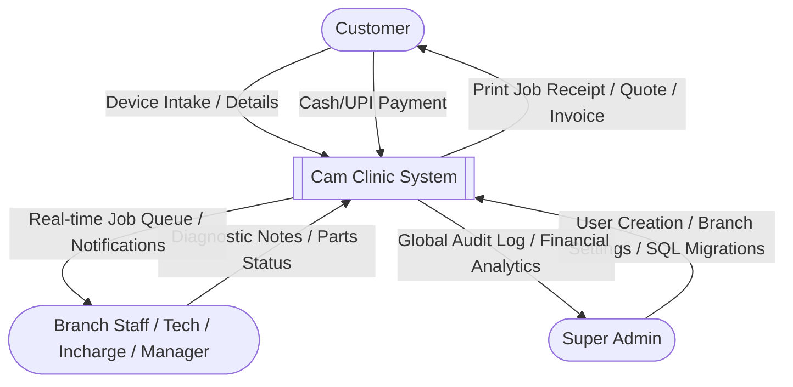
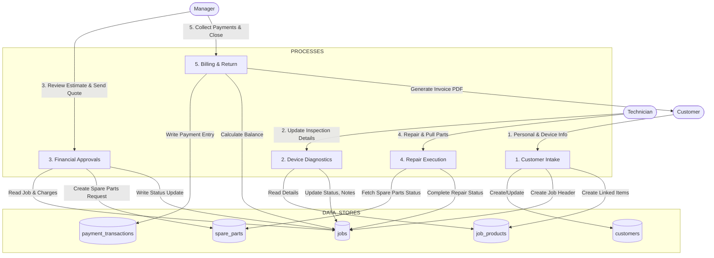
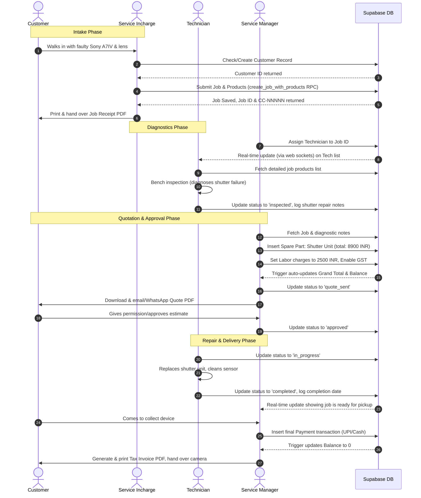

## 4. User Roles, Permissions, & Workflows

### 4.1 Role Matrix
Cam Clinic enforces strict role-based access control (RBAC). A user's role determines which routes they can access, what data they can see, and what actions they can perform.

| Feature / Permission | Super Admin | Service Manager | Service Incharge | Technician |
|---|:---:|:---:|:---:|:---:|
| **Read All Branches Data** | ✅ Yes | ✅ Yes | ❌ Home Branch Only | ❌ Assigned Jobs Only |
| **Manage Branches** | ✅ Yes | ✅ Yes | ❌ No | ❌ No |
| **Manage Staff Users** | ✅ Yes | ❌ No | ❌ No | ❌ No |
| **Create Jobs / Customers** | ✅ Yes | ✅ Yes | ✅ Yes | ❌ No |
| **Assign Incharge / Technician** | ✅ Yes | ✅ Yes | ✅ Yes | ❌ No |
| **Edit Billing Details** | ✅ Yes | ✅ Yes | ✅ Yes | ❌ Read-Only |
| **Delete Jobs** | ✅ Yes | ❌ No | ❌ No | ❌ No |
| **Override Job Status (Any)** | ✅ Yes | ✅ Yes | ❌ Pipeline Order | ❌ Limited Options |

---

### 4.2 Job Status Pipeline
A service job transitions through a structured set of states to represent its real-world status. The state transitions are audited in `job_status_history`.

```
    [new]
      |
      v
 [inspected]
      |
      +------> [pending_approval]
      |              |
      |              +-------> [quote_sent]
      |                             |
      |              +--------------+
      |              v
      +------> [approved] <----+
      |              |         |
      |              v         |
      +------> [disapproved] --+
      |              |
      |              +-------> [spare_parts_pending]
      |                             |
      |              +--------------+
      |              v
      +------> [in_progress]
      |              |
      v              v
 [cancelled]    [completed]
```

#### Status Descriptions:
1. **`new`**: Job card created at intake. Diagnostic/inspection pending.
2. **`inspected`**: Bench diagnostics completed by the assigned technician. Issue identified and logged.
3. **`pending_approval`**: Diagnostics done; estimate prepared. Waiting for manager review.
4. **`quote_sent`**: Estimate shared with customer (Quote PDF generated). Waiting for customer response.
5. **`approved`**: Customer approved charges and estimated completion timeline.
6. **`disapproved`**: Customer rejected estimation. Preparing device for return with diagnostic fee.
7. **`spare_parts_pending`**: Approved repair is stalled waiting for external parts supply.
8. **`in_progress`**: Repair actively being worked on by the bench technician.
9. **`completed`**: Repair successfully done, final quality checks passed. Ready for pickup.
10. **`cancelled`**: Job cancelled due to return-without-repair or other cancellation reasons.

---

### 4.3 Process Flows & Diagrams

#### 4.3.1 DFD Level 0 (Context Diagram)
The Context Diagram represents the core interface boundaries of the Cam Clinic system.



#### 4.3.2 DFD Level 1 (Intake, Diagnostic, and Billing Operations)
Shows process transformations and data store interactions inside the system.



#### 4.3.3 Detailed User Flow Sequence Diagram
Illustrates step-by-step sequencing for a standard mirrorless camera repair.


